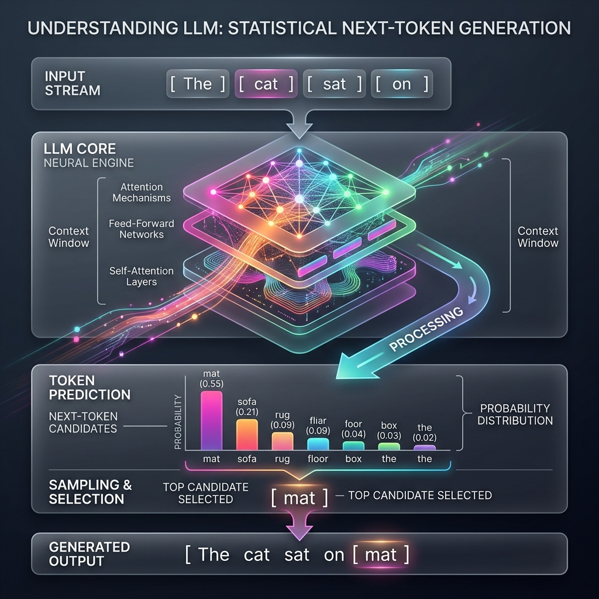

<!-- tags: glossary, agentic-ai, core-llm, llm -->
# LLM

> A large language model trained on massive text data that generates human-like text by predicting the next token — the foundational building block of every agentic system.

| Aspect | Detail |
| --- | --- |
| **Domain** | Core AI / LLM Concepts |
| **Used by** | AI engineer, backend developer, tech lead, product manager |
| **Related** | Foundation Model, Inference, Token, Fine-tuning |

📅 Created: 2026-04-28 · 🔄 Updated: 2026-05-06 · ⏱️ 5 min read

---

## 1. DEFINE

Before large language models existed, building a system that could understand natural language required years of hand-crafted rules, domain-specific parsers, and brittle NLP pipelines. A team that wanted their software to "understand" a user's intent had to enumerate every possible way a human might phrase a request. The moment a user said something unexpected, the system broke.

**LLM** (Large Language Model) is a neural network trained on massive text corpora — billions to trillions of tokens — that learns statistical patterns of language. Given an input sequence, it predicts the most likely next tokens. GPT, Claude, and Gemini are examples. The "large" refers not to vocabulary but to the number of parameters (billions) that encode language patterns.

An LLM does not "understand" text the way a human does. It compresses the statistical structure of human language into weights, then uses those weights to generate plausible continuations. This distinction matters because it explains both the power (fluent, flexible output) and the danger (hallucination, no grounding in truth).

---

## 2. CONTEXT

**Who uses it**: Every role in the AI engineering stack — from the product manager scoping a feature to the ML engineer fine-tuning a model to the DevOps engineer managing inference infrastructure.

**When**: Whenever a system needs to process, generate, or reason about natural language at scale.

**Why it matters**: The LLM is the central engine of every agentic system. Its capabilities and limitations cascade through every layer above it — prompt engineering, tool use, orchestration, and safety.

**In this ecosystem**:
- An LLM becomes a [Foundation Model](./02-foundation-model.md) when it serves as a pretrained base for specialization.
- The process of running an LLM to produce output is [Inference](./03-inference.md).
- The atomic unit it processes is a [Token](./04-token.md).
- When an LLM gains the ability to plan and act autonomously, it becomes an [AI Agent](../agentic-core/34-ai-agent.md).

---

## 3. EXAMPLES

*Figure: An LLM acts as a neural engine predicting the next most likely token based on the statistical patterns in its context.*

### Example 1: LLM as a text completion engine

A developer integrates an LLM API to auto-complete customer support responses. The model receives a partial response and generates the rest. The team discovers that the model occasionally invents product features that do not exist — not because the prompt is bad, but because the model is optimizing for plausible text, not factual accuracy.

→ Understanding that LLMs are statistical pattern matchers, not knowledge bases, changes how the team architects the solution (adding RAG, grounding, or retrieval before generation).

### Example 2: LLM as the engine inside an agent

A coding assistant uses an LLM to read a codebase, plan changes, and generate patches. The LLM is not the agent — it is the reasoning engine inside the agent. The scaffolding around it (tool registry, memory, execution environment) turns it from a text predictor into an autonomous system.

→ Separating "LLM" from "agent" prevents teams from blaming the model when the scaffolding is the real bottleneck.

---

## 4. COMPARE

| | LLM | Traditional NLP | Rule-based System |
|--|---|---|---|
| **Input** | Natural language (any) | Structured or semi-structured text | Predefined patterns |
| **Flexibility** | High — handles unseen phrasings | Medium — limited to trained domains | Low — only exact matches |
| **Failure mode** | Hallucination (confident but wrong) | Misclassification (wrong label) | No match (silent failure) |
| **Cost** | High compute per inference | Low to medium | Negligible |

---

## 5. REF

| Resource | Type | Link | Note |
| --- | --- | --- | --- |
| Attention Is All You Need | Paper | https://arxiv.org/abs/1706.03762 | The transformer architecture paper |
| OpenAI — GPT-4 Technical Report | Paper | https://arxiv.org/abs/2303.08774 | Architecture and capability overview |
| Anthropic — Claude Model Card | Official | https://docs.anthropic.com/en/docs/about-claude/models | Model specifications |

---

## 6. RECOMMEND

| Explore next | When | Why | File/Link |
| --- | --- | --- | --- |
| Foundation Model | You need to understand pretrained bases vs specialized models | LLMs are foundation models before they are fine-tuned | [Foundation Model](./02-foundation-model.md) |
| Inference | You want to understand the runtime cost of using an LLM | Inference is where tokens become dollars | [Inference](./03-inference.md) |
| Hallucination | The model is generating plausible but false information | This is the most critical failure mode to understand early | [Hallucination](./08-hallucination.md) |

**Links**: [← Previous](./README.md) · [→ Next](./02-foundation-model.md)
