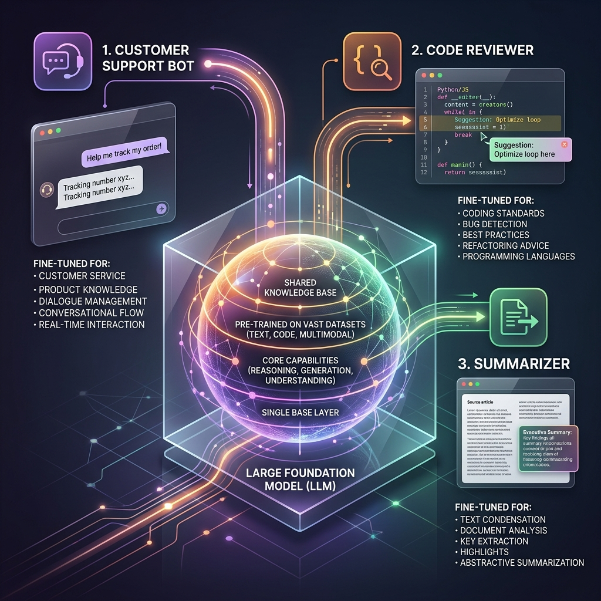

<!-- tags: glossary, agentic-ai, core-llm, foundation-model -->
# Foundation Model

> A model pretrained on massive, diverse data that serves as the base for fine-tuning, prompting, or building specialized AI systems on top.

| Aspect | Detail |
| --- | --- |
| **Domain** | Core AI / LLM Concepts |
| **Used by** | ML engineer, AI architect, tech lead |
| **Related** | LLM, Fine-tuning, RLHF, Inference |

📅 Created: 2026-04-28 · 🔄 Updated: 2026-05-06 · ⏱️ 5 min read

---

## 1. DEFINE

Before foundation models, every ML task required its own model trained from scratch — one for sentiment analysis, another for translation, a third for summarization. Each needed curated datasets, weeks of training, and a team of specialists. A company that wanted five NLP features needed five separate pipelines.

**Foundation Model** is a model pretrained on a broad, diverse dataset (text, code, images, or multimodal data) at massive scale. Instead of training for one task, it learns general-purpose representations that can be adapted to many downstream tasks through fine-tuning, prompting, or in-context learning. GPT-4, Claude, Gemini, and LLaMA are foundation models.

The term "foundation" emphasizes that these models are not the final product — they are the base layer. The value proposition is amortization: one expensive pretraining run enables thousands of applications.

---

## 2. CONTEXT

**Who uses it**: ML engineers selecting base models, architects deciding build-vs-buy, tech leads budgeting training costs.

**When**: At the start of any AI project — choosing which foundation model to build on is the first architectural decision.

**In this ecosystem**:
- Every [LLM](./01-llm.md) used in production is a foundation model or a derivative of one.
- [Fine-tuning](./11-fine-tuning.md) specializes a foundation model for a specific domain.
- [RLHF](./12-rlhf.md) aligns a foundation model with human preferences.

---

## 3. EXAMPLES

*Figure: A single Foundation Model amortizes pretraining costs by serving as the base layer for diverse, fine-tuned downstream applications.*

### Example 1: Foundation model as shared infrastructure

A company uses GPT-4 as the foundation for three products: a customer support bot, a code reviewer, and a document summarizer. Each product uses different prompts and fine-tuning, but they all share the same base model. When the foundation model upgrades, all three products benefit.

→ Foundation models turn AI from a per-project cost into a platform investment.

### Example 2: Foundation model selection trade-offs

A startup evaluates Claude, GPT-4, and an open-source LLaMA variant. Claude excels at long documents, GPT-4 at general reasoning, and LLaMA at cost control with self-hosting. The choice depends on the deployment constraint, not just the benchmark score.

→ "Best foundation model" is always context-dependent.

---

## 4. COMPARE

| | Foundation Model | Task-specific Model | Fine-tuned Model |
|--|---|---|---|
| **Training data** | Broad, diverse, massive | Narrow, curated for one task | Foundation + domain-specific data |
| **Flexibility** | High — adaptable to many tasks | Low — one task only | Medium — specialized but limited |
| **Cost to create** | Millions of dollars | Thousands to tens of thousands | Thousands (on top of foundation) |
| **Time to deploy** | Immediate (API) | Weeks (train from scratch) | Days to weeks |

---

## 5. REF

| Resource | Type | Link | Note |
| --- | --- | --- | --- |
| On the Opportunities and Risks of Foundation Models | Paper | https://arxiv.org/abs/2108.07258 | Stanford CRFM foundational paper |
| Hugging Face Model Hub | Registry | https://huggingface.co/models | Browse and compare foundation models |

---

## 6. RECOMMEND

| Explore next | When | Why | File/Link |
| --- | --- | --- | --- |
| LLM | You need the broader category that foundation models belong to | LLM is the superset concept | [LLM](./01-llm.md) |
| Fine-tuning | You want to specialize a foundation model for your domain | Fine-tuning is the primary adaptation technique | [Fine-tuning](./11-fine-tuning.md) |
| Inference | You need to understand the runtime cost of using a foundation model | Inference cost scales with model size | [Inference](./03-inference.md) |

**Links**: [← Previous](./01-llm.md) · [→ Next](./03-inference.md)
