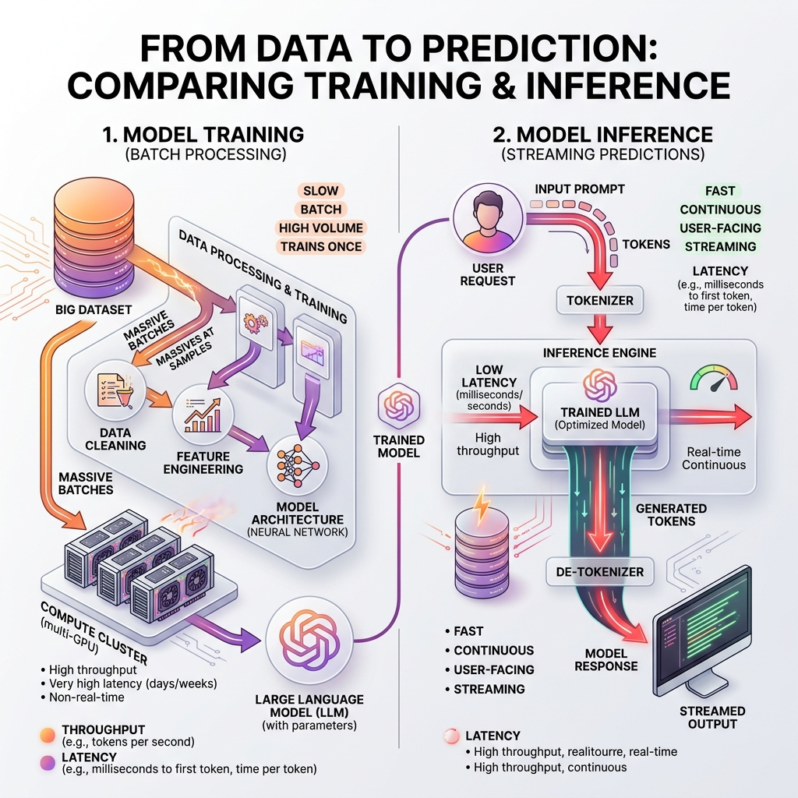

<!-- tags: glossary, agentic-ai, core-llm, inference -->
# Inference

> The process of running a trained model to produce output from input — distinct from training, and where latency, cost, and throughput become engineering problems.

| Aspect | Detail |
| --- | --- |
| **Domain** | Core AI / LLM Concepts |
| **Used by** | AI engineer, backend developer, DevOps, platform engineer |
| **Related** | LLM, Token, Context Window, Latency Budget |

📅 Created: 2026-04-28 · 🔄 Updated: 2026-05-06 · ⏱️ 5 min read

---

## 1. DEFINE

Training a model costs millions of dollars and takes weeks. But training happens once (or rarely). Inference happens every single time a user sends a message, an agent makes a decision, or a pipeline processes a document. In production, inference is where the money goes.

**Inference** is the process of running a trained model to generate output from a given input. For LLMs, this means feeding tokens into the model and receiving generated tokens back. Unlike training (which updates model weights), inference only reads the weights — it is a forward pass through the network.

The engineering challenge of inference is the tension between quality (larger models produce better output), cost (larger models use more compute), and latency (users and agents cannot wait forever). Every production LLM system is an inference optimization problem.

---

## 2. CONTEXT

**Who uses it**: Backend developers calling LLM APIs, DevOps engineers managing GPU infrastructure, platform engineers building inference pipelines.

**When**: Every time the system needs the model to produce an output — chat responses, agent decisions, document processing.

**In this ecosystem**:
- Inference processes [Tokens](./04-token.md) within the [Context Window](./05-context-window.md).
- [Temperature](./06-temperature.md) and [Top-P/Top-K](./07-top-p-top-k.md) are inference-time parameters.
- [Latency Budget](../evaluation-observability/117-latency-budget.md) and [Token Budget](../evaluation-observability/118-token-budget.md) constrain inference in production.

---

## 3. EXAMPLES

### Example 1: API-based inference

A team calls the OpenAI API to generate customer support responses. Each API call is one inference request. The cost is measured in tokens processed, and the latency depends on output length and model size.

→ Understanding inference as a per-call cost makes capacity planning concrete.

### Example 2: Self-hosted inference

A company runs a LLaMA model on their own GPUs using vLLM or TensorRT-LLM. They control batching, quantization, and caching but must manage GPU memory, queue depth, and failure recovery themselves.

→ Self-hosted inference trades API simplicity for cost control and data privacy.

---

## 4. COMPARE

*Figure: While training is a massive, slow batch process, inference is a fast, continuous stream where latency and throughput dictate system viability.*

| | Inference | Training | Fine-tuning |
|--|---|---|---|
| **When** | Every user request | Once (or rarely) | Periodically |
| **Cost driver** | Tokens × model size × requests | Dataset size × model size × epochs | Dataset size × model size × epochs (smaller) |
| **Latency matters?** | Yes — user-facing | No — batch job | No — batch job |
| **Modifies weights?** | No | Yes | Yes |

---

## 5. REF

| Resource | Type | Link | Note |
| --- | --- | --- | --- |
| vLLM — High-throughput LLM serving | Tool | https://github.com/vllm-project/vllm | Open-source inference engine |
| NVIDIA TensorRT-LLM | Tool | https://github.com/NVIDIA/TensorRT-LLM | GPU-optimized inference |

---

## 6. RECOMMEND

| Explore next | When | Why | File/Link |
| --- | --- | --- | --- |
| Token | You need to understand the unit that inference processes | Tokens are the atomic unit of cost and latency | [Token](./04-token.md) |
| Latency Budget | You are designing a production system with SLAs | Inference latency must be budgeted across the pipeline | [Latency Budget](../evaluation-observability/117-latency-budget.md) |
| Context Window | You need to know how much data you can send in one inference call | Context limits constrain input size | [Context Window](./05-context-window.md) |

**Links**: [← Previous](./02-foundation-model.md) · [→ Next](./04-token.md)
