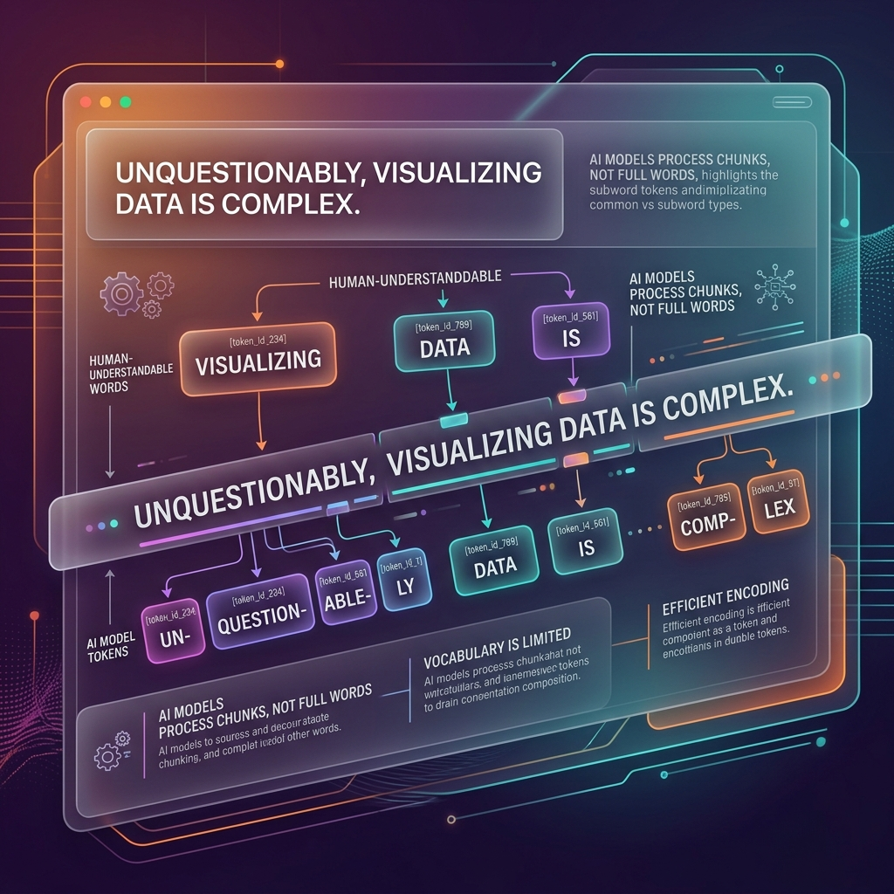

<!-- tags: glossary, agentic-ai, core-llm, token -->
# Token

> The smallest unit an LLM processes — approximately three-quarters of an English word — that determines cost, context limits, and generation speed.

| Aspect | Detail |
| --- | --- |
| **Domain** | Core AI / LLM Concepts |
| **Used by** | AI engineer, backend developer, product manager (cost estimation) |
| **Related** | Context Window, Inference, Token Budget |

📅 Created: 2026-04-28 · 🔄 Updated: 2026-05-06 · ⏱️ 5 min read

---

## 1. DEFINE

A developer sends "Hello, how are you?" to an LLM and assumes the model processes five words. But the model does not see words — it sees tokens. "Hello" might be one token, "how" another, but "tokenization" could be split into "token" + "ization." The billing says 7 tokens, not 5 words. The context window says 128K tokens, not 128K words. Every limit in the LLM world is measured in tokens, not in the units humans think in.

**Token** is the atomic unit of text that an LLM processes. A tokenizer splits input text into tokens before the model sees it, and the model generates output one token at a time. For English text, one token is approximately ¾ of a word. For code, tokens often correspond to keywords, operators, or subwords. For non-Latin scripts, a single character might consume multiple tokens.

Tokens are the unit of cost (you pay per token), the unit of capacity (context window is measured in tokens), and the unit of speed (generation speed is measured in tokens per second).

---

## 2. CONTEXT

**Who uses it**: Everyone interacting with LLMs — developers estimating costs, engineers designing prompts, architects sizing context windows.

**When**: Every LLM interaction involves tokenization. Understanding tokens is necessary for cost estimation, prompt design, and context management.

**In this ecosystem**:
- The [Context Window](./05-context-window.md) is measured in tokens.
- [Inference](./03-inference.md) cost is proportional to tokens processed.
- [Token Budget](../evaluation-observability/118-token-budget.md) controls cost in agentic pipelines.

---

## 3. EXAMPLES

*Figure: A token is a subword chunk. What a human sees as a single word may be sliced into multiple tokens by the model's tokenizer.*

### Example 1: Token count surprises

A developer designs a prompt that fits in 4,000 words. But 4,000 English words is approximately 5,300 tokens. The model's 8K context window leaves only 2,700 tokens for the response — much less than expected.

→ Always count tokens, not words, when designing prompts and estimating capacity.

### Example 2: Multilingual token inflation

A system processes Vietnamese text. Because LLM tokenizers are primarily trained on English, Vietnamese characters often require 2-3x more tokens than equivalent English text. A 4K-token prompt in English becomes 10K tokens in Vietnamese.

→ Token efficiency varies dramatically across languages and must be measured, not assumed.

---

## 4. COMPARE

| | Token | Word | Character |
|--|---|---|---|
| **Definition** | Subword unit from tokenizer | Human-defined word boundary | Single letter or symbol |
| **Size (English)** | ~¾ word | 1 word | 1 character |
| **Used by** | LLMs (internal) | Humans (reading) | Programming (string ops) |
| **Cost metric** | Yes (billing unit) | No | No |

---

## 5. REF

| Resource | Type | Link | Note |
| --- | --- | --- | --- |
| OpenAI Tokenizer | Tool | https://platform.openai.com/tokenizer | Interactive tokenizer visualization |
| Byte Pair Encoding (BPE) | Paper | https://arxiv.org/abs/1508.07909 | The algorithm behind most LLM tokenizers |

---

## 6. RECOMMEND

| Explore next | When | Why | File/Link |
| --- | --- | --- | --- |
| Context Window | You need to understand how many tokens fit in one request | Context window is the capacity limit measured in tokens | [Context Window](./05-context-window.md) |
| Token Budget | You are building an agentic pipeline and need cost control | Token budgets prevent runaway inference costs | [Token Budget](../evaluation-observability/118-token-budget.md) |
| Inference | You want to understand the full request lifecycle | Tokens are what inference processes | [Inference](./03-inference.md) |

**Links**: [← Previous](./03-inference.md) · [→ Next](./05-context-window.md)
