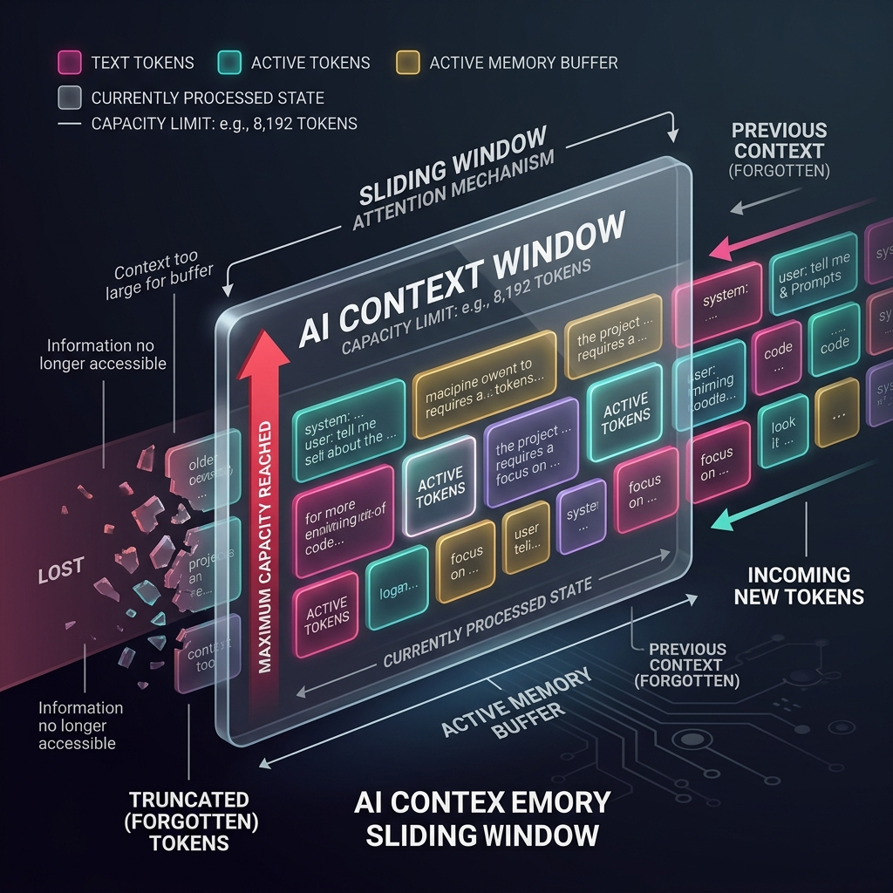

<!-- tags: glossary, agentic-ai, core-llm, context-window -->
# Context Window

> The maximum number of tokens an LLM can process in a single inference call — the model's short-term memory limit that constrains every architectural decision above it.

| Aspect | Detail |
| --- | --- |
| **Domain** | Core AI / LLM Concepts |
| **Used by** | AI engineer, backend developer, prompt engineer |
| **Related** | Token, Inference, Memory Systems, RAG |

📅 Created: 2026-04-28 · 🔄 Updated: 2026-05-06 · ⏱️ 5 min read

---

## 1. DEFINE

An agent is halfway through analyzing a 200-page legal document when its responses start contradicting earlier analysis. The model has not "forgotten" — it never saw the earlier pages. The context window filled up, and the oldest tokens were pushed out. Every decision the agent makes after that point is based on a partial view of the document it was supposed to fully understand.

**Context Window** is the maximum number of tokens a model can "see" in a single inference call — including both the input (system prompt, conversation history, retrieved documents) and the output (generated response). It is the model's working memory. Once the window is full, earlier tokens are either truncated or compressed. GPT-4o supports ~128K tokens; Claude supports ~200K tokens; Gemini supports up to 2M tokens.

The context window is not infinite memory. It is a sliding window with a hard ceiling. Everything that does not fit must be managed externally through summarization, retrieval, or memory systems.

---

## 2. CONTEXT

**Who uses it**: Prompt engineers sizing prompts, architects designing RAG pipelines, agents that need conversation memory.

**When**: At every design decision that involves how much information to pack into a single LLM call.

**In this ecosystem**:
- Measured in [Tokens](./04-token.md).
- When the context window is insufficient, [RAG](../tools-capabilities/53-rag.md) retrieves only the relevant subset.
- [Memory Systems](../memory-systems/README.md) manage information that outlives a single context window.
- [Memory Compression](../memory-systems/100-memory-compression.md) summarizes history when the window fills up.

---

## 3. EXAMPLES

*Figure: The context window acts as a sliding memory buffer. As new tokens are generated or retrieved, the oldest information is pushed out and forgotten.*

### Example 1: Context window as prompt budget

A system prompt uses 2,000 tokens. Conversation history uses 10,000 tokens. Retrieved documents use 50,000 tokens. The model has a 128K context window — but 62,000 tokens are already consumed before the model generates a single word of response. The "128K context" is not 128K for the answer; it is 128K total.

→ Context window planning requires accounting for every component that shares the window.

### Example 2: The "lost in the middle" problem

Research shows that LLMs pay less attention to information in the middle of a long context. Even when documents fit within the window, the model may ignore relevant facts placed between the beginning and the end.

→ Fitting within the context window is necessary but not sufficient. Placement within the window matters.

---

## 4. COMPARE

| | Context Window | Long-Term Memory | RAG |
|--|---|---|---|
| **Persistence** | One inference call only | Across sessions | Per-query retrieval |
| **Capacity** | 8K–2M tokens (model-dependent) | Unlimited (external storage) | Retrieves relevant subset |
| **Cost** | Included in inference | Storage + retrieval cost | Embedding + search cost |
| **Failure mode** | Truncation, lost-in-the-middle | Stale or irrelevant retrieval | Wrong documents retrieved |

---

## 5. REF

| Resource | Type | Link | Note |
| --- | --- | --- | --- |
| Lost in the Middle | Paper | https://arxiv.org/abs/2307.03172 | Attention degradation in long contexts |
| Anthropic — Long context tips | Guide | https://docs.anthropic.com/en/docs/build-with-claude/prompt-caching | Managing long context effectively |

---

## 6. RECOMMEND

| Explore next | When | Why | File/Link |
| --- | --- | --- | --- |
| Token | You need the unit that context windows are measured in | Tokens are the atoms of context | [Token](./04-token.md) |
| RAG | Your data exceeds the context window | RAG retrieves only what is relevant | [RAG](../tools-capabilities/53-rag.md) |
| Memory Compression | Conversation history fills the window | Compression summarizes history to free space | [Memory Compression](../memory-systems/100-memory-compression.md) |

**Links**: [← Previous](./04-token.md) · [→ Next](./06-temperature.md)
