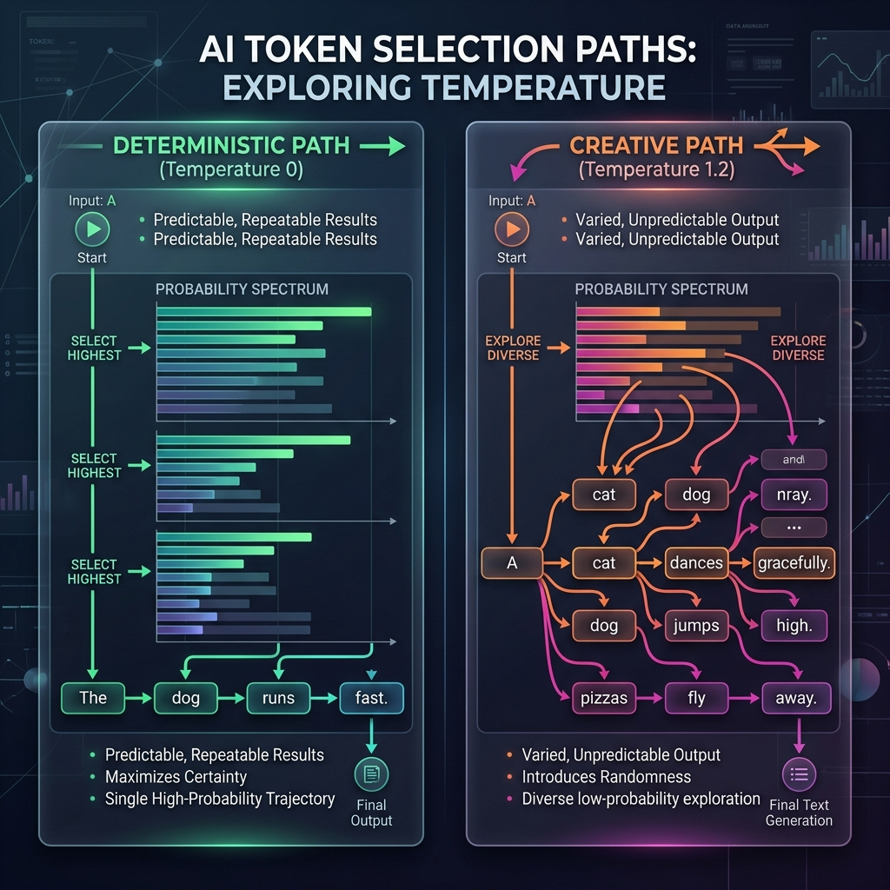

<!-- tags: glossary, agentic-ai, core-llm, temperature -->
# Temperature

> The randomness control parameter for LLM output — 0 produces deterministic responses, higher values increase creativity and unpredictability.

| Aspect | Detail |
| --- | --- |
| **Domain** | Core AI / LLM Concepts |
| **Used by** | Prompt engineer, AI engineer, backend developer |
| **Related** | Top-P / Top-K, Inference, Hallucination |

📅 Created: 2026-04-28 · 🔄 Updated: 2026-05-06 · ⏱️ 5 min read

---

## 1. DEFINE

Two developers test the same prompt. One gets consistent, predictable answers. The other gets creative, varied responses that occasionally contradict themselves. They are using the same model, the same prompt, the same API — but different temperature settings. One has temperature at 0, the other at 1.2. Neither is wrong, but neither realizes the other's experience is equally valid.

**Temperature** is a parameter that controls the randomness of token selection during inference. At temperature 0, the model always picks the highest-probability token (greedy decoding) — producing deterministic, conservative output. As temperature increases toward 1 and beyond, lower-probability tokens get a higher chance of being selected, making output more diverse, creative, and unpredictable.

Mathematically, temperature scales the logits (raw prediction scores) before the softmax function. Lower temperature sharpens the distribution (one token dominates); higher temperature flattens it (many tokens become viable).

---

## 2. CONTEXT

**Who uses it**: Prompt engineers tuning output style, developers building production systems that need deterministic behavior, creative writing applications that need variety.

**When**: At inference time — temperature is set per request, not per model.

**In this ecosystem**:
- Works alongside [Top-P / Top-K](./07-top-p-top-k.md) to control sampling behavior.
- High temperature increases [Hallucination](./08-hallucination.md) risk.
- In agentic systems, lower temperature is typically preferred for reliability.

---

## 3. EXAMPLES

### Example 1: Temperature 0 for production agents

An agentic coding assistant uses temperature 0 because it needs to produce the same code fix for the same bug every time. Non-determinism in code generation is a reliability hazard.

→ Agentic systems that take real-world actions should default to low temperature.

### Example 2: Temperature 0.7–1.0 for brainstorming

A creative writing tool uses temperature 0.9 to generate varied story continuations. The user wants surprise and novelty, not the most probable next word.

→ Temperature is a product decision, not just a technical parameter.

---

## 4. COMPARE

*Figure: Temperature 0 forces a deterministic path picking the highest probability token, whereas Temperature 1.2 enables branching into creative and unpredictable trajectories.*

| | Temperature 0 | Temperature 0.7 | Temperature 1.2+ |
|--|---|---|---|
| **Behavior** | Deterministic, conservative | Balanced creativity | Highly random, surprising |
| **Use case** | Production agents, code gen | Conversational AI, writing | Brainstorming, exploration |
| **Risk** | Repetitive, boring | Occasional drift | Hallucination, incoherence |

---

## 5. REF

| Resource | Type | Link | Note |
| --- | --- | --- | --- |
| OpenAI — Temperature parameter | Official | https://platform.openai.com/docs/api-reference/chat/create | API reference for temperature |
| The Softmax Temperature | Blog | https://lukesalamone.github.io/posts/what-is-temperature/ | Visual explanation of temperature |

---

## 6. RECOMMEND

| Explore next | When | Why | File/Link |
| --- | --- | --- | --- |
| Top-P / Top-K | You want finer control over sampling beyond temperature | These parameters complement temperature | [Top-P / Top-K](./07-top-p-top-k.md) |
| Hallucination | High temperature is causing incorrect output | Temperature amplifies hallucination risk | [Hallucination](./08-hallucination.md) |

**Links**: [← Previous](./05-context-window.md) · [→ Next](./07-top-p-top-k.md)
