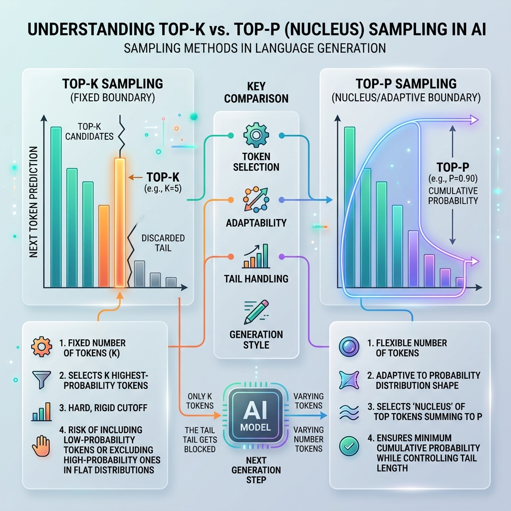

<!-- tags: glossary, agentic-ai, core-llm, top-p, top-k, sampling -->
# Top-P / Top-K

> Sampling strategies that control which tokens the model considers when generating — complementing temperature to shape output diversity.

| Aspect | Detail |
| --- | --- |
| **Domain** | Core AI / LLM Concepts |
| **Used by** | Prompt engineer, AI engineer, ML researcher |
| **Related** | Temperature, Inference, Token |

📅 Created: 2026-04-28 · 🔄 Updated: 2026-05-06 · ⏱️ 5 min read

---

## 1. DEFINE

Temperature controls how peaked or flat the probability distribution is. But it does not limit which tokens are considered. A model at temperature 0.8 could theoretically pick any token in its vocabulary — including wildly improbable ones. Top-P and Top-K are the bouncers at the door: they restrict the candidate pool before sampling happens.

**Top-K** limits selection to the K most probable tokens. If K=50, the model only considers the 50 highest-probability tokens, regardless of how the remaining probability mass is distributed.

**Top-P** (nucleus sampling) limits selection to the smallest set of tokens whose cumulative probability exceeds P. If P=0.9, the model includes tokens until their combined probability reaches 90%, then samples from that set. This means the candidate pool size varies — narrow when the model is confident, wide when it is uncertain.

Most production APIs let you set both, but recommend using one or the other, not both simultaneously.

---

## 2. CONTEXT

**Who uses it**: ML engineers tuning generation quality, prompt engineers balancing creativity and coherence.

**When**: At inference time, alongside temperature. These parameters are set per API call.

**In this ecosystem**:
- Works with [Temperature](./06-temperature.md) to control output diversity.
- Affects [Hallucination](./08-hallucination.md) risk — wider sampling increases the chance of improbable tokens.

---

## 3. EXAMPLES

### Example 1: Top-P for adaptive sampling

A conversation model uses Top-P=0.95. When the model is confident about the next word ("The capital of France is..."), only 2-3 tokens are in the nucleus. When the model is uncertain ("The best approach to..."), 50+ tokens might be candidates. Top-P adapts naturally.

→ Top-P is generally preferred over Top-K because it adapts to model confidence.

### Example 2: Top-K for hard limits

A code generation system uses Top-K=10 to ensure the model never picks low-probability tokens, even when uncertainty is high. This prevents syntactically invalid code from being generated.

→ Top-K provides a hard ceiling on candidate diversity.

---

## 4. COMPARE

*Figure: Top-K uses a rigid cutoff to select a fixed number of candidates, whereas Top-P (nucleus) uses an adaptive boundary based on cumulative probability mass.*

| | Top-P (Nucleus) | Top-K | Temperature |
|--|---|---|---|
| **Controls** | Cumulative probability threshold | Fixed candidate count | Distribution shape |
| **Adaptive?** | Yes — pool size varies | No — always K candidates | No — affects all tokens equally |
| **Best for** | General-purpose generation | Hard safety limits | Overall creativity control |

---

## 5. REF

| Resource | Type | Link | Note |
| --- | --- | --- | --- |
| The Curious Case of Neural Text Degeneration | Paper | https://arxiv.org/abs/1904.09751 | Introduced nucleus sampling (Top-P) |
| OpenAI — top_p parameter | Official | https://platform.openai.com/docs/api-reference/chat/create | API reference |

---

## 6. RECOMMEND

| Explore next | When | Why | File/Link |
| --- | --- | --- | --- |
| Temperature | You need the full picture of output control | Temperature and Top-P/Top-K work together | [Temperature](./06-temperature.md) |
| Constrained Decoding | You need even stricter output control | Constrained decoding enforces grammar, not just token probability | [Constrained Decoding](../prompt-engineering/33-constrained-decoding.md) |

**Links**: [← Previous](./06-temperature.md) · [→ Next](./08-hallucination.md)
