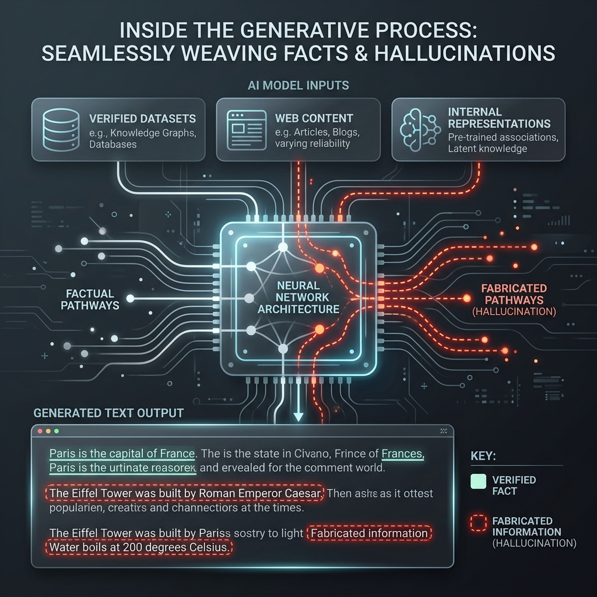

<!-- tags: glossary, agentic-ai, core-llm, hallucination -->
# Hallucination

> When an LLM generates confident, fluent output that is factually wrong — the most dangerous failure mode in agentic systems where the model makes autonomous decisions.

| Aspect | Detail |
| --- | --- |
| **Domain** | Core AI / LLM Concepts |
| **Used by** | AI engineer, product manager, QA engineer, security reviewer |
| **Related** | Grounding, RAG, Evals, Guardrail, Safety Layer |

📅 Created: 2026-04-28 · 🔄 Updated: 2026-05-06 · ⏱️ 5 min read

---

## 1. DEFINE

A customer support agent powered by an LLM tells a customer they can return a product within 90 days. The actual policy is 30 days. The model did not "misread" the policy — it was never given the policy document. It generated a plausible answer based on patterns in its training data, and 90 days is a common return window in its training corpus. The response was fluent, confident, and completely wrong.

**Hallucination** is when an LLM generates output that is factually incorrect, internally inconsistent, or fabricated — but presents it with the same confidence as correct information. The model does not "know" it is wrong because it does not have a truth model — it has a statistical model of plausible text.

Hallucination is not a bug that can be fixed with a patch. It is an inherent property of how LLMs generate text: by predicting likely continuations, not by reasoning from verified facts. Mitigating it requires architectural solutions (grounding, RAG, verification) rather than just better prompts.

---

## 2. CONTEXT

**Who uses it**: Everyone building AI-powered systems — this is the risk that every stakeholder must understand.

**When**: Hallucination risk is present in every LLM output. It becomes critical when the output drives decisions, actions, or user-facing information.

**In this ecosystem**:
- [Grounding](./09-grounding.md) anchors output to real data to reduce hallucination.
- [RAG](../tools-capabilities/53-rag.md) injects verified documents before generation.
- [Guardrails](../hooks-middleware/82-guardrail.md) catch hallucinated content before it reaches users.
- [Evals](../evaluation-observability/111-evals.md) measure hallucination rates systematically.
- In [Agentic](../agentic-core/34-ai-agent.md) systems, hallucination is especially dangerous because the agent may act on its own fabrications.

---

## 3. EXAMPLES

*Figure: Verified facts and hallucinated information look identical in the generative process because both are constructed via the same statistical pathway.*

### Example 1: Hallucinated citations

A research assistant generates a paper summary with three citations. Two are real papers. The third has a plausible-sounding title, author name, and journal — but does not exist. The user trusts all three because they look equally authoritative.

→ LLMs hallucinate not just facts but metadata, references, and supporting evidence.

### Example 2: Hallucination in code generation

A coding assistant suggests calling `database.optimizeQuery(threshold=0.5)`. The API does not have an `optimizeQuery` method. The suggestion is syntactically valid, semantically plausible, and entirely fabricated.

→ Code hallucination is particularly insidious because it compiles (sometimes) but fails at runtime.

---

## 4. COMPARE

| | Hallucination | Bug | Bias |
|--|---|---|---|
| **Root cause** | Statistical text generation | Logic error in code | Skewed training data |
| **Detection** | Fact verification needed | Testing catches it | Audit and evaluation |
| **Fix** | Grounding, RAG, verification | Code fix | Data curation, alignment |
| **Confidence** | Model is confident it is correct | System may crash | Model consistently skews |

---

## 5. REF

| Resource | Type | Link | Note |
| --- | --- | --- | --- |
| Survey of Hallucination in NLG | Paper | https://arxiv.org/abs/2202.03629 | Comprehensive taxonomy of hallucination types |
| Anthropic — Reducing hallucination | Guide | https://docs.anthropic.com/en/docs/build-with-claude/prompt-engineering/reduce-hallucinations | Practical mitigation techniques |

---

## 6. RECOMMEND

| Explore next | When | Why | File/Link |
| --- | --- | --- | --- |
| Grounding | You need to anchor LLM output to verified facts | Grounding is the primary architectural defense | [Grounding](./09-grounding.md) |
| RAG | You have a knowledge base the model should reference | RAG injects facts before generation | [RAG](../tools-capabilities/53-rag.md) |
| Evals | You need to measure hallucination rates | Systematic evaluation catches drift | [Evals](../evaluation-observability/111-evals.md) |

**Links**: [← Previous](./07-top-p-top-k.md) · [→ Next](./09-grounding.md)
