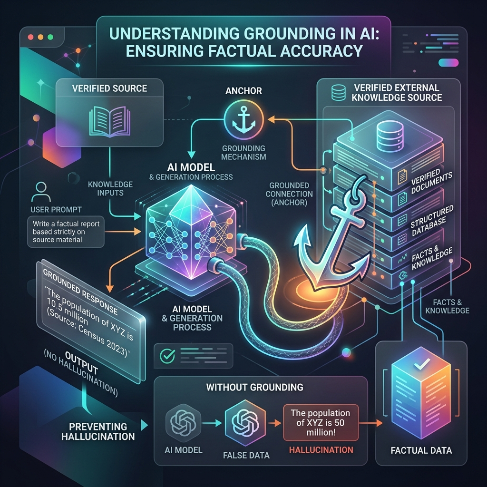

<!-- tags: glossary, agentic-ai, core-llm, grounding -->
# Grounding

> The technique of anchoring LLM output to verified, retrieved, or factual data — the primary architectural defense against hallucination.

| Aspect | Detail |
| --- | --- |
| **Domain** | Core AI / LLM Concepts |
| **Used by** | AI engineer, backend developer, product manager |
| **Related** | Hallucination, RAG, Embedding, Semantic Search |

📅 Created: 2026-04-28 · 🔄 Updated: 2026-05-06 · ⏱️ 5 min read

---

## 1. DEFINE

A legal AI assistant answers questions about employment law. Without grounding, it generates plausible-sounding legal advice from statistical patterns in its training data — which may include outdated laws, foreign jurisdictions, or fictional cases. With grounding, the system first retrieves the actual statute text, injects it into the prompt, and instructs the model to answer only from the provided documents. The answer is still generated by the LLM, but the source material is verified.

**Grounding** is the practice of forcing an LLM to base its output on specific, provided data rather than relying solely on its parametric knowledge (what it learned during training). Grounding techniques include injecting retrieved documents (RAG), providing structured data, citing sources, and instructing the model to say "I don't know" when the answer is not in the provided context.

Grounding does not eliminate hallucination — the model can still misinterpret or ignore the grounding data. But it shifts the failure mode from "invented facts" to "misread facts," which is far easier to detect and debug.

---

## 2. CONTEXT

**Who uses it**: AI engineers building factual systems, product managers defining accuracy requirements, QA engineers verifying output.

**When**: Whenever the LLM output must be factually accurate — legal, medical, financial, customer support, or any domain where incorrect information has consequences.

**In this ecosystem**:
- Grounding is the antidote to [Hallucination](./08-hallucination.md).
- [RAG](../tools-capabilities/53-rag.md) is the most common grounding implementation.
- [Embedding](./10-embedding.md) and [Semantic Search](../tools-capabilities/55-semantic-search.md) enable retrieval for grounding.
- Google's Gemini API offers built-in grounding with Google Search.

---

## 3. EXAMPLES

*Figure: Grounding tethers the AI's generation process to verified external knowledge sources, preventing the model from inventing plausible but incorrect facts.*

### Example 1: Grounding via retrieved documents

A customer support bot receives: "What is the refund policy for enterprise plans?" Before generating, the system retrieves the actual refund policy document from the knowledge base and injects it into the prompt: "Answer only based on the following document: [policy text]."

→ Grounding turns the model from a knowledge source into a reasoning engine over verified data.

### Example 2: Grounding via structured data

A financial dashboard assistant receives: "What was Q3 revenue?" The system queries the database, retrieves the exact number, and passes it to the model: "Q3 revenue was $12.4M. Generate a natural language summary."

→ For numerical data, grounding should provide exact values, not ask the model to recall them.

---

## 4. COMPARE

| | Grounded LLM | Ungrounded LLM | Search Engine |
|--|---|---|---|
| **Source** | Provided documents / data | Training data only | Indexed web pages |
| **Hallucination risk** | Low (but not zero) | High | N/A (returns links, not generated text) |
| **Flexibility** | Natural language answers from specific sources | Natural language answers from general knowledge | Links and snippets |

---

## 5. REF

| Resource | Type | Link | Note |
| --- | --- | --- | --- |
| Google — Grounding with Google Search | Official | https://ai.google.dev/gemini-api/docs/grounding | Built-in grounding in Gemini |
| Anthropic — Cite your sources | Guide | https://docs.anthropic.com/en/docs/build-with-claude/prompt-engineering/cite-sources | Citation-based grounding |

---

## 6. RECOMMEND

| Explore next | When | Why | File/Link |
| --- | --- | --- | --- |
| RAG | You need to implement grounding with a document retrieval pipeline | RAG is the standard grounding architecture | [RAG](../tools-capabilities/53-rag.md) |
| Embedding | You need to understand how documents are matched semantically | Embeddings power the retrieval step in grounding | [Embedding](./10-embedding.md) |
| Hallucination | You want to understand the problem grounding solves | Hallucination is the failure mode grounding mitigates | [Hallucination](./08-hallucination.md) |

**Links**: [← Previous](./08-hallucination.md) · [→ Next](./10-embedding.md)
