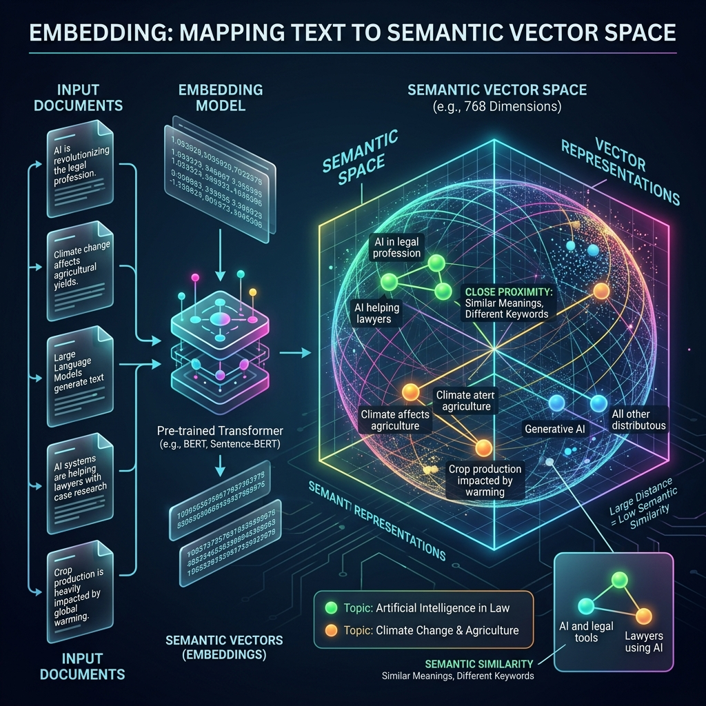

<!-- tags: glossary, agentic-ai, core-llm, embedding -->
# Embedding

> A dense vector representation of text that captures semantic meaning — enabling similarity search, clustering, and retrieval that powers RAG and grounding.

| Aspect | Detail |
| --- | --- |
| **Domain** | Core AI / LLM Concepts |
| **Used by** | AI engineer, backend developer, data engineer |
| **Related** | Semantic Search, Vector Database, RAG, Grounding |

📅 Created: 2026-04-28 · 🔄 Updated: 2026-05-06 · ⏱️ 5 min read

---

## 1. DEFINE

A search system uses keyword matching. A user searches "how to fix a broken deployment" but the documentation says "troubleshooting failed rollouts." The keyword search returns nothing because no words overlap. An embedding-based search converts both the query and the document into vectors in the same semantic space, discovers they mean similar things, and surfaces the right document.

**Embedding** is a vector (array of floating-point numbers, typically 768–3072 dimensions) that represents the semantic meaning of a piece of text. An embedding model converts text into this vector such that semantically similar texts produce vectors that are close together in vector space (measured by cosine similarity or dot product). Unlike keyword matching, embeddings capture meaning, not just surface words.

Embeddings are the bridge between human language and machine-searchable space. They power semantic search, RAG, clustering, classification, and anomaly detection in AI systems.

---

## 2. CONTEXT

**Who uses it**: AI engineers building retrieval systems, backend developers implementing search, data engineers indexing content.

**When**: Whenever the system needs to find semantically similar content — document retrieval, recommendation, deduplication.

**In this ecosystem**:
- Embeddings are stored in [Vector Databases](../tools-capabilities/54-vector-database.md).
- [Semantic Search](../tools-capabilities/55-semantic-search.md) uses embeddings for meaning-based lookup.
- [RAG](../tools-capabilities/53-rag.md) uses embeddings to retrieve relevant documents for [Grounding](./09-grounding.md).

---

## 3. EXAMPLES

*Figure: Embeddings mathematically project text into a multi-dimensional semantic space, allowing documents with similar meanings to cluster together regardless of exact keywords.*

### Example 1: Embedding for document retrieval

A knowledge base has 10,000 documents. When a user asks a question, the system embeds the question, then finds the 5 documents whose embeddings are closest to the query embedding. These documents are injected into the LLM prompt.

→ Embeddings turn unstructured text into a searchable, ranked index.

### Example 2: Embedding for semantic deduplication

A content moderation system embeds every new post and compares it against recent posts. If the cosine similarity exceeds 0.95, the post is flagged as a near-duplicate.

→ Embeddings detect semantic similarity even when the surface text is completely different.

---

## 4. COMPARE

| | Embedding Search | Keyword Search (BM25) | Hybrid Search |
|--|---|---|---|
| **Matches on** | Meaning | Exact words | Both |
| **Handles synonyms** | Yes | No | Yes |
| **Handles typos** | Partially | No | Partially |
| **Best for** | Conceptual queries | Exact term lookup | Production search |

---

## 5. REF

| Resource | Type | Link | Note |
| --- | --- | --- | --- |
| OpenAI — Embeddings | Official | https://platform.openai.com/docs/guides/embeddings | Embedding model usage guide |
| Sentence-BERT | Paper | https://arxiv.org/abs/1908.10084 | Efficient sentence embeddings |

---

## 6. RECOMMEND

| Explore next | When | Why | File/Link |
| --- | --- | --- | --- |
| Vector Database | You need to store and search embeddings at scale | Vector DBs are purpose-built for embedding storage | [Vector Database](../tools-capabilities/54-vector-database.md) |
| Semantic Search | You want to build search that understands meaning | Semantic search is the primary application of embeddings | [Semantic Search](../tools-capabilities/55-semantic-search.md) |
| RAG | You want to inject retrieved documents into LLM prompts | RAG uses embeddings for the retrieval step | [RAG](../tools-capabilities/53-rag.md) |

**Links**: [← Previous](./09-grounding.md) · [→ Next](./11-fine-tuning.md)
