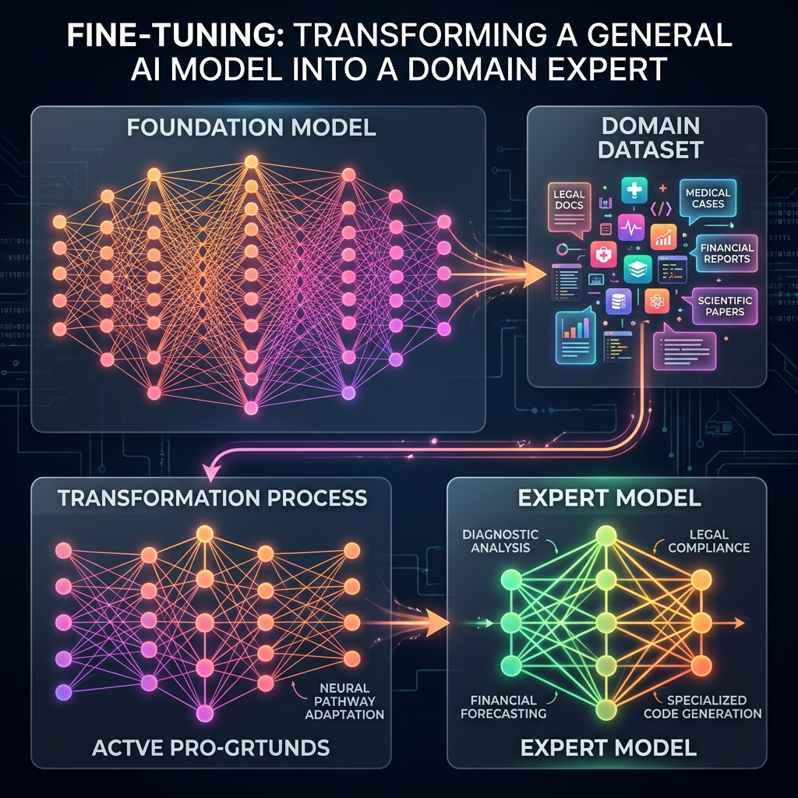

<!-- tags: glossary, agentic-ai, core-llm, fine-tuning -->
# Fine-tuning

> Training a pretrained model further on domain-specific data to specialize its behavior — the bridge between a general foundation model and a domain expert.

| Aspect | Detail |
| --- | --- |
| **Domain** | Core AI / LLM Concepts |
| **Used by** | ML engineer, AI engineer, tech lead |
| **Related** | Foundation Model, RLHF, LLM, Inference |

📅 Created: 2026-04-28 · 🔄 Updated: 2026-05-06 · ⏱️ 5 min read

---

## 1. DEFINE

A general-purpose LLM writes decent Python code but struggles with your company's internal framework. Prompt engineering helps, but the model still misses domain-specific conventions, proprietary APIs, and coding standards. RAG retrieves relevant docs, but the model's "instinct" for how to use those docs is off. Fine-tuning is the option when you need the model to internalize domain knowledge at the weight level — not just at the prompt level.

**Fine-tuning** is the process of training a pretrained foundation model on a smaller, domain-specific dataset to adapt its behavior for a particular task or domain. The model's weights are updated (partially or fully) to reflect patterns in the new data. This creates a specialized model that retains the general capabilities of the base model while excelling at the target domain.

Fine-tuning is not pretraining from scratch — it is standing on the shoulders of the foundation model's existing knowledge.

---

## 2. CONTEXT

**Who uses it**: ML engineers who have determined that prompting and RAG are insufficient, teams with proprietary data they want embedded in the model.

**When**: After exhausting prompt engineering and RAG, when the model needs to consistently behave differently than its default.

**In this ecosystem**:
- Fine-tuning builds on [Foundation Models](./02-foundation-model.md).
- [RLHF](./12-rlhf.md) is a specific fine-tuning technique using human feedback.
- Fine-tuned models still run through [Inference](./03-inference.md).
- Often compared against [RAG](../tools-capabilities/53-rag.md) as a knowledge injection strategy.

---

## 3. EXAMPLES

*Figure: Fine-tuning transforms a general-purpose Foundation Model by absorbing highly specialized domain data, altering its neural pathways to create an expert model.*

### Example 1: Fine-tuning for format consistency

A company needs every LLM response to follow a specific JSON schema. Prompt engineering works 90% of the time, but the remaining 10% breaks downstream parsers. Fine-tuning on 1,000 examples of correct JSON responses brings compliance to 99.5%.

→ Fine-tuning excels when you need consistent behavior that prompting cannot reliably enforce.

### Example 2: Fine-tuning vs RAG decision

A medical AI team debates: fine-tune on medical literature, or use RAG to retrieve relevant papers? Fine-tuning internalizes medical reasoning patterns. RAG provides up-to-date evidence. The answer is often both — fine-tune for domain style, RAG for current facts.

→ Fine-tuning and RAG are complementary, not competing strategies.

---

## 4. COMPARE

| | Fine-tuning | RAG | Prompt Engineering |
|--|---|---|---|
| **Knowledge source** | Baked into model weights | Retrieved at inference time | Provided in prompt text |
| **Update frequency** | Requires retraining | Real-time (document updates) | Immediate (prompt changes) |
| **Cost** | High (training compute) | Medium (embedding + storage) | Low (text editing) |
| **Best for** | Style, format, domain reasoning | Current facts, large knowledge bases | Quick experiments, prototyping |

---

## 5. REF

| Resource | Type | Link | Note |
| --- | --- | --- | --- |
| OpenAI — Fine-tuning guide | Official | https://platform.openai.com/docs/guides/fine-tuning | Practical fine-tuning workflow |
| LoRA: Low-Rank Adaptation | Paper | https://arxiv.org/abs/2106.09685 | Parameter-efficient fine-tuning |

---

## 6. RECOMMEND

| Explore next | When | Why | File/Link |
| --- | --- | --- | --- |
| RLHF | You want to align the model with human preferences | RLHF is fine-tuning with human feedback signals | [RLHF](./12-rlhf.md) |
| RAG | You want to inject knowledge without retraining | RAG is the retrieval-based alternative to fine-tuning | [RAG](../tools-capabilities/53-rag.md) |
| Foundation Model | You need to understand what you are fine-tuning on top of | Foundation models are the base layer | [Foundation Model](./02-foundation-model.md) |

**Links**: [← Previous](./10-embedding.md) · [→ Next](./12-rlhf.md)
