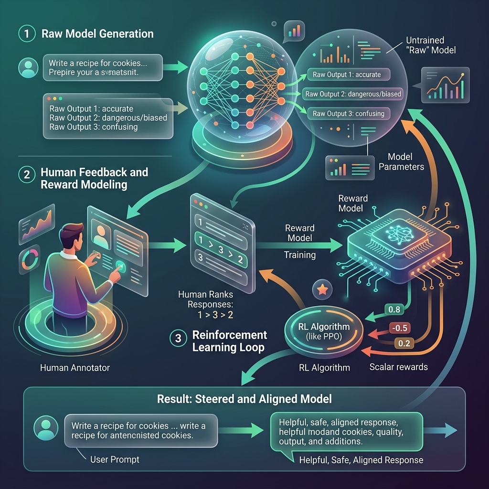

<!-- tags: glossary, agentic-ai, core-llm, rlhf -->
# RLHF

> Reinforcement Learning from Human Feedback — the technique that aligns language models with human preferences, turning a raw text predictor into a helpful, harmless assistant.

| Aspect | Detail |
| --- | --- |
| **Domain** | Core AI / LLM Concepts |
| **Used by** | ML researcher, AI safety engineer, tech lead |
| **Related** | Fine-tuning, Alignment, Constitutional AI, Foundation Model |

📅 Created: 2026-04-28 · 🔄 Updated: 2026-05-06 · ⏱️ 5 min read

---

## 1. DEFINE

A raw pretrained LLM completes text impressively but has no concept of "helpful" or "harmful." Ask it to write a phishing email, and it obliges — because "write a convincing email" is just a text completion task. Ask it a question, and it might respond with a question, a poem, or a continuation that ignores the intent entirely. The model predicts probable text, not useful text.

**RLHF** (Reinforcement Learning from Human Feedback) is a training technique where human evaluators rank model outputs by quality, and a reward model is trained on those rankings. The LLM is then fine-tuned using reinforcement learning to maximize the reward model's score — effectively teaching it to prefer outputs that humans rate as helpful, accurate, and safe.

RLHF is what turns a raw text predictor into ChatGPT, Claude, or Gemini. Without RLHF (or similar alignment techniques), foundation models are powerful but uncontrollable.

---

## 2. CONTEXT

**Who uses it**: ML researchers at frontier labs, AI safety teams, engineers understanding why their model behaves the way it does.

**When**: During model training (not at inference time). RLHF shapes the model's default behavior before it reaches users.

**In this ecosystem**:
- RLHF is a specialized form of [Fine-tuning](./11-fine-tuning.md).
- It is a core technique in [Alignment](../safety-alignment/121-alignment.md).
- [Constitutional AI](../safety-alignment/122-constitutional-ai.md) is Anthropic's alternative/complement to pure RLHF.
- RLHF-trained models are the [Foundation Models](./02-foundation-model.md) used in production.

---

## 3. EXAMPLES

*Figure: RLHF uses a reward model trained on human preferences to steer a raw text predictor toward generating helpful, safe, and aligned responses.*

### Example 1: RLHF making models helpful

Before RLHF: "What is the capital of France?" → "The capital of France is a city that many tourists visit. Speaking of tourism, the Eiffel Tower was built in..." (text completion continues indefinitely).

After RLHF: "What is the capital of France?" → "The capital of France is Paris." (direct answer, appropriate length).

→ RLHF teaches the model what "answering a question" means, as opposed to "continuing text."

### Example 2: RLHF making models refuse harmful requests

Before RLHF: "How to break into a car?" → detailed instructions (because the training data contains such information).

After RLHF: "How to break into a car?" → "I can't provide instructions for illegal activities. If you're locked out of your own car, here are legitimate options..."

→ RLHF encodes safety preferences into the model's default behavior.

---

## 4. COMPARE

| | RLHF | Constitutional AI | Direct Fine-tuning | Prompt-based Safety |
|--|---|---|---|---|
| **Mechanism** | Human rankings → reward model → RL | Self-critique against principles | Supervised on curated examples | System prompt rules |
| **Depth** | Weight-level alignment | Weight-level alignment | Weight-level behavior | Surface-level instruction |
| **Cost** | Very high (human labelers + training) | High (automated but iterative) | Medium | Low |
| **Robustness** | High | High | Medium | Low (bypassed by jailbreaks) |

---

## 5. REF

| Resource | Type | Link | Note |
| --- | --- | --- | --- |
| Training language models to follow instructions with human feedback | Paper | https://arxiv.org/abs/2203.02155 | OpenAI InstructGPT paper introducing RLHF for LLMs |
| Anthropic — RLHF overview | Blog | https://www.anthropic.com/research | Research on alignment techniques |

---

## 6. RECOMMEND

| Explore next | When | Why | File/Link |
| --- | --- | --- | --- |
| Alignment | You want the broader concept RLHF serves | RLHF is one technique within the alignment field | [Alignment](../safety-alignment/121-alignment.md) |
| Constitutional AI | You want to understand Anthropic's alternative approach | Constitutional AI reduces reliance on human labelers | [Constitutional AI](../safety-alignment/122-constitutional-ai.md) |
| Fine-tuning | You want the general technique RLHF builds on | RLHF is fine-tuning with a specific reward signal | [Fine-tuning](./11-fine-tuning.md) |

**Links**: [← Previous](./11-fine-tuning.md) · [→ Next](../prompt-engineering/README.md)
