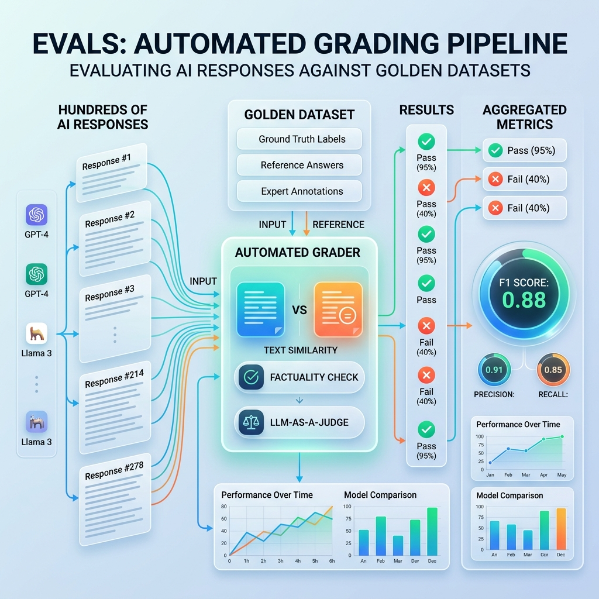

<!-- tags: glossary, agentic-ai, evaluation-observability -->
# Evals

> The automated tests you run to grade how well an AI model or agent performs a specific task.

| Aspect | Detail |
| --- | --- |
| **Domain** | Evaluation & Observability |
| **Used by** | AI researcher, QA engineer |
| **Related** | See RECOMMEND section |

📅 Created: 2026-04-28 · 🔄 Updated: 2026-05-13 · ⏱️ 5 min read

---

## 1. DEFINE

**Evals** (short for Evaluations) are the systematic methodologies and automated test suites used to measure the performance, accuracy, safety, and reliability of Large Language Models and agentic systems. Unlike traditional software testing (where `2+2` always equals `4`), evals must handle non-deterministic outputs. They typically consist of a dataset of inputs, expected outcomes, and a grading mechanism to score the AI's response.

---

## 2. CONTEXT

**Who uses it**: AI Researchers, QA Engineers, and ML Ops teams.
**When**: Before deploying a new prompt, model version, or agent architecture to production, and continuously during runtime to monitor degradation.
**Why it matters**: You can't improve what you can't measure. Because LLMs are probabilistic, changing a single word in a system prompt might improve performance on one task while destroying it on another. Evals provide the quantitative dashboard needed to deploy changes with confidence.

---

## 3. EXAMPLES

### Example 1: The QA Evaluation Pipeline

1. A developer modifies the RAG prompt for a customer support bot.
2. The CI/CD pipeline triggers an **Eval Suite**.
3. The suite feeds 500 historical customer questions into the new agent.
4. The agent generates 500 answers.
5. The Eval Engine compares the generated answers against a human-curated "Golden Dataset" of perfect answers.
6. The system calculates an F1 score for factual overlap. The new prompt scores 92% (up from 88%), so it is approved for production.

---

## 4. COMPARE

| Feature | Evals | Unit Tests |
|---|---|---|
| **Subject** | Probabilistic models and prompts | Deterministic code and logic |
| **Asserts** | Fuzzy matching, semantic similarity, LLM-as-Judge | Exact string matches, boolean equality |
| **Pass/Fail** | Often a continuous score (e.g., 0.0 to 1.0) | Binary (True/False) |

---

## 5. REF

| Resource | Type | Link | Note |
| --- | --- | --- | --- |
| OpenAI Evals | Framework | https://github.com/openai/evals | OpenAI's open-source framework for evaluating LLMs |
| RAGAS | Framework | https://docs.ragas.io/ | Specialized evals for Retrieval-Augmented Generation |

---

## 6. RECOMMEND

| Explore next | When | Why | File/Link |
| --- | --- | --- | --- |
| LLM-as-Judge | You need to grade complex open-ended text | Humans are too slow; use an LLM to grade the LLM | [LLM-as-Judge](./112-llm-as-judge.md) |
| Benchmark | You want to compare your model to others | Benchmarks are standardized, public evals | [Benchmark](./113-benchmark.md) |

**Links**: [← Previous](../memory-systems/README.md) · [→ Next](./112-llm-as-judge.md)
