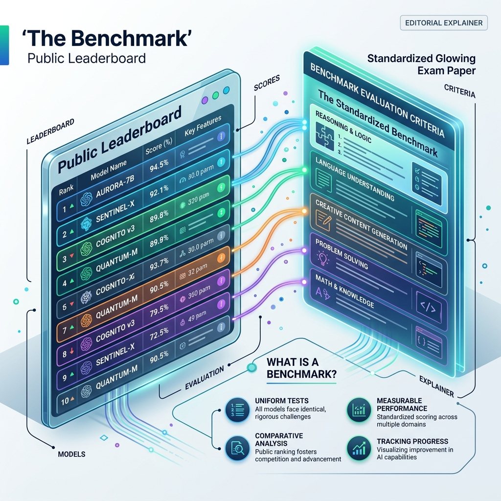

<!-- tags: glossary, agentic-ai, evaluation-observability -->
# Benchmark

> A standardized, public test used to compare the intelligence of different AI models against each other.

| Aspect | Detail |
| --- | --- |
| **Domain** | Evaluation & Observability |
| **Used by** | AI researcher, CTO |
| **Related** | See RECOMMEND section |

📅 Created: 2026-04-28 · 🔄 Updated: 2026-05-13 · ⏱️ 5 min read

---

## 1. DEFINE

A **Benchmark** is a standardized, publicly recognized dataset and evaluation metric used to assess specific capabilities of foundational models. Unlike internal corporate evals (which test how well a model performs a specific business task), benchmarks are industry-wide exams designed to rank models on leaderboards. They cover areas like general reasoning, mathematics, coding ability, and medical knowledge.

---

## 2. CONTEXT

**Who uses it**: AI Researchers publishing new models, and CTOs deciding which model to buy.
**When**: Reading release papers for new foundational models (like Llama 3 or Gemini 1.5) to understand if they are actually better than the previous state-of-the-art.
**Why it matters**: Without standardized benchmarks, AI companies could make wild, unverifiable claims about their models' intelligence. Benchmarks provide a level playing field. However, they are susceptible to "data contamination" (when the test questions accidentally leak into the model's training data).

---

## 3. EXAMPLES

### Example 1: The Coding Exam (HumanEval)

1. Company X releases a new model, "CodeBot-9000".
2. To prove it's good, they run it against **HumanEval**, an industry-standard benchmark containing 164 Python programming problems.
3. CodeBot-9000 solves 85% of the problems on the first try (Pass@1).
4. The company publishes this score. Developers compare it to GPT-4's HumanEval score (e.g., 88%) and conclude that CodeBot-9000 is highly capable, but slightly below the state-of-the-art.

---

## 4. COMPARE

| Feature | Benchmark | Custom Eval |
|---|---|---|
| **Scope** | General, industry-wide | Specific, company-internal |
| **Purpose** | Ranking models on leaderboards | Ensuring the agent works for a specific product feature |
| **Data Source** | Public, static datasets (MMLU, GSM8K) | Private, dynamic user logs |

---

## 5. REF

| Resource | Type | Link | Note |
| --- | --- | --- | --- |
| HuggingFace Leaderboard | Platform | https://huggingface.co/spaces/HuggingFaceH4/open_llm_leaderboard | The most popular aggregator of open-source benchmark scores |
| MMLU | Dataset | https://arxiv.org/abs/2009.03300 | Massive Multitask Language Understanding (The gold standard general benchmark) |

---

## 6. RECOMMEND

| Explore next | When | Why | File/Link |
| --- | --- | --- | --- |
| Evals | You want to build your own test | Evals are the internal equivalent of a public benchmark | [Evals](./111-evals.md) |
| Foundation Model | You want to know what is being tested | Benchmarks are primarily used to rank Foundation Models | [Foundation Model](../core-concepts/02-foundation-model.md) |

**Links**: [← Previous](./112-llm-as-judge.md) · [→ Next](./114-trace.md)
