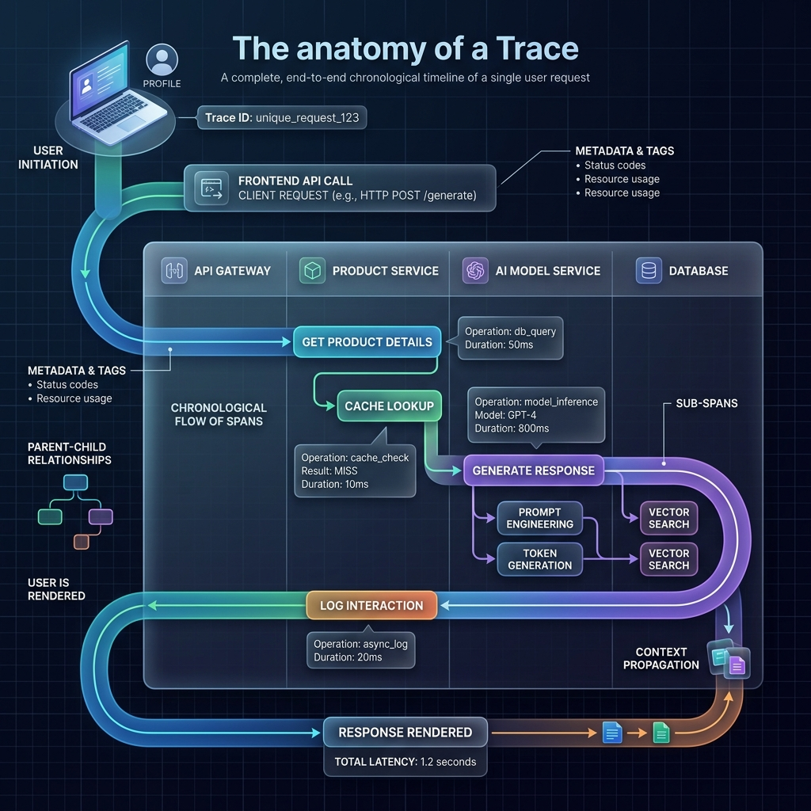

<!-- tags: glossary, agentic-ai, evaluation-observability -->
# Trace

> The complete, end-to-end recorded journey of a single user request as it bounces through an AI system.

| Aspect | Detail |
| --- | --- |
| **Domain** | Evaluation & Observability |
| **Used by** | Software engineer, DevOps |
| **Related** | See RECOMMEND section |

📅 Created: 2026-04-28 · 🔄 Updated: 2026-05-13 · ⏱️ 5 min read

---

## 1. DEFINE

A **Trace** is a comprehensive observability record that captures the entire lifecycle of a request as it flows through a distributed AI or agentic architecture. In an agentic system, a single user prompt might trigger a chain reaction: an LLM call, a database search, a Python script execution, and a final LLM summary. The Trace acts as the central binder, linking all these individual steps (spans) together chronologically so developers can debug exactly what happened.

---

## 2. CONTEXT

**Who uses it**: Software Engineers and DevOps teams.
**When**: Debugging a complex agent loop. If a user complains, "The AI gave me the wrong answer and took 20 seconds," you look up the trace for that specific interaction to find the root cause.
**Why it matters**: Agentic systems are non-linear and highly autonomous. Without tracing, an agent's internal thought process is a black box. Tracing visualizes the execution graph, showing exactly which tool was called, what data it returned, and which step caused the 15-second bottleneck.

---

## 3. EXAMPLES

### Example 1: The Agent Execution Graph

A user asks: "What is the weather in Tokyo?"
The observability platform records a single **Trace** with the ID `req-99x`. Inside this trace:
- *Span 1 (0ms)*: User prompt received.
- *Span 2 (50ms)*: LLM analyzes intent -> decides to use WeatherTool.
- *Span 3 (1200ms)*: WeatherTool API call executes (Returns: "Rainy, 15C").
- *Span 4 (500ms)*: LLM generates final response: "It's rainy in Tokyo."
- *Span 5 (10ms)*: Response sent to user.
The developer can view this entire timeline in a UI like LangSmith or DataDog.

---

## 4. COMPARE

| Feature | Trace | Span |
|---|---|---|
| **Scope** | The entire end-to-end request (The whole journey) | A single operation within the request (One step) |
| **Structure** | A collection of spans | A single node |
| **Use Case** | Understanding the holistic flow and overall latency | Debugging a specific failing tool or slow database query |

---

## 5. REF

| Resource | Type | Link | Note |
| --- | --- | --- | --- |
| OpenTelemetry | Standard | https://opentelemetry.io/ | The industry standard protocol for distributed tracing |
| LangSmith Tracing | Tool | https://docs.smith.langchain.com/ | Visualizing traces specifically for LLM applications |

---

## 6. RECOMMEND

| Explore next | When | Why | File/Link |
| --- | --- | --- | --- |
| Span | You want to understand the building blocks | A Trace is just a collection of Spans | [Span](./115-span.md) |
| LLM Observability | You want the big picture | Tracing is the core pillar of Observability | [LLM Observability](./119-llm-observability.md) |

**Links**: [← Previous](./113-benchmark.md) · [→ Next](./115-span.md)
