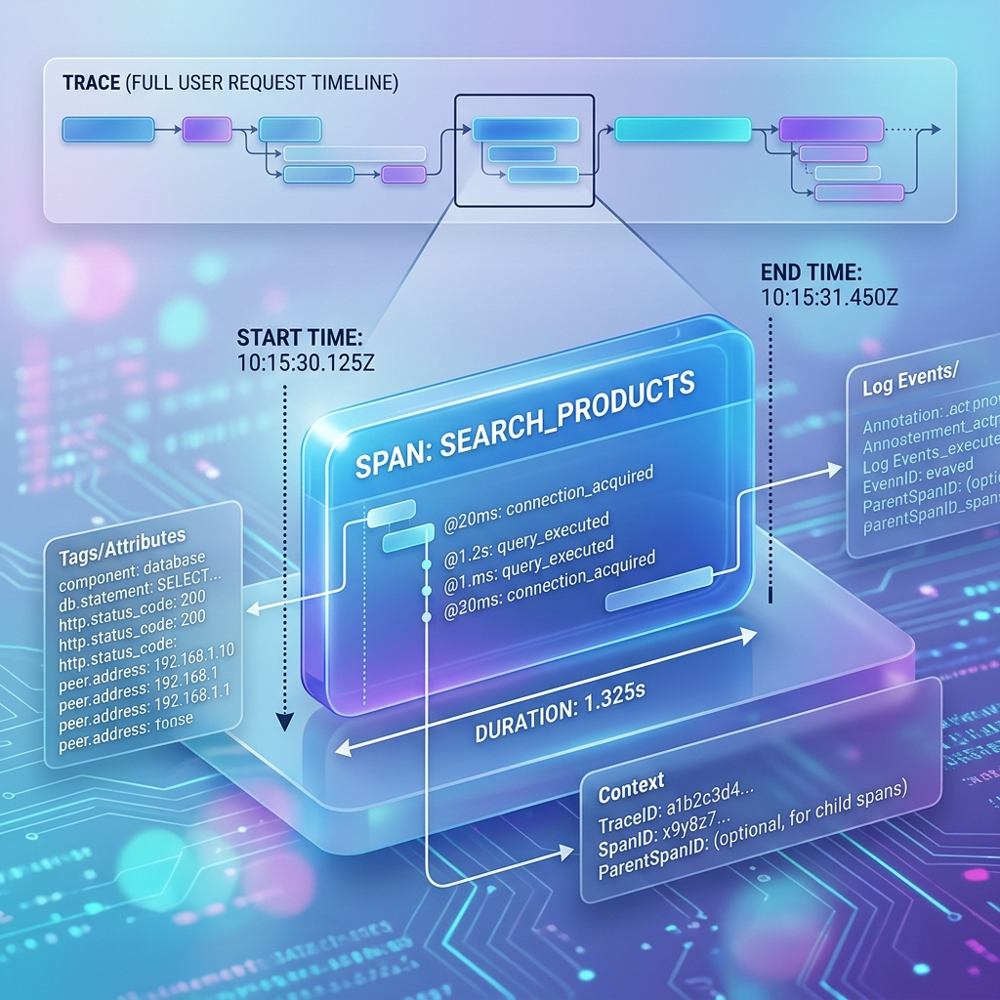

<!-- tags: glossary, agentic-ai, evaluation-observability -->
# Span

> A single, specific step or operation within a larger AI workflow.

| Aspect | Detail |
| --- | --- |
| **Domain** | Evaluation & Observability |
| **Used by** | Software engineer, backend developer |
| **Related** | See RECOMMEND section |

📅 Created: 2026-04-28 · 🔄 Updated: 2026-05-13 · ⏱️ 5 min read

---

## 1. DEFINE

A **Span** is the fundamental building block of a Trace in distributed observability. It represents a single, distinct unit of work or operation within a larger system request. In an LLM application, a span might represent the exact duration of a single call to the OpenAI API, the time taken to run a SQL query, or the execution of a specific Python tool. Every span records a start time, an end time, and metadata (like the prompt used, tokens consumed, or errors thrown).

---

## 2. CONTEXT

**Who uses it**: Software Engineers optimizing performance.
**When**: Drilling down into a slow Trace to figure out exactly which component is causing the bottleneck.
**Why it matters**: Knowing an agent took 10 seconds to reply (the Trace) isn't actionable. Knowing that 8 seconds of that time was spent inside the `SearchDatabase` Span tells the engineer exactly what code they need to optimize.

---

## 3. EXAMPLES

### Example 1: The Bottleneck Span

A developer looks at a Trace for a failed agent task. They see a tree of **Spans**:
- `Root Span: agent.run()` [Duration: 4.2s]
  - `Span 1: generate_search_query()` [Duration: 0.5s] -> Success
  - `Span 2: execute_search_tool()` [Duration: 3.7s] -> Failed
    - `Span 2a: parse_results()` [Duration: 0.0s] -> Never ran

By clicking into `Span 2`, the developer sees the exact metadata: `Error 504: Gateway Timeout from Google Search API`. They instantly know the external API caused the agent to fail.

---

## 4. COMPARE

| Feature | Span | Log |
|---|---|---|
| **Structure** | Has a definite start and end time (duration) | A single point-in-time event |
| **Context** | Hierarchical (Spans have Parent Spans) | Flat text |
| **Visualization** | Rendered as a Gantt chart or waterfall timeline | Rendered as a list of text lines |

---

## 5. REF

| Resource | Type | Link | Note |
| --- | --- | --- | --- |
| OpenTelemetry Spans | Docs | https://opentelemetry.io/docs/concepts/signals/traces/#spans | Technical definition of spans |
| Arize Phoenix | Tool | https://phoenix.arize.com/ | Open-source tool for visualizing spans and traces in LLM apps |

---

## 6. RECOMMEND

| Explore next | When | Why | File/Link |
| --- | --- | --- | --- |
| Trace | You want to see how spans connect | A Trace is the parent container that holds all the Spans | [Trace](./114-trace.md) |
| Latency Budget | You are trying to optimize spans | Spans are how you measure if you are hitting your latency budget | [Latency Budget](./117-latency-budget.md) |

**Links**: [← Previous](./114-trace.md) · [→ Next](./116-prompt-versioning.md)
