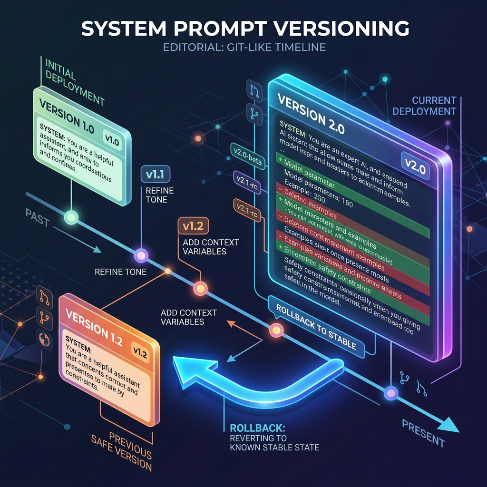

<!-- tags: glossary, agentic-ai, evaluation-observability -->
# Prompt Versioning

> Tracking changes to your prompts exactly like you track changes to your code.

| Aspect | Detail |
| --- | --- |
| **Domain** | Evaluation & Observability |
| **Used by** | Prompt engineer, AI architect |
| **Related** | See RECOMMEND section |

📅 Created: 2026-04-28 · 🔄 Updated: 2026-05-13 · ⏱️ 5 min read

---

## 1. DEFINE

**Prompt Versioning** is the practice of treating LLM prompts as immutable, version-controlled artifacts rather than hardcoded strings. Instead of editing a prompt directly in the codebase, prompts are managed in a CMS or registry (e.g., `system_prompt_v1.2.3`). This allows teams to A/B test different versions, instantly roll back if a new prompt degrades performance, and definitively link observability traces to the exact prompt version that was active at the time.

---

## 2. CONTEXT

**Who uses it**: Prompt Engineers and AI Architects.
**When**: Managing production applications where prompts are frequently tweaked to improve accuracy or reduce token usage.
**Why it matters**: A change of just three words in a prompt can completely alter the behavior of an agent. If prompts are just variables in code, tracking exactly *which* prompt caused a spike in user complaints is nearly impossible. Versioning makes prompt engineering an engineering discipline.

---

## 3. EXAMPLES

### Example 1: The Rollback

1. The marketing team updates the chatbot prompt to `v2.0` to be "more enthusiastic."
2. The observability platform detects that `v2.0` is causing a 40% increase in hallucinations (the agent is getting *too* enthusiastic).
3. The AI Architect logs into the Prompt Registry.
4. With one click, they revert the active prompt from `v2.0` back to `v1.9`.
5. The application instantly begins using `v1.9` on the next API call without needing a full code redeploy.

---

## 4. COMPARE

| Feature | Prompt Versioning | Git Versioning |
|---|---|---|
| **Asset** | Prompts, Few-shot examples, Model parameters | Source code |
| **Deployment** | Often dynamic (fetched at runtime) | Static (requires a build pipeline) |
| **Metrics** | Tied directly to Evals and Traces | Tied to CI/CD pass/fail |

---

## 5. REF

| Resource | Type | Link | Note |
| --- | --- | --- | --- |
| LangChain Hub | Tool | https://smith.langchain.com/hub | A popular registry for managing and versioning prompts |
| Prompt Engineering Guide | Guide | https://www.promptingguide.ai/ | Best practices for treating prompts as code |

---

## 6. RECOMMEND

| Explore next | When | Why | File/Link |
| --- | --- | --- | --- |
| Regression Testing | You update a prompt version | You must run regression tests before deploying a new version | [Regression Testing](./120-regression-testing-for-ai.md) |
| Evals | You want to score a prompt version | Evals tell you if v2 is better than v1 | [Evals](./111-evals.md) |

**Links**: [← Previous](./115-span.md) · [→ Next](./117-latency-budget.md)
