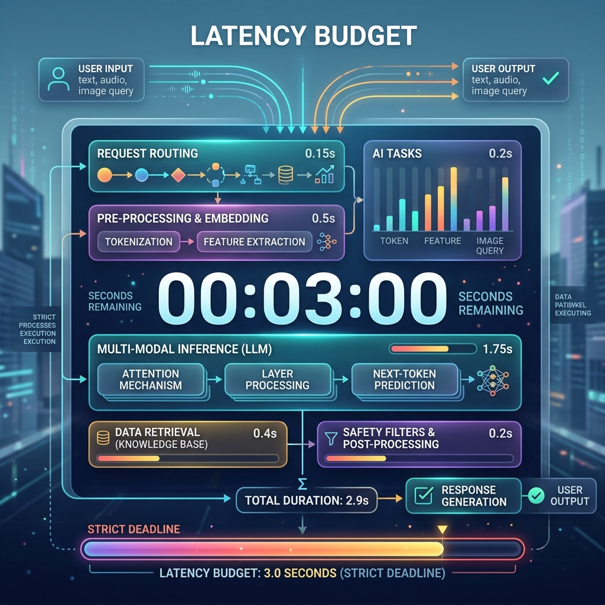

<!-- tags: glossary, agentic-ai, evaluation-observability -->
# Latency Budget

> The strict time limit an AI agent has to finish thinking and respond before the user gets bored and leaves.

| Aspect | Detail |
| --- | --- |
| **Domain** | Evaluation & Observability |
| **Used by** | Systems architect, UX designer |
| **Related** | See RECOMMEND section |

📅 Created: 2026-04-28 · 🔄 Updated: 2026-05-13 · ⏱️ 5 min read

---

## 1. DEFINE

A **Latency Budget** is an SLA (Service Level Agreement) defining the maximum acceptable time an AI system is allowed to take before delivering a response to the user. Because agentic workflows involve multiple sequential LLM calls, tool executions, and database queries, latency compounding is a major issue. The budget forces architects to carefully apportion time to different spans (e.g., 500ms for retrieval, 2000ms for generation) to ensure the total user wait time remains acceptable.

---

## 2. CONTEXT

**Who uses it**: Systems Architects and UX Designers.
**When**: Designing the user experience and architectural constraints of a multi-agent system.
**Why it matters**: Traditional APIs return in <100ms. LLMs can take 10 seconds. If an agent loop requires 5 steps, the user might be waiting 50 seconds. A latency budget forces developers to optimize (e.g., using smaller, faster models for routing, running tools in parallel, or streaming partial results).

---

## 3. EXAMPLES

### Example 1: Apportioning the Budget

The UX team mandates a **3.0 second Latency Budget** for a search feature.
The AI Architect designs the system:
- Input Guard check: 200ms
- Vector DB Retrieval: 300ms
- LLM Generation (Fast Model): 2,000ms
- Output Parsing: 100ms
- **Total Projected Latency**: 2.6 seconds.
Because 2.6s < 3.0s, the design passes the budget. If the architect wanted to use GPT-4 (which takes 6 seconds), it would blow the budget, forcing them to use a faster model.

---

## 4. COMPARE

| Feature | Latency Budget | Token Budget |
|---|---|---|
| **Constraint** | Time (Milliseconds/Seconds) | Context size (Tokens) |
| **Impact** | User Experience (Boredom/Abandonment) | Cost and Model Limits (API errors) |
| **Optimization** | Parallelization, Smaller Models, Streaming | Summarization, Truncation, RAG |

---

## 5. REF

| Resource | Type | Link | Note |
| --- | --- | --- | --- |
| Time to First Token (TTFT) | Metric | https://www.databricks.com/glossary/time-to-first-token | The most critical metric for perceived latency |
| LLM Performance Optimization | Guide | https://developer.nvidia.com/blog/mastering-llm-techniques-inference-optimization/ | How to speed up LLMs to meet latency budgets |

---

## 6. RECOMMEND

| Explore next | When | Why | File/Link |
| --- | --- | --- | --- |
| Token Budget | You are optimizing costs | Token budgets and latency budgets are the twin constraints of AI | [Token Budget](./118-token-budget.md) |
| Span | You need to find what's slow | Spans show exactly where the latency budget was blown | [Span](./115-span.md) |

**Links**: [← Previous](./116-prompt-versioning.md) · [→ Next](./118-token-budget.md)
