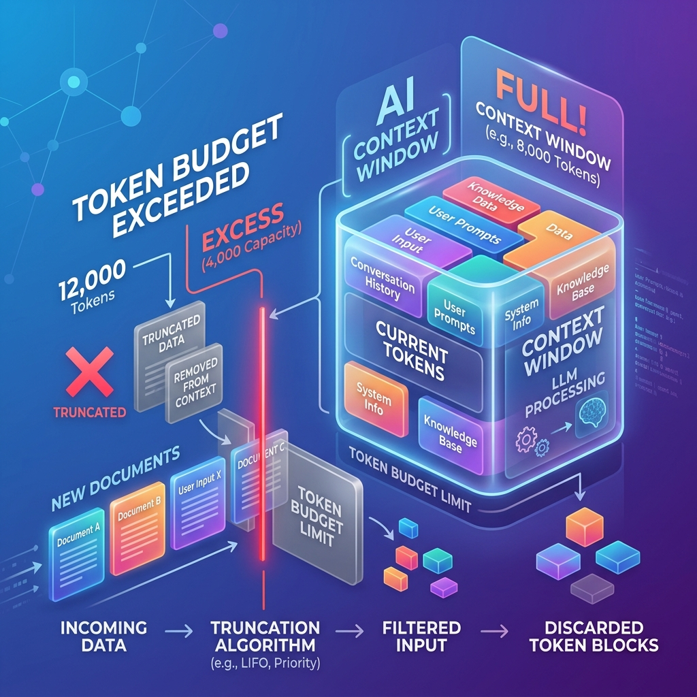

<!-- tags: glossary, agentic-ai, evaluation-observability -->
# Token Budget

> The strict limit on how many words (tokens) an AI can consume or generate in a single turn to avoid breaking the bank or the context window.

| Aspect | Detail |
| --- | --- |
| **Domain** | Evaluation & Observability |
| **Used by** | FinOps, AI architect |
| **Related** | See RECOMMEND section |

📅 Created: 2026-04-28 · 🔄 Updated: 2026-05-13 · ⏱️ 5 min read

---

## 1. DEFINE

A **Token Budget** is a predefined constraint on the maximum number of input and output tokens allowed per interaction, session, or user. It serves two purposes: Technical (ensuring the prompt does not exceed the model's hard context window limit) and Financial (ensuring the cost of API calls does not exceed the unit economics of the product).

---

## 2. CONTEXT

**Who uses it**: FinOps (Financial Operations) and AI Architects.
**When**: Designing RAG pipelines (deciding how many documents to retrieve) and managing user subscriptions.
**Why it matters**: LLMs charge per token. An agent loop might make 10 API calls, pulling in 5,000 tokens of context each time. If 1,000 users do this daily, the API bill will skyrocket. A token budget enforces hard stops (e.g., "Max 2,000 input tokens per RAG query") to ensure profitability.

---

## 3. EXAMPLES

### Example 1: The RAG Truncator

An architect sets an Input **Token Budget** of 4,000 tokens per prompt to keep costs under $0.01 per query.
1. The user asks a question.
2. The RAG system finds 10 relevant documents, totaling 6,000 tokens.
3. The system checks the Token Budget (4,000).
4. Instead of sending all 10 documents, the system takes the top 5 highest-ranked documents (totaling 3,500 tokens) and truncates the rest.
5. The prompt successfully executes under budget.

---

## 4. COMPARE

| Feature | Token Budget | Latency Budget |
|---|---|---|
| **Constraint** | Volume of text (Input/Output) | Execution Time |
| **Impacts** | Direct financial cost, Context limits | User experience, System throughput |
| **Managed By** | Context Summarization, Top-K Filtering | Caching, Parallelization, Streaming |

---

## 5. REF

| Resource | Type | Link | Note |
| --- | --- | --- | --- |
| OpenAI Pricing | Reference | https://openai.com/pricing | Understanding why token budgeting is financially necessary |
| Context Window Management | Concept | https://learn.microsoft.com/en-us/azure/ai-services/openai/how-to/manage-context | Azure's guide on managing token limits |

---

## 6. RECOMMEND

| Explore next | When | Why | File/Link |
| --- | --- | --- | --- |
| Memory Compression | You hit your token budget | Compression shrinks history to fit the budget | [Memory Compression](../memory-systems/100-memory-compression.md) |
| Latency Budget | You are optimizing the system | Token size directly impacts latency | [Latency Budget](./117-latency-budget.md) |

**Links**: [← Previous](./117-latency-budget.md) · [→ Next](./119-llm-observability.md)
