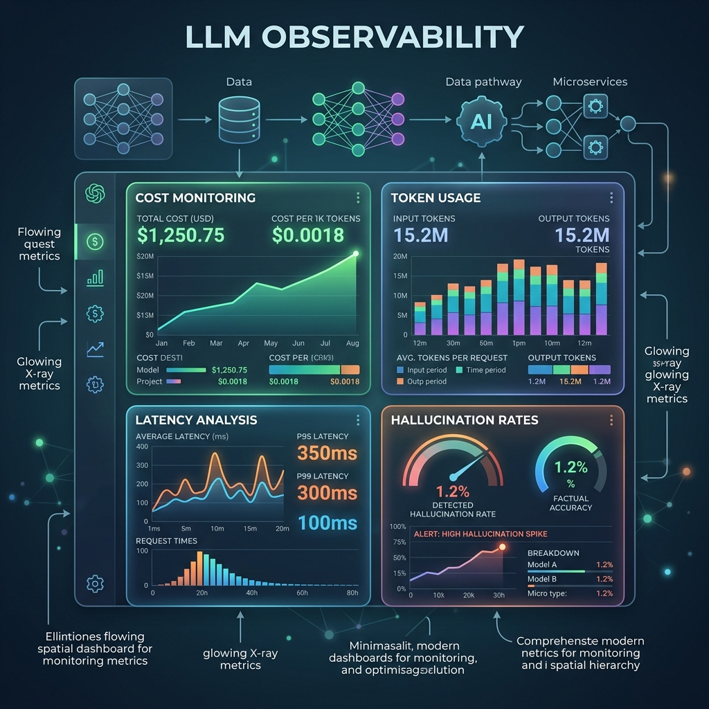

<!-- tags: glossary, agentic-ai, evaluation-observability -->
# LLM Observability

> The "X-ray vision" that lets you see exactly what the AI is thinking, how much it costs, and why it failed in production.

| Aspect | Detail |
| --- | --- |
| **Domain** | Evaluation & Observability |
| **Used by** | DevOps, platform engineer |
| **Related** | See RECOMMEND section |

📅 Created: 2026-04-28 · 🔄 Updated: 2026-05-13 · ⏱️ 5 min read

---

## 1. DEFINE

**LLM Observability** is the specialized discipline of monitoring, tracing, and logging AI applications in production. Unlike traditional observability (which tracks CPU, memory, and HTTP errors), LLM observability tracks AI-specific metrics: prompt tokens, completion tokens, latency (Time to First Token), hallucination rates, tool execution success, and the actual raw text of the inputs and outputs across complex agentic chains.

---

## 2. CONTEXT

**Who uses it**: DevOps, Platform Engineers, and AI Product Managers.
**When**: Moving an AI agent out of the local Jupyter notebook and into a live, user-facing production environment.
**Why it matters**: When an agent fails in production, it doesn't usually throw a clean `NullReferenceException`. Instead, it confidently hallucinates the wrong answer. Without LLM observability, you have no way to reproduce the error or understand which step in the agent's thought process went off the rails.

---

## 3. EXAMPLES

### Example 1: The Production Dashboard

A Platform Engineer opens their LangSmith observability dashboard. They see:
- **Total Cost**: $45.20 today.
- **P99 Latency**: 4.2 seconds.
- **Error Rate**: 2% (Mostly caused by the `GoogleCalendarTool` failing).
- **User Feedback**: 85% Thumbs Up.
They filter the dashboard to only show sessions where the user clicked "Thumbs Down." They instantly see the exact traces and prompts that led to the bad user experience, allowing them to fix the underlying prompt.

---

## 4. COMPARE

| Feature | LLM Observability | Traditional Observability (e.g., Datadog) |
|---|---|---|
| **Core Metrics** | Tokens, Cost, Generation Quality, TTFT | CPU usage, Memory, Disk IO, HTTP 500s |
| **Payload Tracking** | Must capture exact strings (Prompts/Responses) | Usually anonymizes or drops payload data |
| **Debugging Method** | Tracing the semantic logic and agent routing | Tracing stack traces and network requests |

---

## 5. REF

| Resource | Type | Link | Note |
| --- | --- | --- | --- |
| LangSmith | Platform | https://smith.langchain.com/ | The industry leader for LLM observability |
| Datadog LLM Observability | Platform | https://www.datadoghq.com/product/llm-observability/ | Enterprise observability adapting to AI |

---

## 6. RECOMMEND

| Explore next | When | Why | File/Link |
| --- | --- | --- | --- |
| Trace | You are looking at an observability dashboard | Traces are the core view inside an observability platform | [Trace](./114-trace.md) |
| Regression Testing | You fix a bug found via observability | After finding the bug, you write a test so it doesn't happen again | [Regression Testing](./120-regression-testing-for-ai.md) |

**Links**: [← Previous](./118-token-budget.md) · [→ Next](./120-regression-testing-for-ai.md)
