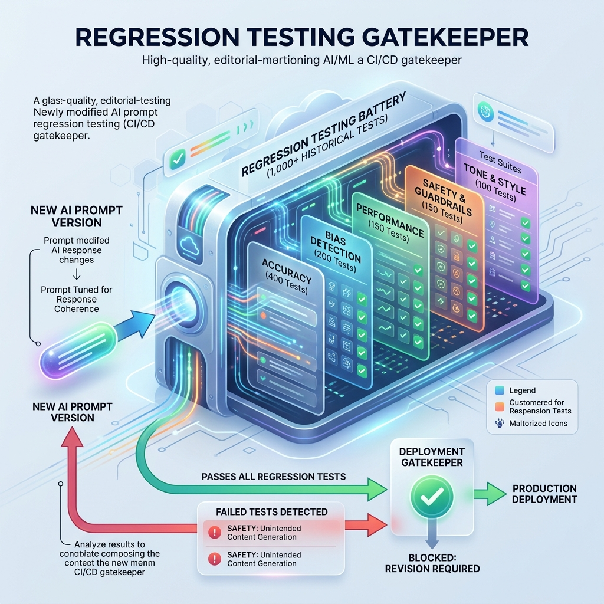

<!-- tags: glossary, agentic-ai, evaluation-observability -->
# Regression Testing (for AI)

> Running a massive test suite every time you change a prompt to ensure the AI didn't suddenly forget how to do things it used to be good at.

| Aspect | Detail |
| --- | --- |
| **Domain** | Evaluation & Observability |
| **Used by** | QA engineer, ML ops |
| **Related** | See RECOMMEND section |

📅 Created: 2026-04-28 · 🔄 Updated: 2026-05-13 · ⏱️ 5 min read

---

## 1. DEFINE

**Regression Testing for AI** is the automated process of re-evaluating an agentic system against a historical baseline dataset whenever a change is made (e.g., updating a system prompt, swapping from GPT-4 to Claude 3.5, or adding a new tool). Its purpose is to detect "regressions"—instances where the new version performs worse on established tasks than the older version.

---

## 2. CONTEXT

**Who uses it**: QA Engineers and ML Ops teams.
**When**: Integrated into the CI/CD pipeline, executing automatically on every Pull Request that touches agent logic or prompts.
**Why it matters**: LLMs are highly sensitive. A developer might tweak a prompt to fix a specific bug regarding refund policies. However, that tweak might accidentally cause the model to become overly aggressive when answering billing questions. Regression testing catches this unintended side-effect before it hits production.

---

## 3. EXAMPLES

### Example 1: The CI/CD Gatekeeper

1. Developer changes the agent's prompt to be "more concise."
2. The PR triggers a **Regression Test**.
3. The test suite runs the new prompt against 1,000 historical user queries.
4. The new prompt is indeed more concise, but the Evals show that its "Factual Accuracy" score dropped from 95% to 80% because it started skipping important details.
5. The Regression Test fails, blocking the PR from being merged. The developer must refine the prompt.

---

## 4. COMPARE

| Feature | AI Regression Testing | AI Evals |
|---|---|---|
| **Focus** | Comparing *New Version* vs *Old Version* | Scoring a *Single Version* against a rubric |
| **Goal** | Catching unintended degradation | Measuring absolute capability |
| **Execution** | Automated in CI/CD pipelines | Can be manual, automated, or continuous |

---

## 5. REF

| Resource | Type | Link | Note |
| --- | --- | --- | --- |
| Continuous Integration | Concept | https://en.wikipedia.org/wiki/Continuous_integration | The DevOps concept applying this testing |
| Promptfoo | Tool | https://www.promptfoo.dev/ | Open-source CLI for testing and evaluating LLM output quality |

---

## 6. RECOMMEND

| Explore next | When | Why | File/Link |
| --- | --- | --- | --- |
| Prompt Versioning | You are running regression tests | You test Version A against Version B | [Prompt Versioning](./116-prompt-versioning.md) |
| LLM-as-Judge | You need a way to grade the test | Regression tests usually use LLM-as-Judge to score the output | [LLM-as-Judge](./112-llm-as-judge.md) |

**Links**: [← Previous](./119-llm-observability.md) · [→ Next](../safety-alignment/README.md)
