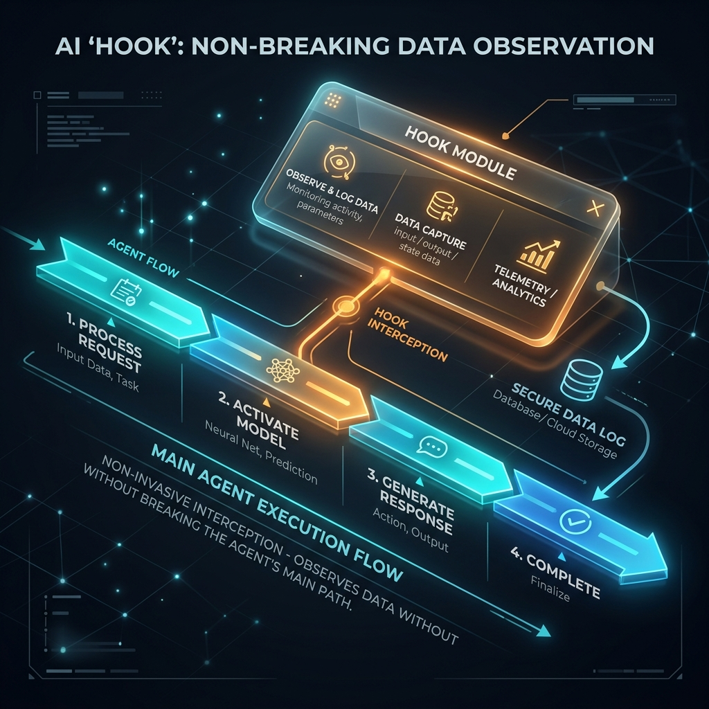

<!-- tags: glossary, agentic-ai, hooks-middleware -->
# Hook

> A designated point in an AI's workflow where you can inject custom code to modify or monitor what's happening.

| Aspect | Detail |
| --- | --- |
| **Domain** | Hooks & Middleware |
| **Used by** | Backend developer, platform engineer |
| **Related** | See RECOMMEND section |

📅 Created: 2026-04-28 · 🔄 Updated: 2026-05-13 · ⏱️ 5 min read

---

## 1. DEFINE

A **Hook** is a specialized interception point within an agentic execution lifecycle (e.g., before sending a prompt, after receiving a response, or during tool execution). It allows developers to register custom callback functions that execute synchronously at that exact moment. Hooks are the primary mechanism for adding observability, telemetry, and dynamic state modifications without altering the core agent orchestration code.

---

## 2. CONTEXT

**Who uses it**: Backend Developers and Platform Engineers.
**When**: Integrating an off-the-shelf AI framework (like LangChain or LlamaIndex) into a highly customized enterprise backend where specific logging or validation is required.
**Why it matters**: You rarely want to rewrite the core loop of an agent framework. Hooks provide a clean, decoupled architecture. If you want to track API costs, you simply attach a hook to the `on_llm_end` event rather than hacking the API call itself.

---

## 3. EXAMPLES

### Example 1: The Logging Hook

A developer wants to log exactly how many tokens an agent is using per step.
1. They define a custom hook: `function log_tokens(payload) { DB.insert(payload.token_count) }`
2. They attach this hook to the agent: `agent.add_hook('after_llm_call', log_tokens)`
3. Now, every time the LLM generates a response, the agent automatically pauses, runs the hook (saving the token count to the database), and then resumes its work.

---

## 4. COMPARE

| Feature | Hook | Middleware |
|---|---|---|
| **Primary Function** | Reacting to events (Logging, Telemetry) | Modifying data in transit (Filtering, Enrichment) |
| **Execution Flow** | Often passive observer | Active participant (can block or change the request) |
| **Location** | Attached to specific lifecycle events | Wraps the entire request/response pipeline |

---

## 5. REF

| Resource | Type | Link | Note |
| --- | --- | --- | --- |
| LangChain Callbacks | Framework Docs | https://python.langchain.com/docs/modules/callbacks/ | How LangChain implements hooks for logging and tracing |
| Webhooks | Concept | https://en.wikipedia.org/wiki/Webhook | The broader software engineering concept of event-driven hooks |

---

## 6. RECOMMEND

| Explore next | When | Why | File/Link |
| --- | --- | --- | --- |
| Pre-Hook | You want to execute code *before* the LLM runs | Pre-hooks are specific hooks triggered before execution | [Pre-Hook](./76-pre-hook.md) |
| Post-Hook | You want to execute code *after* the LLM runs | Post-hooks handle the output | [Post-Hook](./77-post-hook.md) |

**Links**: [← Previous](../prompt-engineering/README.md) · [→ Next](./76-pre-hook.md)
