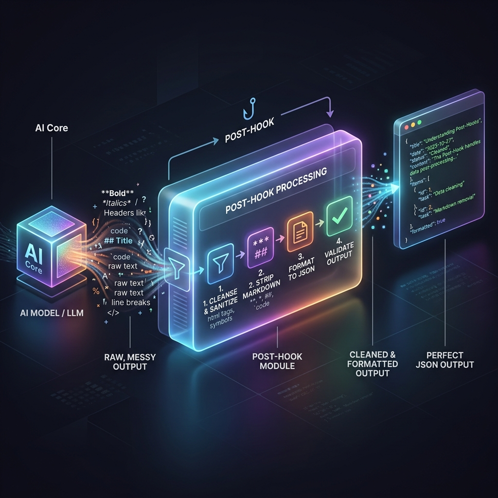

<!-- tags: glossary, agentic-ai, hooks-middleware -->
# Post-Hook

> Custom code that runs immediately *after* the LLM generates a response, used for formatting or logging.

| Aspect | Detail |
| --- | --- |
| **Domain** | Hooks & Middleware |
| **Used by** | Backend developer, data engineer |
| **Related** | See RECOMMEND section |

📅 Created: 2026-04-28 · 🔄 Updated: 2026-05-13 · ⏱️ 5 min read

---

## 1. DEFINE

A **Post-Hook** is a lifecycle hook that triggers immediately after an AI model returns its generated output or after a tool finishes its execution, but before that output is sent back to the user or the next agent in the chain. It is used primarily to parse raw text into structured formats (like JSON), log telemetry data (like latency and cost), or strip out unwanted formatting artifacts.

---

## 2. CONTEXT

**Who uses it**: Backend Developers and Data Engineers.
**When**: Cleaning up messy LLM outputs, enforcing schema compliance, or recording transaction metrics into an observability platform.
**Why it matters**: LLMs often add conversational filler (e.g., "Here is the JSON you requested: ..."). A post-hook is essential for catching this output, stripping the conversational text via regex, and passing only the clean, parsable data back to the application layer.

---

## 3. EXAMPLES

### Example 1: The Markdown Stripper



1. The LLM generates a response: "```json\n{\"status\": \"ok\"}\n```"
2. If this is sent directly to the frontend's JSON parser, it will crash because of the markdown backticks.
3. The **Post-Hook** `clean_json_output()` intercepts the raw response.
4. It strips the backticks and the "json" keyword.
5. The clean string `{"status": "ok"}` is successfully passed to the application.

---

## 4. COMPARE

| Feature | Post-Hook | Output Parser |
|---|---|---|
| **Scope** | Broad (can do logging, cleaning, alerting) | Narrow (only extracts and formats data) |
| **Function** | A point in the lifecycle to run any code | A specific utility often executed *inside* a post-hook |

---

## 5. REF

| Resource | Type | Link | Note |
| --- | --- | --- | --- |
| Callbacks (Programming) | Concept | https://en.wikipedia.org/wiki/Callback_(computer_programming) | The foundation of post-hooks |
| LLM Observability | Guide | https://docs.smith.langchain.com/ | Tracing latency via post-hooks |

---

## 6. RECOMMEND

| Explore next | When | Why | File/Link |
| --- | --- | --- | --- |
| Output Parser | You specifically need to extract data | Output Parsers are usually executed within Post-Hooks | [Output Parser](./83-output-parser.md) |
| Hook | You want to understand the base concept | Post-hooks are a specific implementation of a Hook | [Hook](./75-hook.md) |

**Links**: [← Previous](./76-pre-hook.md) · [→ Next](./78-middleware.md)
