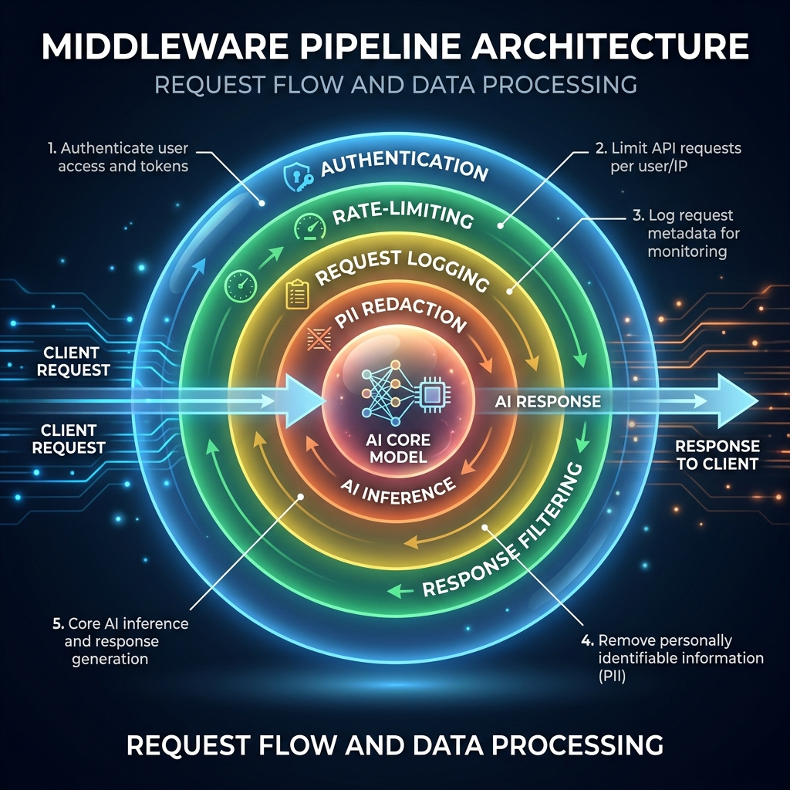

<!-- tags: glossary, agentic-ai, hooks-middleware -->
# Middleware

> A chain of filters and modifiers that the request passes through before reaching the AI, and the response passes through on the way back.

| Aspect | Detail |
| --- | --- |
| **Domain** | Hooks & Middleware |
| **Used by** | Backend developer, systems architect |
| **Related** | See RECOMMEND section |

📅 Created: 2026-04-28 · 🔄 Updated: 2026-05-13 · ⏱️ 5 min read

---

## 1. DEFINE

**Middleware** in an AI context is a sequence of processing layers that wrap the core LLM execution. Unlike standalone hooks, middleware functions operate like a pipeline or an "onion." A request passes through each layer of the middleware (for validation, enrichment, routing) on its way to the model, and the response passes back out through the same layers in reverse order (for redaction, formatting, logging).

---

## 2. CONTEXT

**Who uses it**: Systems Architects and Backend Developers.
**When**: Building enterprise-grade APIs where global rules (like authentication, rate limiting, and PII redaction) must be applied to every single AI interaction automatically.
**Why it matters**: Middleware centralizes logic. Instead of writing PII detection inside every single agent's code, you write it once in the middleware pipeline. Every request is automatically scrubbed, ensuring system-wide compliance without code duplication.

---

## 3. EXAMPLES

### Example 1: The Enterprise Pipeline

A user sends a prompt: "Analyze my portfolio: [Account 123]."
1. **Auth Middleware**: Checks the user's API key. (Pass)
2. **Rate Limit Middleware**: Checks if they exceed 50 requests/min. (Pass)
3. **PII Middleware**: Redacts `[Account 123]` to `[REDACTED]`. (Pass)
4. **LLM**: Analyzes the portfolio.
5. **PII Middleware (Reverse)**: Re-hydrates `[REDACTED]` back to `[Account 123]`.
6. **Logging Middleware**: Records the transaction latency.
7. Final response sent to user.

---

## 4. COMPARE

| Feature | Middleware | Hooks |
|---|---|---|
| **Architecture** | Pipeline / Onion model (wraps the request) | Event-driven (fires at specific moments) |
| **Data Modification** | Can easily mutate the request/response payload | Often read-only (used for telemetry) |
| **Coupling** | High (forms the backbone of the API) | Low (easily attached/detached) |

---

## 5. REF

| Resource | Type | Link | Note |
| --- | --- | --- | --- |
| Express.js Middleware | Framework | https://expressjs.com/en/guide/using-middleware.html | The classic backend concept applied to AI APIs |
| LiteLLM Routing | Tool | https://github.com/BerriAI/litellm | An AI proxy that acts as routing middleware |

---

## 6. RECOMMEND

| Explore next | When | Why | File/Link |
| --- | --- | --- | --- |
| Interceptor | You need to block a request entirely | Interceptors are a specific aggressive type of middleware | [Interceptor](./79-interceptor.md) |
| Safety Layer | You are building security middleware | A Safety Layer is just a specific configuration of Middleware | [Safety Layer](../safety-alignment/124-safety-layer.md) |

**Links**: [← Previous](./77-post-hook.md) · [→ Next](./79-interceptor.md)
