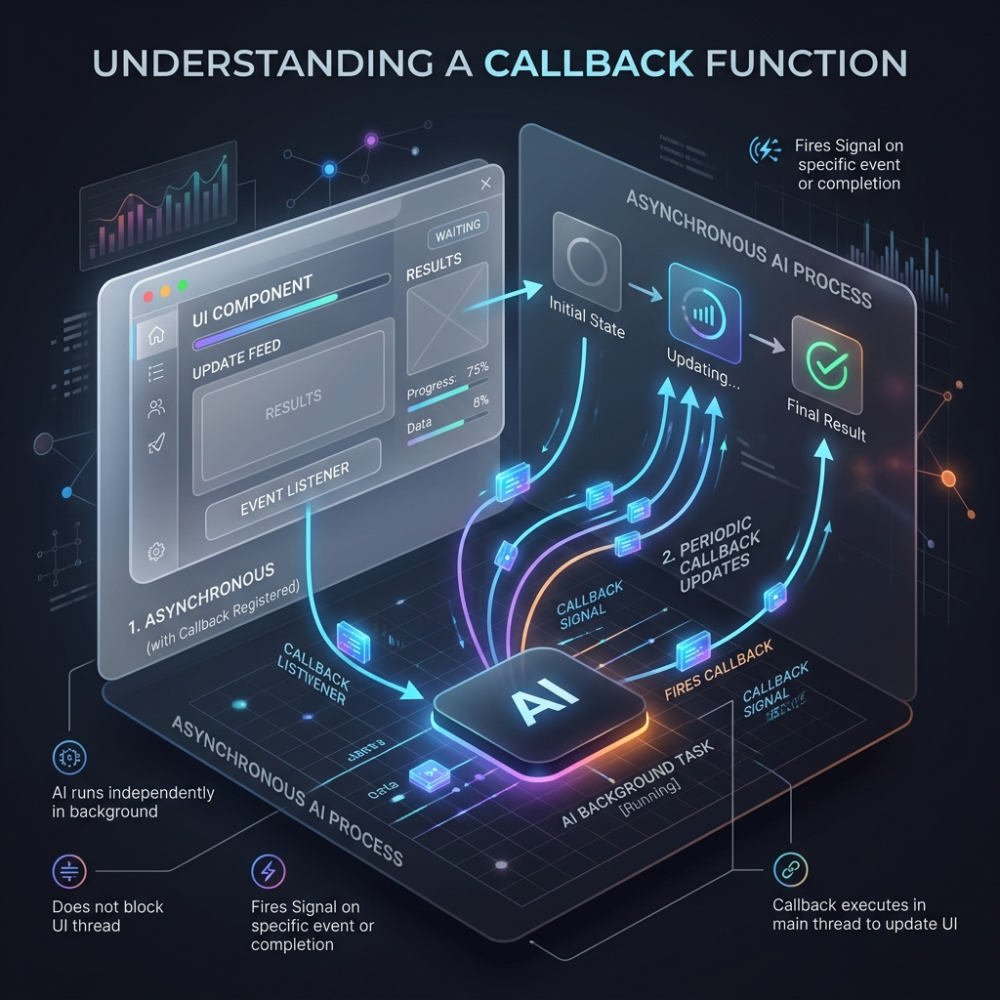

<!-- tags: glossary, agentic-ai, hooks-middleware -->
# Callback

> A function you pass into an AI system that gets "called back" when a specific event happens asynchronously.

| Aspect | Detail |
| --- | --- |
| **Domain** | Hooks & Middleware |
| **Used by** | Backend developer |
| **Related** | See RECOMMEND section |

📅 Created: 2026-04-28 · 🔄 Updated: 2026-05-13 · ⏱️ 5 min read

---

## 1. DEFINE

A **Callback** is an asynchronous implementation of a hook. It is a function passed as an argument to an agentic process (like an LLM call or tool execution) with the expectation that the system will execute it ("call it back") when a specific lifecycle event occurs, such as a streaming token arriving, an error being thrown, or a process completing.

---

## 2. CONTEXT

**Who uses it**: Frontend and Backend Developers building streaming UIs.
**When**: Handling streaming responses from an LLM, where you want to update the UI on the frontend every time a new word is generated, rather than waiting for the entire paragraph to finish.
**Why it matters**: Without callbacks, the application thread would block while waiting for the LLM to finish its 10-second generation. Callbacks allow the main application to remain responsive while listening for updates in the background.

---

## 3. EXAMPLES

### Example 1: The Token Streaming Callback

1. The developer triggers an agent: `agent.run(prompt, on_new_token=update_ui)`
2. The agent starts processing. The main application thread is free.
3. The LLM generates the first word: "Hello".
4. The system fires the callback: `update_ui("Hello")`.
5. The LLM generates the second word: "World".
6. The system fires the callback: `update_ui("World")`.
7. The user sees the text typing out in real-time on their screen.

---

## 4. COMPARE

| Feature | Callback | Hook |
|---|---|---|
| **Execution Style** | Usually asynchronous / event-driven | Usually synchronous / sequential |
| **Primary Use Case** | Streaming, UI updates, async notifications | Telemetry, data modification, state changes |

---

## 5. REF

| Resource | Type | Link | Note |
| --- | --- | --- | --- |
| Callbacks (JS) | Concept | https://developer.mozilla.org/en-US/docs/Glossary/Callback_function | The core software engineering concept |
| LangChain Streaming | Guide | https://python.langchain.com/docs/modules/callbacks/ | Using callbacks to stream LLM outputs |

---

## 6. RECOMMEND

| Explore next | When | Why | File/Link |
| --- | --- | --- | --- |
| Event Listener | You have multiple things waiting for the callback | An Event Listener is a pub/sub version of a Callback | [Event Listener](./81-event-listener.md) |
| Hook | You want to understand synchronous interception | Hooks are the synchronous cousins of callbacks | [Hook](./75-hook.md) |

**Links**: [← Previous](./79-interceptor.md) · [→ Next](./81-event-listener.md)
