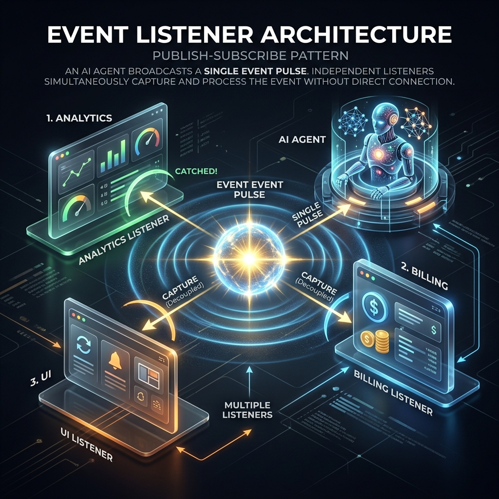

<!-- tags: glossary, agentic-ai, hooks-middleware -->
# Event Listener

> A system that sits quietly and waits for a specific signal (an event) to occur, and then triggers an action.

| Aspect | Detail |
| --- | --- |
| **Domain** | Hooks & Middleware |
| **Used by** | Systems architect, backend developer |
| **Related** | See RECOMMEND section |

📅 Created: 2026-04-28 · 🔄 Updated: 2026-05-13 · ⏱️ 5 min read

---

## 1. DEFINE

An **Event Listener** is a pattern where an external function subscribes to a specific event emitted by the AI system (e.g., `AgentStarted`, `ToolFailed`, `MemoryUpdated`). Unlike a direct callback, which is passed directly to the function, an event listener is part of a decoupled Publish/Subscribe (Pub/Sub) architecture. The agent emits the event into the void, and any registered listeners react to it independently.

---

## 2. CONTEXT

**Who uses it**: Systems Architects designing decoupled microservices.
**When**: Building complex systems where multiple disparate services need to know what the AI agent is doing without the agent needing to know about those services.
**Why it matters**: Direct callbacks tightly couple the agent to the UI or logging system. By using event listeners, you can have a billing service, an analytics service, and a UI service all "listening" to the same `TokenGenerated` event simultaneously without modifying the agent's code.

---

## 3. EXAMPLES

### Example 1: The Pub/Sub Analytics Pipeline

1. The AI agent finishes a task and broadcasts an event: `emit("TaskCompleted", metadata)`.
2. The agent moves on to the next task immediately.
3. Three different **Event Listeners** hear this broadcast:
   - **Listener A (Billing)** charges the user's account based on the metadata.
   - **Listener B (Analytics)** updates the corporate dashboard.
   - **Listener C (Notification)** sends an email to the user.
4. The agent is completely unaware that these three actions happened.

---

## 4. COMPARE

| Feature | Event Listener | Callback |
|---|---|---|
| **Architecture** | Publish/Subscribe (Decoupled) | Direct execution (Coupled) |
| **One-to-Many** | Multiple listeners can hear one event | Usually a 1:1 relationship |
| **System Overhead** | Requires an event bus or dispatcher | Lightweight, direct function call |

---

## 5. REF

| Resource | Type | Link | Note |
| --- | --- | --- | --- |
| Event-Driven Architecture | Concept | https://en.wikipedia.org/wiki/Event-driven_architecture | The overarching system design pattern |
| Node.js EventEmitter | Tool | https://nodejs.org/api/events.html | The standard event listener system in JavaScript |

---

## 6. RECOMMEND

| Explore next | When | Why | File/Link |
| --- | --- | --- | --- |
| Callback | You just need a simple 1:1 notification | Callbacks are simpler than setting up an event bus | [Callback](./80-callback.md) |
| Hook | You need to modify the data synchronously | Listeners are usually async; Hooks are sync | [Hook](./75-hook.md) |

**Links**: [← Previous](./80-callback.md) · [→ Next](./82-guardrail.md)
