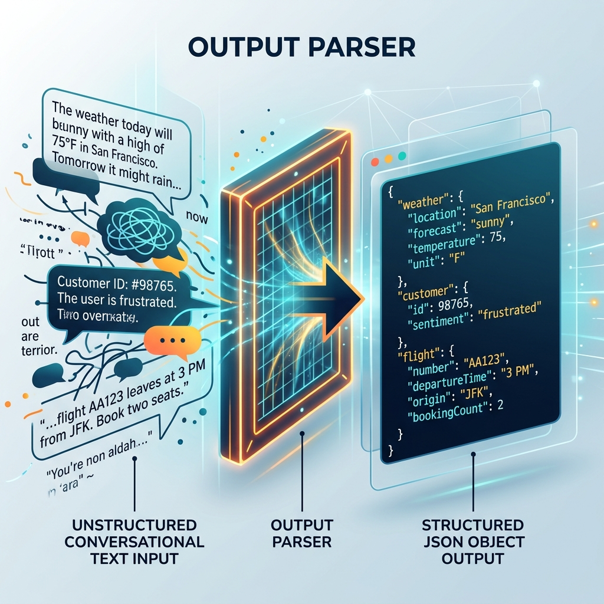

<!-- tags: glossary, agentic-ai, hooks-middleware -->
# Output Parser

> A post-hook tool that takes messy text generated by an AI and converts it into perfectly structured code (like JSON).

| Aspect | Detail |
| --- | --- |
| **Domain** | Hooks & Middleware |
| **Used by** | Backend developer, data engineer |
| **Related** | See RECOMMEND section |

📅 Created: 2026-04-28 · 🔄 Updated: 2026-05-13 · ⏱️ 5 min read

---

## 1. DEFINE

An **Output Parser** is a specialized post-hook utility designed to coerce the unstructured string output of a Language Model into a strict, machine-readable data structure (such as JSON, XML, or Pydantic models). If the LLM's output is slightly malformed (e.g., missing a trailing comma), a robust output parser will attempt to fix the error automatically or trigger a retry loop to ask the LLM to fix it.

---

## 2. CONTEXT

**Who uses it**: Backend Developers integrating AI into traditional software.
**When**: Whenever an AI agent needs to interact with a traditional API, database, or UI component that requires strict JSON payloads.
**Why it matters**: Traditional software cannot read conversational text. To build reliable agentic systems, the AI's "thoughts" must be perfectly translated into deterministic data structures. Output parsers bridge the gap between probabilistic AI generation and deterministic software execution.

---

## 3. EXAMPLES

### Example 1: The Pydantic Enforcer

1. The system prompt asks the LLM to return data matching a `User` schema (name, age).
2. The LLM replies: `Here is the user: { "name": "John", "age": "thirty" }`
3. The **Output Parser** intercepts this text.
4. It strips away "Here is the user:".
5. It validates the JSON against the schema. It notices "age" is a string instead of an integer.
6. The parser automatically throws an exception, captures it, and sends a new hidden prompt to the LLM: "Error: age must be an integer. Fix this."
7. The LLM corrects it to `{"name": "John", "age": 30}`, which the parser successfully returns to the app.

---

## 4. COMPARE

| Feature | Output Parser | Post-Hook |
|---|---|---|
| **Primary Goal** | Data structuring and schema validation | General code execution after generation |
| **Failure Mode** | Can trigger retry loops if parsing fails | Usually fails silently or logs an error |
| **Usage** | Specific to data extraction | Broad (Logging, Telemetry, Parsing) |

---

## 5. REF

| Resource | Type | Link | Note |
| --- | --- | --- | --- |
| LangChain Output Parsers | Framework Docs | https://python.langchain.com/docs/modules/model_io/output_parsers/ | Comprehensive guide on parsing LLM outputs |
| Instructor | Framework | https://github.com/jxnl/instructor | Library for structured LLM outputs using Pydantic |

---

## 6. RECOMMEND

| Explore next | When | Why | File/Link |
| --- | --- | --- | --- |
| Structured Output | You want the LLM to do this natively | Newer LLMs support strict JSON natively, bypassing parsers | [Structured Output](../prompt-engineering/32-structured-output.md) |
| Post-Hook | You want to run code after parsing | Parsers are executed inside Post-Hooks | [Post-Hook](./77-post-hook.md) |

**Links**: [← Previous](./82-guardrail.md) · [→ Next](./84-input-guard.md)
