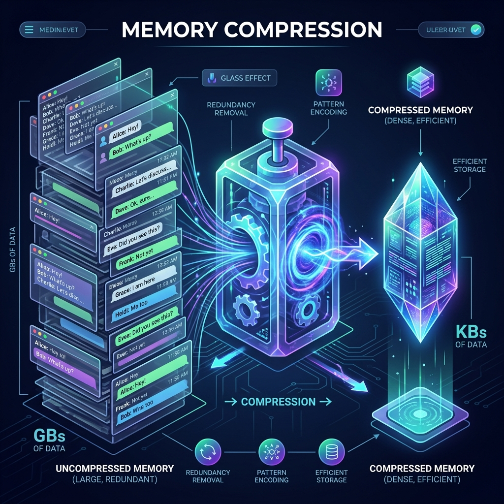

<!-- tags: glossary, agentic-ai, memory-systems -->
# Memory Compression

> Taking a massive, sprawling conversation and shrinking it into a dense summary to save context space.

| Aspect | Detail |
| --- | --- |
| **Domain** | Memory Systems |
| **Used by** | Platform engineer, AI architect |
| **Related** | See RECOMMEND section |

📅 Created: 2026-04-28 · 🔄 Updated: 2026-05-13 · ⏱️ 5 min read

---

## 1. DEFINE

**Memory Compression** (or Context Summarization) is an optimization technique used to manage an LLM's context window. Instead of passing an ever-growing raw transcript of a long conversation, a background AI process analyzes the older messages, strips out pleasantries, verbosity, and redundant information, and rewrites them into a highly dense, factual summary. This summary replaces the raw logs in the prompt, drastically reducing token usage while preserving the core context.

---

## 2. CONTEXT

**Who uses it**: Platform Engineers optimizing LLM inference costs and latency.
**When**: Building long-running chatbots or agents where conversations regularly exceed the model's optimal context window (e.g., >8,000 tokens).
**Why it matters**: Large context windows are expensive and slow (due to quadratic attention scaling in Transformers). Furthermore, models suffer from "Lost in the Middle" syndrome when bombarded with massive raw logs. Compression ensures the AI only sees the concentrated, high-signal essence of the past.

---

## 3. EXAMPLES

### Example 1: The Rolling Summary

A conversation reaches 5,000 tokens. The compression algorithm triggers:
- **Raw History (Oldest 20 messages)**: "Hi, how are you?" "I'm good, can you help me write code?" "Yes, what language?" "Python. I need a web scraper using BeautifulSoup..."
- **Compression Agent**: Summarizes the 20 messages into a single string.
- **Compressed Output**: `[Context Summary: User requested a Python web scraper using BeautifulSoup. Initial setup complete.]`
- The system deletes the raw 20 messages from Short-Term Memory and inserts the 15-token summary at the top of the prompt.

---

## 4. COMPARE

| Feature | Memory Compression | Vector DB Retrieval (RAG) |
|---|---|---|
| **Mechanism** | Summarizing older context into a smaller string | Searching an external database for relevant chunks |
| **Continuity** | High (Maintains narrative flow of the session) | Fragmented (Pulls isolated chunks out of order) |
| **Compute Cost** | Requires an extra LLM call to generate the summary | Requires embedding compute and DB hosting |

---

## 5. REF

| Resource | Type | Link | Note |
| --- | --- | --- | --- |
| LangChain ConversationSummaryMemory | Framework Docs | https://python.langchain.com/docs/modules/memory/ | Built-in tool for rolling compression |
| Lost in the Middle | Research Paper | https://arxiv.org/abs/2307.03172 | Why compressing context is better than raw long context |

---

## 6. RECOMMEND

| Explore next | When | Why | File/Link |
| --- | --- | --- | --- |
| Short-Term Memory | You want to understand what is being compressed | Compression directly targets short-term memory overload | [Short-Term Memory](./95-short-term-memory.md) |
| Semantic Memory | You want to compress facts, not summaries | Semantic memory extracts pure data instead of text summaries | [Semantic Memory](./98-semantic-memory.md) |

**Links**: [← Previous](./99-working-memory.md) · [→ Next](./101-memory-retrieval.md)
