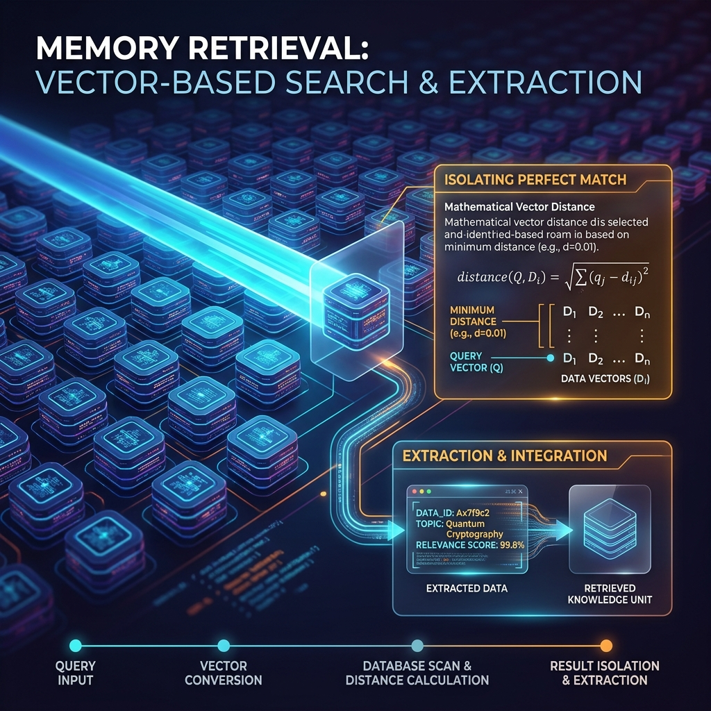

<!-- tags: glossary, agentic-ai, memory-systems -->
# Memory Retrieval

> The specific search process an AI uses to fetch the exact right piece of information from its massive long-term database.

| Aspect | Detail |
| --- | --- |
| **Domain** | Memory Systems |
| **Used by** | Search engineer, AI architect |
| **Related** | See RECOMMEND section |

📅 Created: 2026-04-28 · 🔄 Updated: 2026-05-13 · ⏱️ 5 min read

---

## 1. DEFINE

**Memory Retrieval** is the algorithmic mechanism by which an AI agent queries its Long-Term Memory (Vector DB, Graph DB, or relational database) to find historical data relevant to the current user prompt. It involves analyzing the user's intent, converting the query into the appropriate search format (like an embedding vector or a SQL query), executing the search, ranking the results, and returning the top hits to the LLM's context window.

---

## 2. CONTEXT

**Who uses it**: Search Engineers and AI Architects optimizing RAG pipelines.
**When**: Whenever a user asks a question that requires historical context or enterprise knowledge not present in the immediate short-term memory.
**Why it matters**: A massive long-term memory is useless if the agent can't find the right information. Poor retrieval leads to hallucinations (the AI answers without the facts) or context bloat (the AI retrieves irrelevant data, confusing itself).

---

## 3. EXAMPLES

### Example 1: The Multi-Hop Retrieval

- **User**: "Did we resolve the bug that Sarah reported last month?"
- **Retrieval Step 1 (Semantic)**: The agent converts the prompt to a vector and searches the database. It finds the incident report: `Bug #402 reported by Sarah regarding login timeout.`
- **Retrieval Step 2 (Relational)**: The agent realizes it needs the *status* of Bug #402. It executes an internal query: `SELECT status FROM Jira WHERE ticket_id = 402`.
- **Result**: The memory retrieval system injects `[Context: Bug #402 is CLOSED]` into the prompt. The AI answers the user confidently.

---

## 4. COMPARE

| Feature | Semantic Retrieval (Vector) | Exact Match Retrieval (SQL/Keyword) |
|---|---|---|
| **Mechanism** | Mathematical distance between meaning (Embeddings) | Exact string or ID matching |
| **Best For** | Fuzzy concepts, unstructured documents, conversations | Specific IDs, dates, structured tables |
| **Flexibility** | High (Handles typos and synonyms) | Low (Fails if the keyword is slightly wrong) |

---

## 5. REF

| Resource | Type | Link | Note |
| --- | --- | --- | --- |
| Advanced RAG Techniques | Guide | https://python.langchain.com/docs/use_cases/question_answering/ | Best practices for memory retrieval |
| Hybrid Search | Concept | https://weaviate.io/blog/hybrid-search-explained | Combining vector and keyword retrieval |

---

## 6. RECOMMEND

| Explore next | When | Why | File/Link |
| --- | --- | --- | --- |
| Hybrid Search | You want the best retrieval method | Hybrid search combines both vector and exact matching | [Hybrid Search](../tools-capabilities/56-hybrid-search.md) |
| Long-Term Memory | You want to know where the data comes from | Retrieval is the "read" operation of Long-Term Memory | [Long-Term Memory](./96-long-term-memory.md) |

**Links**: [← Previous](./100-memory-compression.md) · [→ Next](./102-external-memory.md)
