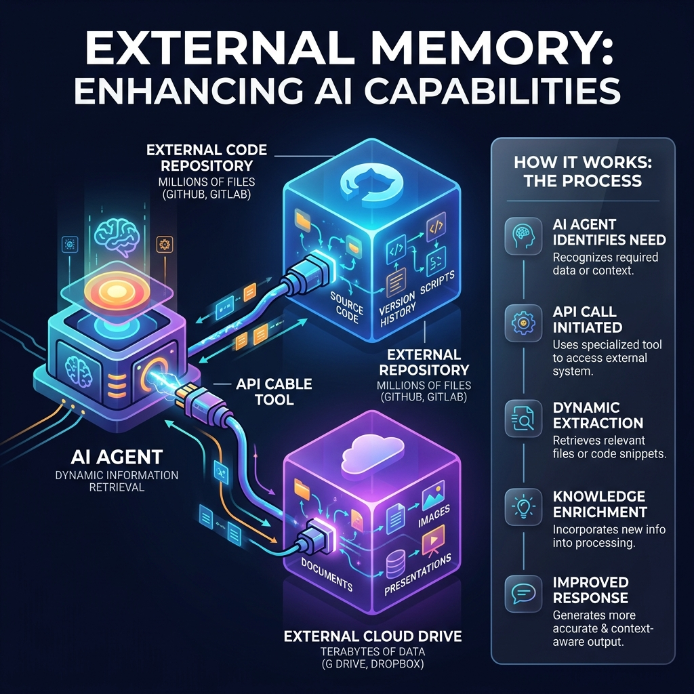

<!-- tags: glossary, agentic-ai, memory-systems -->
# External Memory

> Connecting the AI to outside file systems, like Google Drive or a codebase, allowing it to "remember" huge files by reading them dynamically.

| Aspect | Detail |
| --- | --- |
| **Domain** | Memory Systems |
| **Used by** | Platform engineer, backend developer |
| **Related** | See RECOMMEND section |

📅 Created: 2026-04-28 · 🔄 Updated: 2026-05-13 · ⏱️ 5 min read

---

## 1. DEFINE

**External Memory** refers to massive, unstructured data sources outside the AI's internal databases that the agent can access dynamically via tools. Instead of ingesting and vectorizing a 10,000-page PDF into a standard Long-Term Memory system, the agent is given a tool (like `read_file` or `search_drive`) to browse the raw external filesystem or API on demand, treating the external world as its extended memory drive.

---

## 2. CONTEXT

**Who uses it**: Platform Engineers integrating AI with enterprise tools.
**When**: Building agents that interact with vast codebases, cloud storage (S3, Google Drive), or rapidly changing external wikis (Notion, Confluence).
**Why it matters**: Vectorizing and constantly syncing every file in a corporate Google Drive to an internal Vector DB is incredibly expensive and difficult to keep updated. External memory allows the AI to simply "look it up" via API precisely when needed, ensuring the data is always perfectly up to date.

---

## 3. EXAMPLES

### Example 1: The File System as Memory

An AI coding assistant (like Cursor or Copilot) is asked to modify a routing function.
1. The agent doesn't have the entire 500-file repository in its context window.
2. The agent uses its **External Memory** tools to run `grep_search("routing")` across the local filesystem.
3. It finds the file `router.ts`.
4. It uses the `view_file("router.ts")` tool to pull the code into its Working Memory.
5. The agent modifies the code and writes it back to the external filesystem.

---

## 4. COMPARE

| Feature | External Memory | Long-Term Memory (Internal Vector DB) |
|---|---|---|
| **Data Location** | Host file system, SaaS APIs (Drive, Notion) | Dedicated AI database managed by the platform |
| **Data Freshness** | Always perfectly real-time | Can be stale if syncing jobs fail |
| **Retrieval Speed** | Slower (requires API calls and parsing tools) | Extremely fast (optimized vector math) |

---

## 5. REF

| Resource | Type | Link | Note |
| --- | --- | --- | --- |
| LlamaIndex Data Connectors | Framework | https://llamahub.ai/ | Tools connecting LLMs to external memory sources |
| MCP (Model Context Protocol) | Standard | https://modelcontextprotocol.io/ | The standard for securely connecting AI to external data sources |

---

## 6. RECOMMEND

| Explore next | When | Why | File/Link |
| --- | --- | --- | --- |
| MCP | You want to build external memory connectors | MCP is the standard protocol for connecting external data | [MCP](../tools-capabilities/110-mcp.md) |
| Permission Scoping | You are connecting to a filesystem | External memory requires extremely strict security boundaries | [Permission Scoping](../safety-alignment/127-permission-scoping.md) |

**Links**: [← Previous](./101-memory-retrieval.md) · [→ Next](../evaluation-observability/README.md)
