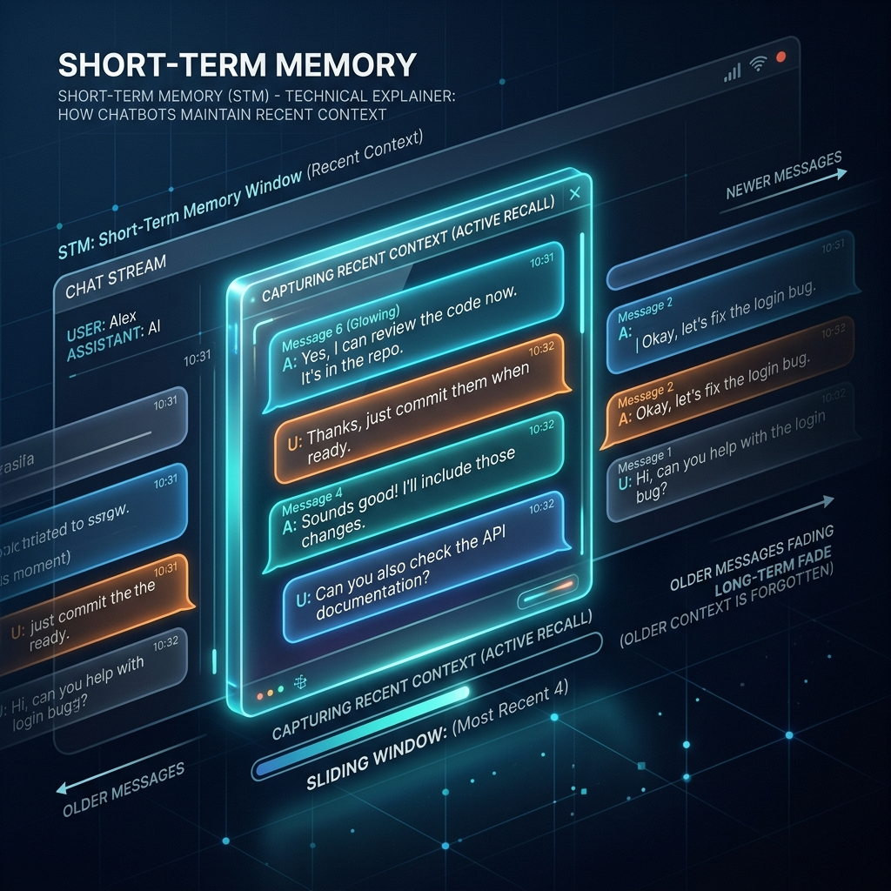

<!-- tags: glossary, agentic-ai, memory-systems -->
# Short-Term Memory

> The immediate context window of an AI, containing the current conversation history.

| Aspect | Detail |
| --- | --- |
| **Domain** | Memory Systems |
| **Used by** | AI engineer, prompt engineer |
| **Related** | See RECOMMEND section |

📅 Created: 2026-04-28 · 🔄 Updated: 2026-05-13 · ⏱️ 5 min read

---

## 1. DEFINE

**Short-Term Memory** in an agentic AI system refers to the immediate, transient state held within the active context window of the LLM during a single session or conversational thread. It consists of the most recent user prompts, system instructions, and agent responses. Once the context window limit is reached, or the session is cleared, this memory is lost unless explicitly saved to a long-term storage mechanism.

---

## 2. CONTEXT

**Who uses it**: AI Engineers designing chat applications and conversational flows.
**When**: Managing the active state of an interaction, deciding how many past messages to include in the next API call to the LLM.
**Why it matters**: LLMs are stateless by default. To have a coherent conversation, the application must feed the recent history back to the model with every new prompt. Managing short-term memory is a balancing act between providing enough context for coherence and not overflowing the token limit (or running up API costs).

---

## 3. EXAMPLES

### Example 1: The Sliding Context Window

A user has been chatting with an AI assistant for 20 minutes.
1. The LLM has a context limit of 4,000 tokens.
2. The total conversation history reaches 4,500 tokens.
3. The **Short-Term Memory Manager** kicks in, acting like a sliding window. It truncates the oldest 500 tokens of the conversation (the very first messages) before sending the payload to the LLM.
4. The AI successfully answers the user's immediate question but has "forgotten" what was said at the very beginning of the chat.

---

## 4. COMPARE

| Feature | Short-Term Memory | Long-Term Memory |
|---|---|---|
| **Storage Medium** | In-memory RAM, Context Window | Vector Database, SQL Database |
| **Persistence** | Lost when session ends | Permanent |
| **Retrieval Speed** | Instant (already in the prompt) | Requires an explicit query/search step |

---

## 5. REF

| Resource | Type | Link | Note |
| --- | --- | --- | --- |
| LangChain Memory | Framework Docs | https://python.langchain.com/docs/modules/memory/ | Explains `ConversationBufferMemory` and windowing |
| OpenAI Token Limits | Guide | https://platform.openai.com/docs/models | Understanding how context windows limit short-term memory |

---

## 6. RECOMMEND

| Explore next | When | Why | File/Link |
| --- | --- | --- | --- |
| Long-Term Memory | When the context window isn't enough | Move data from short-term to long-term storage | [Long-Term Memory](./96-long-term-memory.md) |
| Working Memory | When the agent needs scratchpad space | Working memory is a specific functional slice of short-term memory | [Working Memory](./99-working-memory.md) |

**Links**: [← Previous](../hooks-middleware/README.md) · [→ Next](./96-long-term-memory.md)
