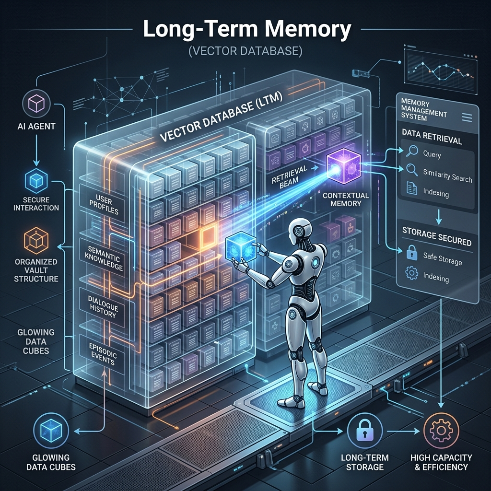

<!-- tags: glossary, agentic-ai, memory-systems -->
# Long-Term Memory

> A permanent database where an AI stores facts and past experiences to recall them weeks or months later.

| Aspect | Detail |
| --- | --- |
| **Domain** | Memory Systems |
| **Used by** | Backend developer, AI architect |
| **Related** | See RECOMMEND section |

📅 Created: 2026-04-28 · 🔄 Updated: 2026-05-13 · ⏱️ 5 min read

---

## 1. DEFINE

**Long-Term Memory** is an external, persistent storage architecture that allows an AI agent to retain knowledge, user preferences, and past conversational context across multiple independent sessions. Instead of relying on the limited short-term context window, the agent queries a database (typically a Vector Database or Graph Database) to retrieve highly relevant historical data and injects it into the current prompt just-in-time.

---

## 2. CONTEXT

**Who uses it**: AI Architects and Backend Developers.
**When**: Building personalized AI companions, enterprise knowledge assistants, or autonomous agents that operate over days or weeks.
**Why it matters**: Without long-term memory, an AI suffers from "Groundhog Day" syndrome—every interaction starts from zero. Long-term memory enables continuity, allowing the AI to build a relationship with the user, remember past mistakes, and accumulate project-specific context over time.

---

## 3. EXAMPLES

### Example 1: The Vector Store Recall

1. **Day 1**: User says, "I am strictly allergic to peanuts." The AI extracts this fact, embeds it, and stores it in a Vector Database.
2. **Session Ends**. The short-term context window is wiped clean.
3. **Day 14**: User says, "Suggest a recipe for Thai noodles."
4. **Retrieval**: Before answering, the AI queries its Long-Term Memory for user dietary restrictions. It retrieves the "peanut allergy" vector.
5. **Generation**: The AI generates a recipe using cashew butter instead of peanut butter, explicitly mentioning it remembered the allergy.

---

## 4. COMPARE

| Feature | Long-Term Memory | Fine-Tuning |
|---|---|---|
| **Mechanism** | RAG (Retrieval-Augmented Generation) | Updating the model's neural weights |
| **Update Speed** | Real-time (Instant write to DB) | Slow (Requires re-training phase) |
| **Cost** | Very low (DB storage and query costs) | High (GPU compute costs) |

---

## 5. REF

| Resource | Type | Link | Note |
| --- | --- | --- | --- |
| Mem0 | Framework | https://github.com/mem0ai/mem0 | Open-source long-term memory layer for AI agents |
| Pinecone Vector DB | Database | https://www.pinecone.io/ | A popular vector database used for long-term memory |

---

## 6. RECOMMEND

| Explore next | When | Why | File/Link |
| --- | --- | --- | --- |
| Episodic Memory | You want to store historical timelines | Episodic memory is a specific type of long-term memory for events | [Episodic Memory](./97-episodic-memory.md) |
| Semantic Memory | You want to store raw facts | Semantic memory is for facts independent of time | [Semantic Memory](./98-semantic-memory.md) |

**Links**: [← Previous](./95-short-term-memory.md) · [→ Next](./97-episodic-memory.md)
