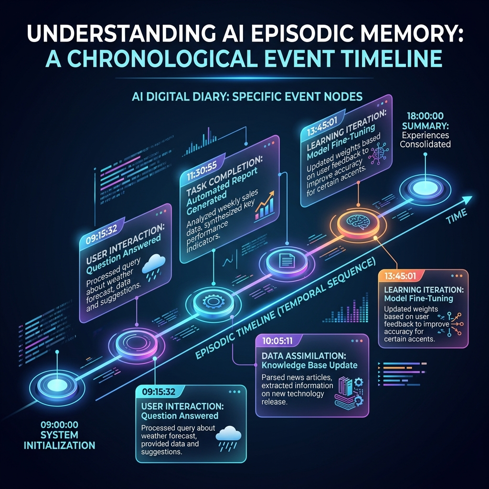

<!-- tags: glossary, agentic-ai, memory-systems -->
# Episodic Memory

> Remembering specific past events and the exact timeline of when they happened.

| Aspect | Detail |
| --- | --- |
| **Domain** | Memory Systems |
| **Used by** | AI researcher, system designer |
| **Related** | See RECOMMEND section |

📅 Created: 2026-04-28 · 🔄 Updated: 2026-05-13 · ⏱️ 5 min read

---

## 1. DEFINE

**Episodic Memory** is a specialized sub-type of long-term memory that stores autobiographical events—specific experiences, actions taken, and the temporal context (when and where they occurred). Unlike semantic memory (which just stores abstract facts), episodic memory allows an AI agent to recall exactly *how* a past situation unfolded, essentially "remembering" its own operational history in chronological order.

---

## 2. CONTEXT

**Who uses it**: AI Researchers and System Designers building autonomous agents.
**When**: Designing agents that navigate environments (like video games, robotics) or perform complex multi-step workflows over several days.
**Why it matters**: If an agent fails a task (e.g., crashing a server), it needs episodic memory to review the exact sequence of commands it executed right before the crash. Without temporal context, the agent cannot learn from specific past mistakes.

---

## 3. EXAMPLES

### Example 1: The Debugging Timeline

An AI coding agent is asked to fix a bug.
1. The agent queries its Episodic Memory: "Have I tried to fix this bug before?"
2. The memory retrieves a chronological episode:
   - *Timestamp: Tuesday 2:00 PM* -> Executed `npm update`.
   - *Timestamp: Tuesday 2:05 PM* -> Ran test suite.
   - *Timestamp: Tuesday 2:06 PM* -> Tests failed with Error X.
3. Because the agent remembers this specific *episode*, it decides not to try `npm update` again, and instead tries rolling back the dependency.

---

## 4. COMPARE

| Feature | Episodic Memory | Semantic Memory |
|---|---|---|
| **What it stores** | Events, actions, timelines ("I did X on Tuesday") | Facts, concepts, rules ("Paris is the capital of France") |
| **Context** | Highly contextual and time-bound | Context-independent |
| **Use Case** | Learning from past mistakes | Answering factual queries |

---

## 5. REF

| Resource | Type | Link | Note |
| --- | --- | --- | --- |
| Generative Agents | Research Paper | https://arxiv.org/abs/2304.03442 | Stanford's paper on AI agents using episodic memory to simulate human behavior |
| Episodic Memory in AI | Concept | https://en.wikipedia.org/wiki/Episodic_memory | The cognitive psychology roots of the concept |

---

## 6. RECOMMEND

| Explore next | When | Why | File/Link |
| --- | --- | --- | --- |
| Semantic Memory | You don't need timelines, just facts | Semantic memory is cheaper and easier to query for pure knowledge | [Semantic Memory](./98-semantic-memory.md) |
| Audit Log | You want humans to read the timeline | Episodic memory is for the AI; Audit Logs are for humans | [Audit Log](../safety-alignment/128-audit-log.md) |

**Links**: [← Previous](./96-long-term-memory.md) · [→ Next](./98-semantic-memory.md)
