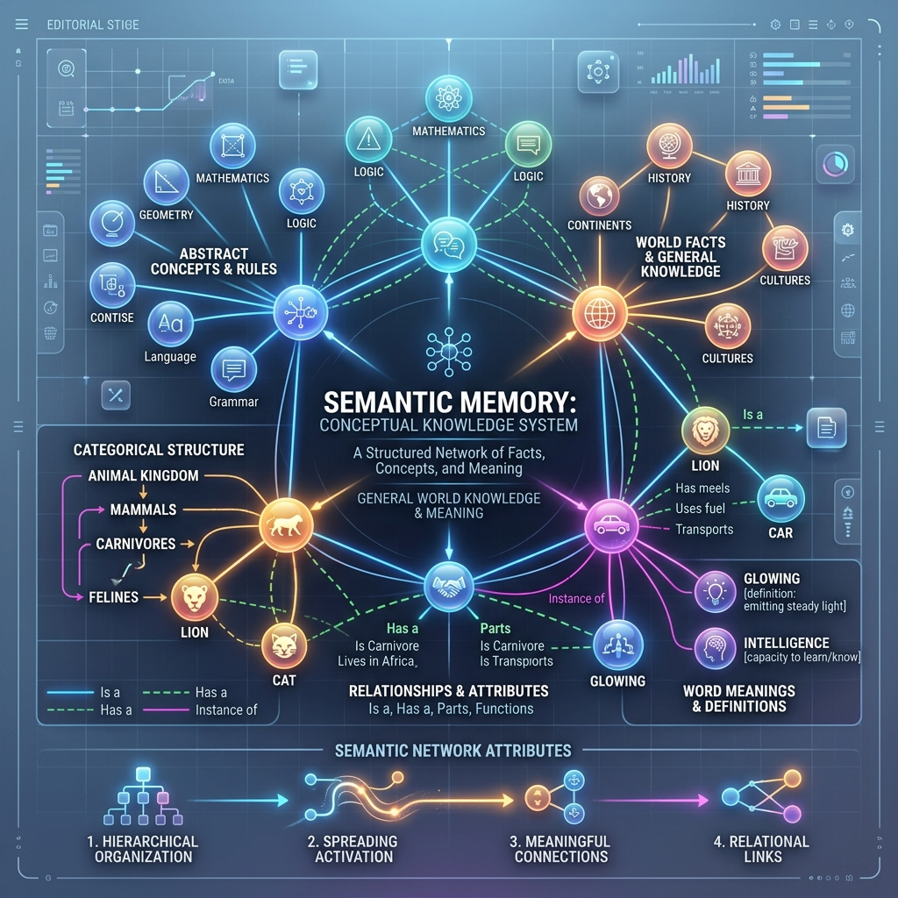

<!-- tags: glossary, agentic-ai, memory-systems -->
# Semantic Memory

> A vast, organized database of facts, concepts, and general knowledge, independent of when it was learned.

| Aspect | Detail |
| --- | --- |
| **Domain** | Memory Systems |
| **Used by** | Data engineer, AI architect |
| **Related** | See RECOMMEND section |

📅 Created: 2026-04-28 · 🔄 Updated: 2026-05-13 · ⏱️ 5 min read

---

## 1. DEFINE

**Semantic Memory** is a sub-type of long-term memory that stores structured, factual knowledge about the world, the user, or the enterprise domain. Unlike episodic memory, semantic memory is completely stripped of temporal context—it doesn't remember *when* or *how* it learned a fact, only the fact itself. It is the core repository of an AI's "worldview," usually implemented via Knowledge Graphs or dense Vector Databases.

---

## 2. CONTEXT

**Who uses it**: Data Engineers and AI Architects building RAG systems.
**When**: Constructing enterprise knowledge bases where the AI needs to reliably recall product specs, user preferences, or corporate policies.
**Why it matters**: Storing every single conversation log (episodic) is inefficient and noisy. Semantic memory extracts the "signal" from the noise, consolidating scattered conversational data into absolute, queryable facts (e.g., `User.Company = AcmeCorp`), making retrieval highly accurate.

---

## 3. EXAMPLES

### Example 1: The Knowledge Graph Extraction

1. Over a month, an AI reads thousands of emails and chat logs.
2. An async background process analyzes these episodic logs and extracts core semantic facts.
3. It updates the Semantic Memory (a Graph Database):
   - `[Node: John] -> [Relationship: WORKS_FOR] -> [Node: Microsoft]`
   - `[Node: Microsoft] -> [Relationship: USES_TECH] -> [Node: Azure]`
4. When queried "What cloud does John's company use?", the AI instantly traverses the semantic graph and answers "Azure," without needing to read a single old email.

---

## 4. COMPARE

| Feature | Semantic Memory | Episodic Memory |
|---|---|---|
| **Structure** | Facts, relationships, entities | Chronological logs, events, conversations |
| **Technology** | Knowledge Graphs (Neo4j), Vector DBs | Relational DBs (Postgres), Document DBs |
| **Data Type** | Abstracted, consolidated | Raw, highly specific |

---

## 5. REF

| Resource | Type | Link | Note |
| --- | --- | --- | --- |
| Neo4j GenAI | Framework | https://neo4j.com/generativeai/ | Using Graph Databases for Semantic Memory |
| Microsoft GraphRAG | Framework | https://www.microsoft.com/en-us/research/project/graphrag/ | Advanced RAG using semantic knowledge graphs |

---

## 6. RECOMMEND

| Explore next | When | Why | File/Link |
| --- | --- | --- | --- |
| Memory Extraction | You want to populate a graph | You need algorithms to extract facts from raw text | [Memory Compression](./100-memory-compression.md) |
| RAG | You want to retrieve this knowledge | RAG is the primary way semantic memory is used | [RAG](../tools-capabilities/53-rag.md) |

**Links**: [← Previous](./97-episodic-memory.md) · [→ Next](./99-working-memory.md)
