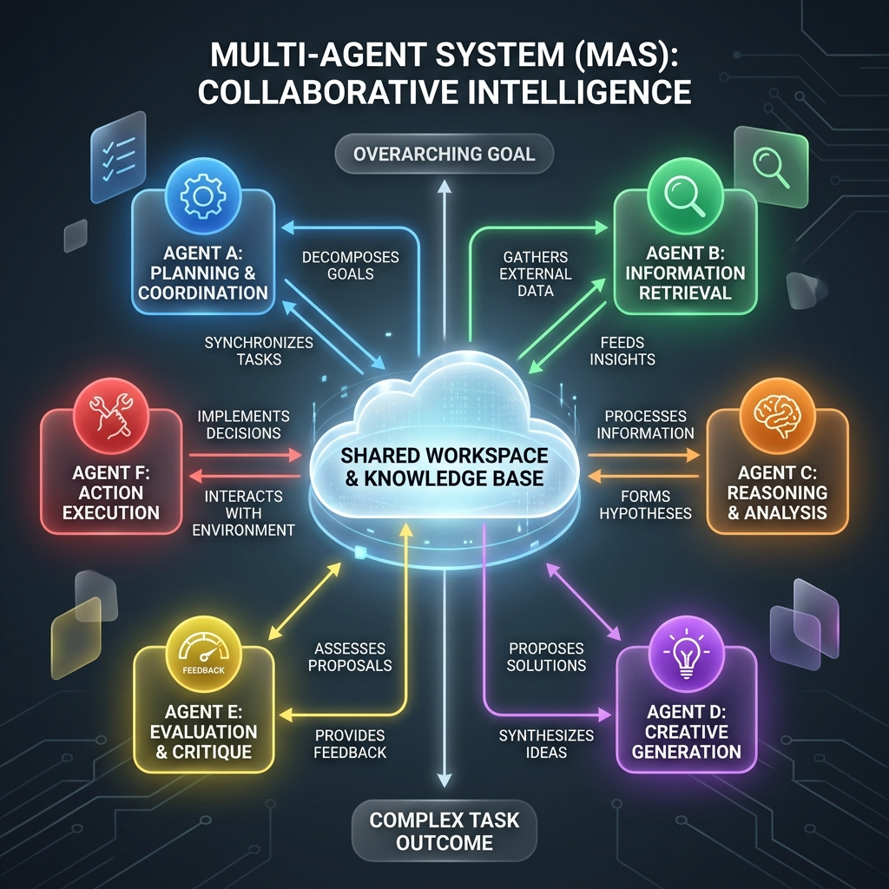

<!-- tags: glossary, agentic-ai, multi-agent-systems -->
# Multi-Agent System (MAS)

> A network of specialized AI agents working together to solve a complex problem that is too big for a single agent.

| Aspect | Detail |
| --- | --- |
| **Domain** | Multi-Agent Systems |
| **Used by** | AI architect, system designer, tech lead |
| **Related** | See RECOMMEND section |

📅 Created: 2026-04-28 · 🔄 Updated: 2026-05-07 · ⏱️ 5 min read

---

## 1. DEFINE

A **Multi-Agent System (MAS)** is an architectural paradigm where multiple, loosely coupled autonomous AI agents collaborate or compete to achieve a broader objective. Instead of relying on one massive, monolithic LLM to handle planning, coding, reviewing, and deployment, the problem is decomposed. Each agent is given a specific role, specific tools, and a bounded context, interacting with other agents via predefined communication protocols to synthesize a final solution.

---

## 2. CONTEXT

**Who uses it**: AI Architects and Platform Engineers.
**When**: Designing enterprise-scale AI applications like autonomous software factories, comprehensive financial research engines, or game NPCs.
**Why it matters**: A single agent suffers from context degradation and "lost in the middle" phenomena when given too many instructions. MAS solves this by enforcing separation of concerns—allowing for massive horizontal scalability of intelligence.

---

## 3. EXAMPLES

### Example 1: The Software Factory

A user prompts a MAS: "Build a snake game in Python."
1. **Product Manager Agent**: Writes the requirements and rules of the game.
2. **Developer Agent**: Takes the requirements and writes the Python code.
3. **QA Agent**: Takes the Python code, runs it in a sandbox, finds a bug, and sends it back to the Developer.
4. **Developer Agent**: Fixes the bug.
5. **Deployment Agent**: Packages the final code into a zip file.

The entire system acts as an autonomous virtual company.

---

## 4. COMPARE

| Feature | Multi-Agent System | Single-Agent System |
|---|---|---|
| **Architecture** | Distributed microservices-like design | Monolithic design |
| **Complexity to Build** | Very high (requires routing, state sharing) | Low (a simple loop) |
| **Context Window Usage** | Highly efficient (each agent only sees what it needs) | Poor (prompt becomes massive and cluttered) |

---

## 5. REF

| Resource | Type | Link | Note |
| --- | --- | --- | --- |
| AutoGen | Framework | https://microsoft.github.io/autogen/ | Microsoft's leading MAS framework |
| CrewAI | Framework | https://www.crewai.com/ | Popular framework for defining agent roles |

---

## 6. RECOMMEND

| Explore next | When | Why | File/Link |
| --- | --- | --- | --- |
| Agent Role | You are defining the nodes in the system | Roles define the capabilities of individual agents | [Agent Role](./86-agent-role.md) |
| Supervisor Agent | You need to orchestrate the MAS | Supervisors route tasks between specialized workers | [Supervisor Agent](./87-supervisor-agent.md) |

**Links**: [← Previous](../tools-capabilities/README.md) · [→ Next](./86-agent-role.md)
