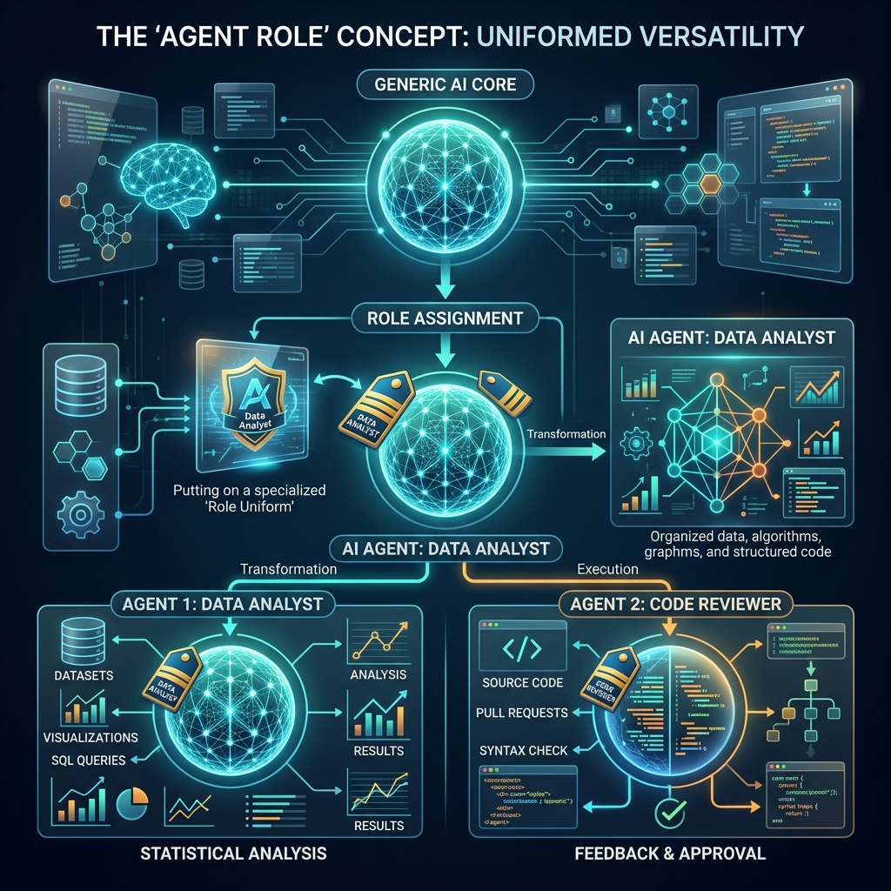

<!-- tags: glossary, agentic-ai, multi-agent-systems -->
# Agent Role

> The specific persona, system prompt, and subset of tools given to an agent so it focuses entirely on one job.

| Aspect | Detail |
| --- | --- |
| **Domain** | Multi-Agent Systems |
| **Used by** | Prompt engineer, AI architect, backend developer |
| **Related** | See RECOMMEND section |

📅 Created: 2026-04-28 · 🔄 Updated: 2026-05-07 · ⏱️ 5 min read

---

## 1. DEFINE

An **Agent Role** is the bounded configuration of a single AI agent within a multi-agent system. It consists of a highly specific system prompt (persona), a restricted set of tools (capabilities), and a defined scope of authority. By adopting a strict role, the underlying foundational model abandons its generalized nature to become a hyper-specialized expert in one domain, drastically reducing hallucinations.

---

## 2. CONTEXT

**Who uses it**: Prompt Engineers and AI Architects.
**When**: Decomposing a massive objective (like "Write a book") into distinct manageable jobs (e.g., "Outliner", "Researcher", "Writer", "Editor").
**Why it matters**: A generalist LLM trying to be a database administrator and a UX designer at the same time will perform poorly. Assigning roles enforces focus and allows for granular access control over tools.

---

## 3. EXAMPLES

### Example 1: Defining a Role



```yaml
role_name: "Senior QA Engineer"
backstory: "You are a meticulous software tester with 10 years of experience. You find edge cases that others miss. You are highly critical and never approve code unless it has 100% test coverage."
goal: "Identify logical flaws and missing test coverage in the provided pull request."
tools:
  - execute_pytest
  - read_coverage_report
```
By defining this role, the LLM stops generating new features and strictly behaves as a validator.

---

## 4. COMPARE

| Feature | Agent Role | System Prompt |
|---|---|---|
| **Scope** | Encompasses the prompt, the tools, and the interaction model | Just the text instructions |
| **Context** | Exists within a Multi-Agent ecosystem | Used in any LLM interaction |
| **Flexibility** | Highly rigid by design | Can be broad or narrow |

---

## 5. REF

| Resource | Type | Link | Note |
| --- | --- | --- | --- |
| ChatDev | Research/Repo | https://github.com/OpenBMB/ChatDev | Demonstrates highly specific roles in software dev |
| CrewAI Roles | Documentation | https://docs.crewai.com/core-concepts/Agents/ | How roles are configured in production |

---

## 6. RECOMMEND

| Explore next | When | Why | File/Link |
| --- | --- | --- | --- |
| Worker Agent | You have defined a role and need execution | Roles are played by Worker Agents | [Worker Agent](./88-sub-agent-worker-agent.md) |
| Critic Agent | You need a role designed specifically for quality control | The Critic is the most common validation role | [Critic Agent](./89-critic-agent.md) |

**Links**: [← Previous](./85-multi-agent-system.md) · [→ Next](./87-supervisor-agent.md)
