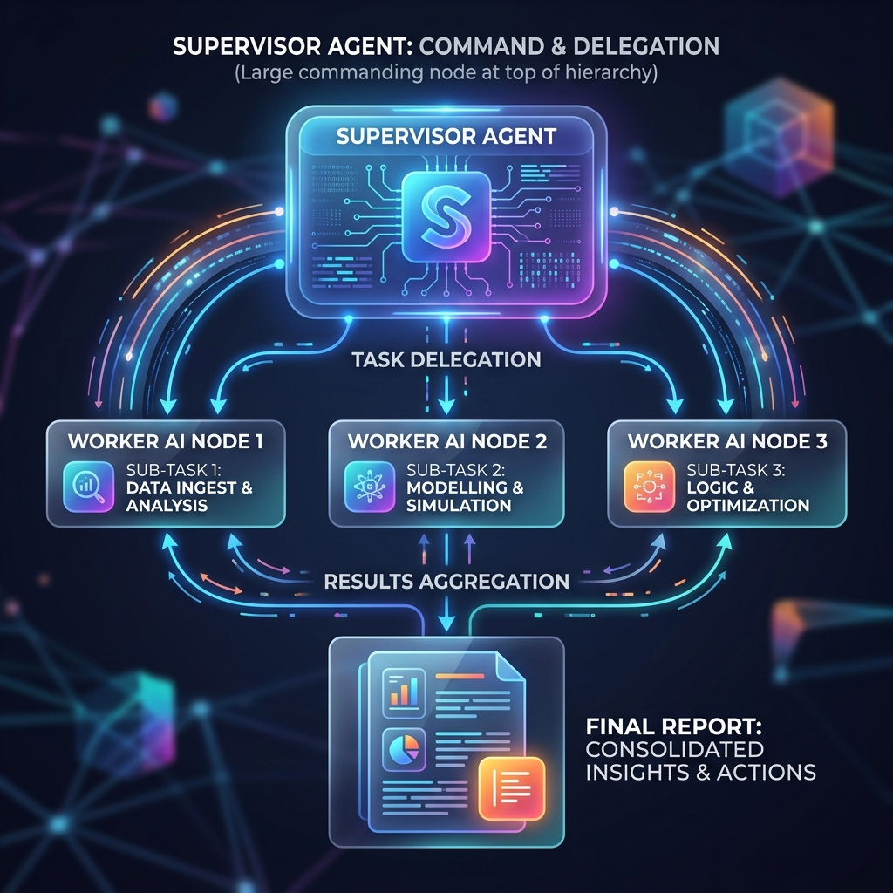

<!-- tags: glossary, agentic-ai, multi-agent-systems -->
# Supervisor Agent

> The manager AI that breaks down a user's request and delegates the pieces to specialized sub-agents.

| Aspect | Detail |
| --- | --- |
| **Domain** | Multi-Agent Systems |
| **Used by** | AI architect, system designer, tech lead |
| **Related** | See RECOMMEND section |

📅 Created: 2026-04-28 · 🔄 Updated: 2026-05-07 · ⏱️ 5 min read

---

## 1. DEFINE

A **Supervisor Agent** (also known as an Orchestrator or Manager Agent) is the central coordinating node in a hierarchical multi-agent system. It is responsible for receiving the initial high-level user objective, decomposing it into actionable sub-tasks, routing those sub-tasks to the appropriate specialized worker agents, and finally aggregating the results back into a cohesive final output. It does not perform the heavy lifting itself; its sole capability is state management and delegation.

---

## 2. CONTEXT

**Who uses it**: AI Architects and Platform Engineers.
**When**: Designing hierarchical agentic systems where a single query touches multiple distinct knowledge domains (e.g., retrieving customer data, querying an inventory database, and drafting an email).
**Why it matters**: Without a supervisor, multi-agent systems devolve into chaotic peer-to-peer chatter (swarm intelligence) which is highly unpredictable. The Supervisor introduces deterministic control flow into non-deterministic AI generation.

---

## 3. EXAMPLES

### Example 1: The Delegation Loop

A user asks: "Write a report on TSLA stock performance this week and email it to my boss."
1. **Supervisor**: Analyzes the intent. Identifies two tasks: Research and Communication.
2. **Supervisor -> Finance Agent**: "Get TSLA closing prices for the last 5 days."
3. **Finance Agent**: Retrieves data and returns `[201, 205, 199, 210, 215]`.
4. **Supervisor -> Email Agent**: "Draft and send an email to boss@company.com with these numbers: [201, 205, 199, 210, 215]."
5. **Email Agent**: Sends the email and returns `Success`.
6. **Supervisor -> User**: "I have researched the stock and emailed the report to your boss."

---

## 4. COMPARE

| Feature | Supervisor Agent | Router (Semantic) |
|---|---|---|
| **Intelligence** | High (uses an LLM to reason about planning and delegation) | Low (uses vector similarity or basic logic to forward a request) |
| **State Management** | Maintains the global state of the entire multi-step process | Stateless; fire-and-forget |
| **Execution** | Multi-turn; can re-prompt workers if they fail | Single-turn |

---

## 5. REF

| Resource | Type | Link | Note |
| --- | --- | --- | --- |
| LangGraph | Framework | https://python.langchain.com/docs/langgraph | State-machine approach for building supervisors |
| AutoGen Hierarchical Chat | Guide | https://microsoft.github.io/autogen/ | Implementing manager agents |

---

## 6. RECOMMEND

| Explore next | When | Why | File/Link |
| --- | --- | --- | --- |
| Worker Agent | You are building the agents that report to the supervisor | Supervisors are useless without workers to delegate to | [Worker Agent](./88-sub-agent-worker-agent.md) |
| Swarm Intelligence | You want an alternative to hierarchical management | Swarms don't use supervisors; they use emergent peer-to-peer logic | [Swarm Intelligence](./91-swarm-intelligence.md) |

**Links**: [← Previous](./86-agent-role.md) · [→ Next](./88-sub-agent-worker-agent.md)
