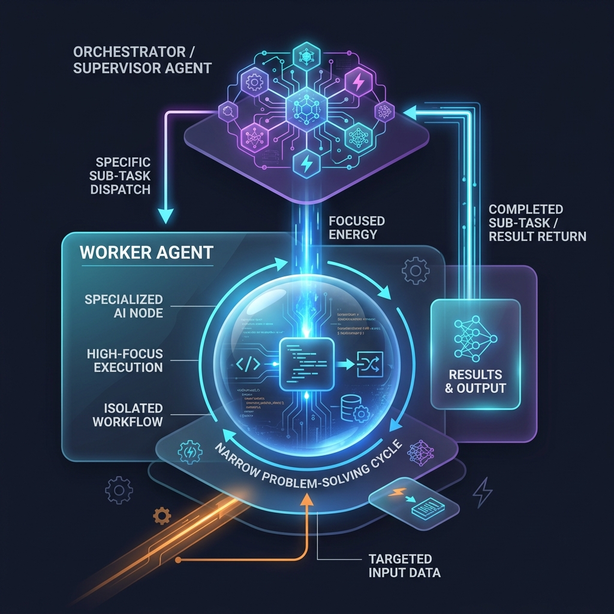

<!-- tags: glossary, agentic-ai, multi-agent-systems -->
# Sub-Agent / Worker Agent

> A hyper-focused AI that only knows how to do one specific job (like searching the web or writing Python) and reports back to a manager.

| Aspect | Detail |
| --- | --- |
| **Domain** | Multi-Agent Systems |
| **Used by** | AI developer, system designer |
| **Related** | See RECOMMEND section |

📅 Created: 2026-04-28 · 🔄 Updated: 2026-05-07 · ⏱️ 5 min read

---

## 1. DEFINE

A **Sub-Agent** (or **Worker Agent**) is a specialized node within a multi-agent hierarchy that is purposefully restricted in its context and capabilities. It does not plan overarching architecture or interact directly with the end-user. Instead, it receives narrow, atomic instructions from a Supervisor Agent, executes them using its specific toolset (e.g., executing SQL, writing code, summarizing documents), and returns the concrete result.

---

## 2. CONTEXT

**Who uses it**: AI Developers and Engineers.
**When**: Implementing the leaf nodes of an agentic graph where the actual computation, tool execution, and data retrieval occurs.
**Why it matters**: By keeping the worker's context window extremely clean—containing *only* the specific sub-task and nothing about the user's broader goals—the LLM is far less likely to hallucinate, get distracted, or suffer from prompt injection attacks.

---

## 3. EXAMPLES

### Example 1: The Isolated Workflow

- **Global User Request**: "Find out why my production server crashed, write a patch, and deploy it."
- **Worker Agent (Log Analyzer)** is invoked.
- **Input to Worker**: "Read the last 100 lines of `error.log` and identify the stack trace."
- **Worker Execution**: The worker uses a `read_file` tool, finds a `NullReferenceException` on line 42 of `auth.py`.
- **Output from Worker**: "Crash caused by NullReferenceException in auth.py:42."

The worker knows nothing about the deployment or the user; it only knows how to read logs.

---

## 4. COMPARE

| Feature | Worker Agent | Supervisor Agent |
|---|---|---|
| **Primary Goal** | Execution and Tool Use | Planning, Routing, and Aggregation |
| **Context Scope** | Very narrow (only sees the current micro-task) | Very broad (sees the whole user conversation) |
| **Tools** | High-risk/Compute tools (Bash, SQL, HTTP requests) | Delegation tools (Send_to_Worker_A) |

---

## 5. REF

| Resource | Type | Link | Note |
| --- | --- | --- | --- |
| Anthropic Building Effective Agents | Guide | https://www.anthropic.com/engineering/building-effective-agents | Workflow patterns for specialized agents |

---

## 6. RECOMMEND

| Explore next | When | Why | File/Link |
| --- | --- | --- | --- |
| Critic Agent | You need to validate the worker's output | Workers make mistakes; Critics catch them before the Supervisor sees them | [Critic Agent](./89-critic-agent.md) |
| Agent Role | You are defining what the worker can do | The Role defines the Worker's persona and tools | [Agent Role](./86-agent-role.md) |

**Links**: [← Previous](./87-supervisor-agent.md) · [→ Next](./89-critic-agent.md)
