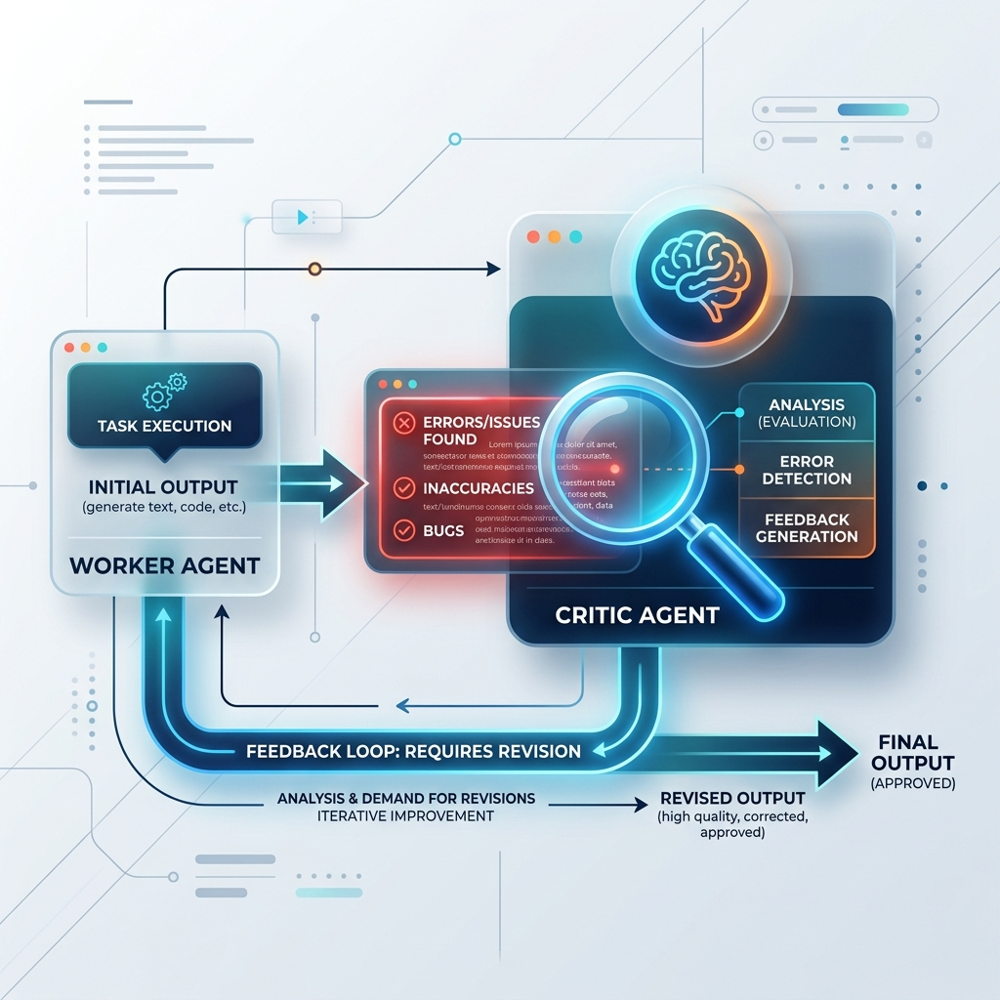

<!-- tags: glossary, agentic-ai, multi-agent-systems -->
# Critic Agent

> An AI agent designed exclusively to review and poke holes in another agent's work, providing feedback for revision.

| Aspect | Detail |
| --- | --- |
| **Domain** | Multi-Agent Systems |
| **Used by** | AI architect, QA engineer, prompt engineer |
| **Related** | See RECOMMEND section |

📅 Created: 2026-04-28 · 🔄 Updated: 2026-05-07 · ⏱️ 5 min read

---

## 1. DEFINE

A **Critic Agent** is a specialized validation node in a multi-agent system tasked solely with evaluating the output of a Worker Agent against predefined constraints, rubrics, or safety guidelines. Instead of generating new content, its role is adversarial: identifying logical flaws, hallucinations, style violations, or security risks, and returning structured feedback so the worker can iterate and improve.

---

## 2. CONTEXT

**Who uses it**: AI Architects building robust, error-resistant systems.
**When**: During reflection loops or validation phases before a final result is passed back to the user.
**Why it matters**: LLMs are statistically prone to "sycophancy" (agreeing with their own bad output). By assigning a completely separate agent to be the "bad cop," you artificially induce a verification step that dramatically improves the mathematical and logical accuracy of the system.

---

## 3. EXAMPLES

### Example 1: The Reflection Loop

1. **Worker Agent** writes a Python script to sort an array.
2. The script is passed to the **Critic Agent**, whose system prompt is: `"You are an elite security auditor. Review this code for buffer overflows, O(n^2) complexity, and missing edge cases. If it fails, reject it."`
3. The Critic finds that the code does not handle empty arrays.
4. It rejects the code and sends feedback to the Worker.
5. The Worker receives the feedback, adds the `if len(arr) == 0` check, and resubmits.
6. The Critic approves.

---

## 4. COMPARE

| Feature | Critic Agent | Worker Agent |
|---|---|---|
| **Primary Action** | Evaluating and scoring | Generating and creating |
| **Output Type** | Pass/Fail Boolean + Feedback strings | Draft documents, code, data |
| **Prompt Persona** | Adversarial, skeptical, strict | Helpful, compliant, creative |

---

## 5. REF

| Resource | Type | Link | Note |
| --- | --- | --- | --- |
| Reflexion | Research Paper | https://arxiv.org/abs/2303.11366 | The foundational paper on agentic reflection |
| Constitutional AI | Framework | https://www.anthropic.com/index/constitutional-ai | Anthropic's approach to having AI critique itself |

---

## 6. RECOMMEND

| Explore next | When | Why | File/Link |
| --- | --- | --- | --- |
| Debate Pattern | You have multiple critics | Debate involves multiple agents arguing until a consensus is reached | [Debate Pattern](./90-debate-pattern.md) |
| Worker Agent | You are setting up the generation side | Critics need workers to criticize | [Worker Agent](./88-sub-agent-worker-agent.md) |

**Links**: [← Previous](./88-sub-agent-worker-agent.md) · [→ Next](./90-debate-pattern.md)
