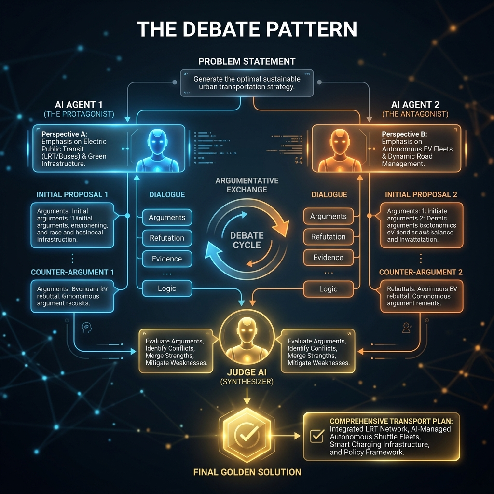

<!-- tags: glossary, agentic-ai, multi-agent-systems -->
# Debate Pattern

> Having two or more AI agents argue different sides of a problem until they reach an agreement or a better solution emerges.

| Aspect | Detail |
| --- | --- |
| **Domain** | Multi-Agent Systems |
| **Used by** | AI architect, prompt engineer |
| **Related** | See RECOMMEND section |

📅 Created: 2026-04-28 · 🔄 Updated: 2026-05-07 · ⏱️ 5 min read

---

## 1. DEFINE

The **Debate Pattern** is a multi-agent validation architecture where two or more distinct agents are instructed to take opposing viewpoints on a specific problem or proposed solution. By forcing the agents to argue, present counter-evidence, and critique each other's logic over several conversational turns, the system organically distills a highly robust, fact-checked final answer.

---

## 2. CONTEXT

**Who uses it**: AI Architects focusing on high-accuracy reasoning systems.
**When**: Solving complex, ambiguous problems where a single "right" answer isn't obvious, such as legal analysis, medical diagnosis, or strategic business planning.
**Why it matters**: LLMs often suffer from confirmation bias and sycophancy when working alone. Forcing an adversarial debate breaks this bias. Research shows that answers synthesized from multi-agent debates score significantly higher in reasoning benchmarks than answers from single-agent reflection loops.

---

## 3. EXAMPLES

### Example 1: The Architectural Debate

- **User**: "Should we migrate our monolithic database to microservices?"
- **Agent A (Pro-Microservices)**: "Yes, it allows independent scaling and faster deployments for isolated teams."
- **Agent B (Pro-Monolith)**: "That introduces network latency, distributed transaction complexity, and massive DevOps overhead for our small team."
- **Agent A**: "We can mitigate transaction complexity by using a Saga pattern."
- **Agent B**: "The Saga pattern requires event sourcing, which over-engineers our current state."
- **Judge Agent (Supervisor)**: Observes the debate and synthesizes a final recommendation: "Keep the monolith but decouple the schema logically, preparing for a future split."

---

## 4. COMPARE

| Feature | Debate Pattern | Critic Agent Pattern |
|---|---|---|
| **Structure** | Peer-to-peer argumentation | Hierarchical (Worker creates, Critic reviews) |
| **Focus** | Exploring alternatives and edge cases | Checking compliance against a rubric |
| **Turns** | High (back and forth) | Low (usually just 1-2 reflection passes) |

---

## 5. REF

| Resource | Type | Link | Note |
| --- | --- | --- | --- |
| ChatEval | Research Paper | https://arxiv.org/abs/2308.07201 | Multi-agent debate for evaluating LLM outputs |
| DeepMind: Improving Factuality | Research | https://arxiv.org/abs/2305.14325 | Using multi-agent debate to reduce hallucinations |

---

## 6. RECOMMEND

| Explore next | When | Why | File/Link |
| --- | --- | --- | --- |
| Critic Agent | You need simple validation | Debates are expensive; Critics are cheaper for simple checks | [Critic Agent](./89-critic-agent.md) |
| Swarm Intelligence | You want unstructured multi-agent interaction | Swarms use similar peer-to-peer mechanics | [Swarm Intelligence](./91-swarm-intelligence.md) |

**Links**: [← Previous](./89-critic-agent.md) · [→ Next](./91-swarm-intelligence.md)
