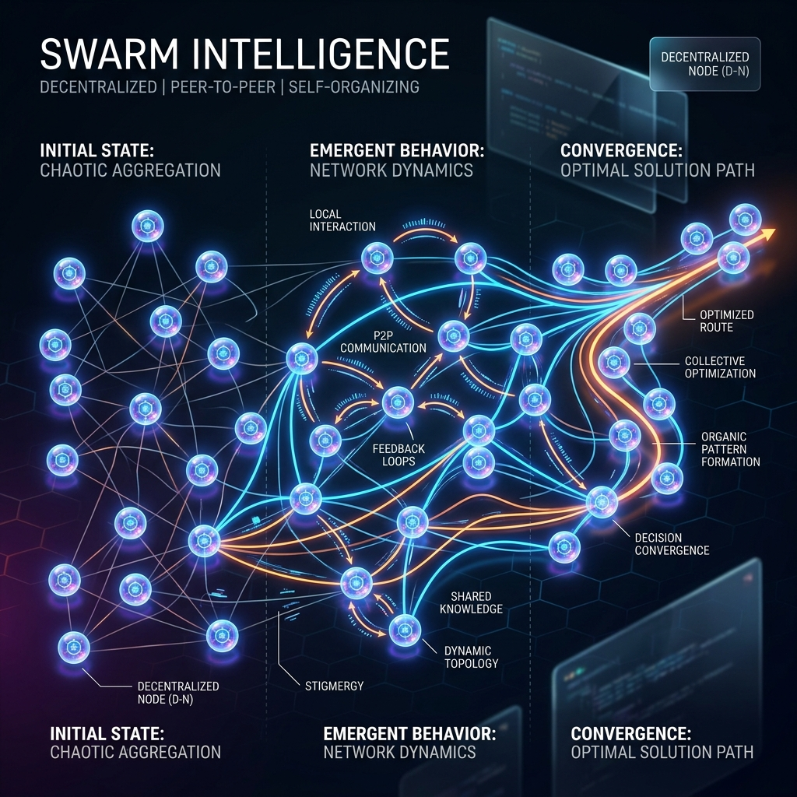

<!-- tags: glossary, agentic-ai, multi-agent-systems -->
# Swarm Intelligence

> A chaotic but powerful system where many identical AI agents interact without a central boss, leading to emergent problem-solving.

| Aspect | Detail |
| --- | --- |
| **Domain** | Multi-Agent Systems |
| **Used by** | AI researcher, system designer |
| **Related** | See RECOMMEND section |

📅 Created: 2026-04-28 · 🔄 Updated: 2026-05-07 · ⏱️ 5 min read

---

## 1. DEFINE

**Swarm Intelligence** is a decentralized multi-agent architecture inspired by biological systems (like ant colonies or flocks of birds). Instead of a rigid hierarchy with a Supervisor Agent dictating tasks, a swarm consists of numerous, often identical, agents that follow simple local rules and interact peer-to-peer. Complex, intelligent behavior emerges organically from the collective interactions of the swarm rather than from centralized planning.

---

## 2. CONTEXT

**Who uses it**: Advanced AI Researchers and experimental system designers.
**When**: Exploring vast search spaces, optimizing complex logistics, or conducting massive parallel brainstorming where rigid, deterministic paths fail.
**Why it matters**: Hierarchical systems (Supervisor -> Worker) are brittle; if the supervisor fails or makes a bad plan, the whole system fails. Swarms are highly resilient. If half the agents in a swarm fail or hallucinate, the swarm's collective consensus often still reaches the correct conclusion.

---

## 3. EXAMPLES

### Example 1: Parallel Code Generation

A user wants a highly optimized sorting algorithm in C++.
1. Instead of asking one agent, the system spawns a swarm of **50 independent agents**.
2. Each agent writes a slightly different implementation based on random temperature variations.
3. The agents compile and run their code against a benchmark suite.
4. Agents that fail or run slowly "die" (are discarded).
5. Agents that succeed share their code with others in the swarm, who then iterate and mutate it further.
6. The swarm rapidly converges on the mathematically optimal solution.

---

## 4. COMPARE

| Feature | Swarm Intelligence | Hierarchical (Supervisor) MAS |
|---|---|---|
| **Control Flow** | Decentralized, emergent | Centralized, deterministic |
| **Agent Types** | Often homogeneous (many identical agents) | Heterogeneous (highly specialized distinct roles) |
| **Resilience** | High (no single point of failure) | Low (if the supervisor fails, the system halts) |

---

## 5. REF

| Resource | Type | Link | Note |
| --- | --- | --- | --- |
| OpenAI Swarm | Framework | https://github.com/openai/swarm | Experimental framework for lightweight multi-agent orchestration |
| Swarm Optimization | Concept | https://en.wikipedia.org/wiki/Swarm_intelligence | The mathematical foundations of swarm logic |

---

## 6. RECOMMEND

| Explore next | When | Why | File/Link |
| --- | --- | --- | --- |
| Supervisor Agent | You need predictability | Swarms are unpredictable; use supervisors for business logic | [Supervisor Agent](./87-supervisor-agent.md) |
| Shared Memory | You are building a swarm | Swarms often coordinate by reading from a central blackboard | [Shared Memory](./93-shared-memory.md) |

**Links**: [← Previous](./90-debate-pattern.md) · [→ Next](./92-agent-communication-protocol.md)
