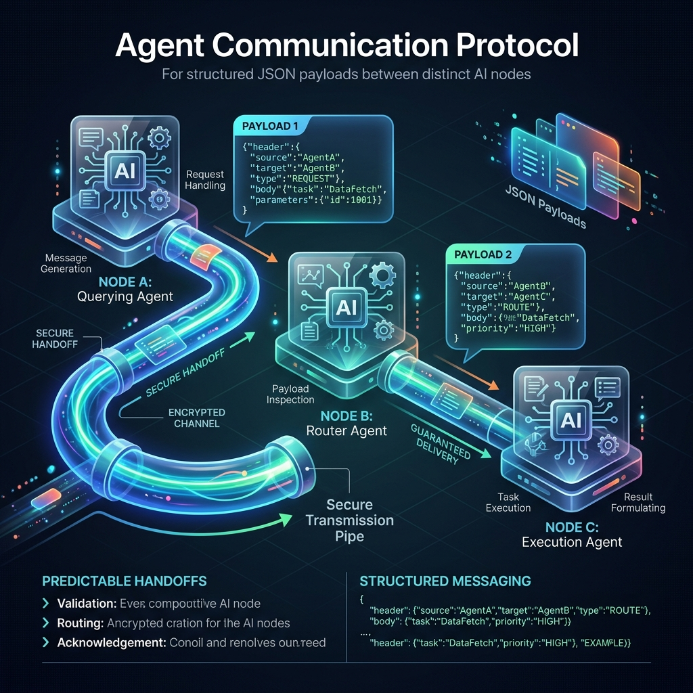

<!-- tags: glossary, agentic-ai, multi-agent-systems -->
# Agent Communication Protocol

> The standardized language and format (usually JSON) that agents use to talk to each other so they don't get confused.

| Aspect | Detail |
| --- | --- |
| **Domain** | Multi-Agent Systems |
| **Used by** | Platform engineer, backend developer |
| **Related** | See RECOMMEND section |

📅 Created: 2026-04-28 · 🔄 Updated: 2026-05-07 · ⏱️ 5 min read

---

## 1. DEFINE

An **Agent Communication Protocol** is a standardized set of rules, formats, and schemas that dictate how distinct AI agents exchange information, state, and task assignments. Instead of agents sending unstructured conversational text back and forth, they use structured data formats (like JSON) containing specific headers (Sender, Receiver, Intent, Payload) to ensure deterministic parsing and reliable hand-offs within a Multi-Agent System.

---

## 2. CONTEXT

**Who uses it**: Platform Engineers building agentic frameworks.
**When**: Designing enterprise systems where multiple agents built by different teams (or running on different models) need to collaborate.
**Why it matters**: LLMs are chatty and unpredictable. If Agent A sends Agent B a paragraph of conversational text, Agent B might misinterpret the core instruction. Enforcing a strict JSON protocol ensures that tasks, context, and expected outputs are transmitted flawlessly across the network.

---

## 3. EXAMPLES

### Example 1: The Standardized Hand-off




When the **Supervisor Agent** wants to delegate to the **SQL Agent**, it doesn't say "Hey, please get the user data." It emits a strictly formatted JSON payload:

```json
{
  "sender_id": "agent_supervisor_01",
  "receiver_id": "agent_sql_worker_04",
  "message_type": "TASK_DELEGATION",
  "payload": {
    "task": "Retrieve user IDs for accounts created in 2023",
    "required_format": "CSV array"
  },
  "context_thread_id": "thread_9921"
}
```
The receiving framework parses this, wraps it in the SQL Agent's system prompt, and executes it.

---

## 4. COMPARE

| Feature | Structured Protocol | Natural Language Chat |
|---|---|---|
| **Format** | Strict JSON / XML / Protobuf | Freeform text |
| **Parsing Reliability** | 100% deterministic | Variable, prone to hallucinations |
| **Human Readability** | Lower | Very high |

---

## 5. REF

| Resource | Type | Link | Note |
| --- | --- | --- | --- |
| FIPA ACL | Standard | http://www.fipa.org/repository/aclspecs.html | The classic Foundation for Intelligent Physical Agents standard |
| LangGraph State | Framework | https://python.langchain.com/docs/langgraph | How state/messages are passed between nodes |

---

## 6. RECOMMEND

| Explore next | When | Why | File/Link |
| --- | --- | --- | --- |
| Multi-Agent System | You want to see the whole picture | Protocols are the glue that hold MAS together | [Multi-Agent System](./85-multi-agent-system.md) |
| Shared Memory | You don't want agents talking directly | Shared memory is an alternative to direct P2P messaging | [Shared Memory](./93-shared-memory.md) |

**Links**: [← Previous](./91-swarm-intelligence.md) · [→ Next](./93-shared-memory.md)
