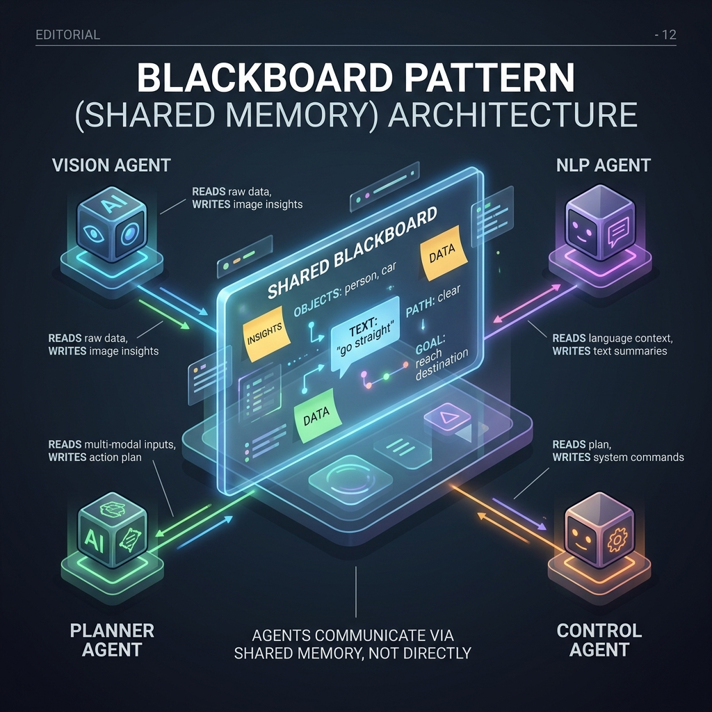

<!-- tags: glossary, agentic-ai, multi-agent-systems -->
# Shared Memory (Blackboard)

> A central bulletin board where all agents can pin their findings, so they don't have to message each other directly.

| Aspect | Detail |
| --- | --- |
| **Domain** | Multi-Agent Systems |
| **Used by** | System designer, backend developer |
| **Related** | See RECOMMEND section |

📅 Created: 2026-04-28 · 🔄 Updated: 2026-05-07 · ⏱️ 5 min read

---

## 1. DEFINE

**Shared Memory**, often implemented as the **Blackboard Pattern**, is an architectural state-management approach in Multi-Agent Systems. Instead of agents communicating directly via peer-to-peer messages, they all read from and write to a centralized, shared data structure (the blackboard). This allows multiple specialized agents to independently observe the current state of a problem, contribute their specific insights when relevant, and collaboratively build a solution.

---

## 2. CONTEXT

**Who uses it**: System Designers and AI Architects.
**When**: Building complex reasoning systems where the order of operations isn't strictly linear, and multiple agents might need access to the same context simultaneously.
**Why it matters**: As the number of agents grows, direct communication creates an unmanageable web of $N^2$ connections. Shared memory decouples the agents. They don't need to know about each other; they only need to know how to read and update the blackboard.

---

## 3. EXAMPLES

### Example 1: The Detective Blackboard

A MAS is tasked with diagnosing a complex server outage.
1. The **Log Agent** finds an error in the logs and posts it to the Shared Memory: `"State: Database connection timed out."`
2. The **Network Agent** sees this update on the board, pings the database IP, and posts its finding: `"State: Ping failed, network switch offline."`
3. The **DevOps Agent** sees both findings on the board, generates an alert, and posts: `"State: Alert sent to on-call engineer regarding Switch B."`

No agent spoke to another agent directly; they just reacted to changes on the board.

---

## 4. COMPARE

| Feature | Shared Memory (Blackboard) | Direct P2P Messaging |
|---|---|---|
| **Architecture** | Centralized state, decoupled agents | Decentralized state, tightly coupled agents |
| **Scalability** | Easy to add new agents | Harder (requires routing logic updates) |
| **Latency** | Slower (requires DB/memory reads) | Faster (direct function calls) |

---

## 5. REF

| Resource | Type | Link | Note |
| --- | --- | --- | --- |
| Blackboard Architecture | Concept | https://en.wikipedia.org/wiki/Blackboard_system | The classic computer science AI pattern |
| LangGraph State Management | Framework | https://python.langchain.com/docs/langgraph | Managing a shared `State` object across nodes |

---

## 6. RECOMMEND

| Explore next | When | Why | File/Link |
| --- | --- | --- | --- |
| Agent Communication Protocol | You prefer direct messaging | The alternative to shared memory is strict messaging | [Agent Comm Protocol](./92-agent-communication-protocol.md) |
| Swarm Intelligence | You want emergent behavior | Swarms heavily utilize shared memory for coordination | [Swarm Intelligence](./91-swarm-intelligence.md) |

**Links**: [← Previous](./92-agent-communication-protocol.md) · [→ Next](./94-agent-registry.md)
