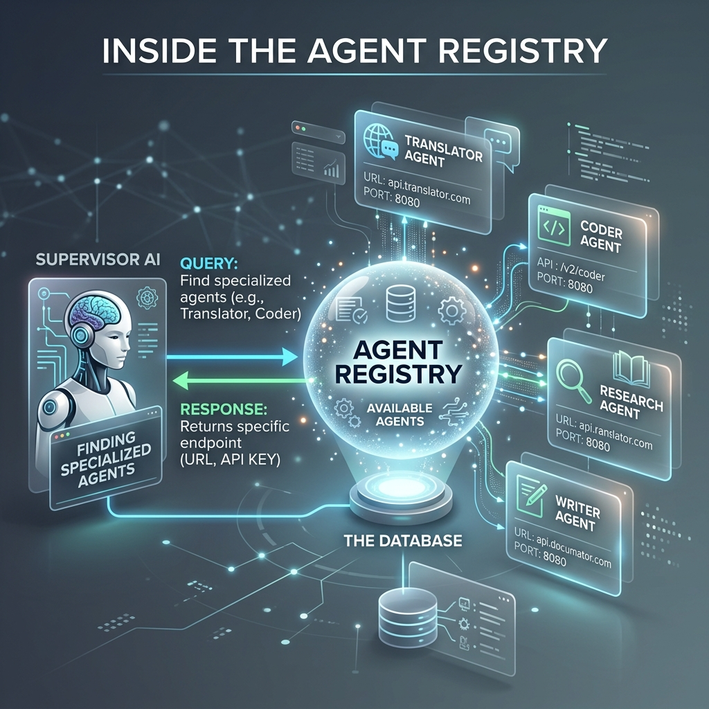

<!-- tags: glossary, agentic-ai, multi-agent-systems -->
# Agent Registry

> A phone book for the system, listing all available AI agents and exactly what they know how to do.

| Aspect | Detail |
| --- | --- |
| **Domain** | Multi-Agent Systems |
| **Used by** | Platform engineer, backend developer |
| **Related** | See RECOMMEND section |

📅 Created: 2026-04-28 · 🔄 Updated: 2026-05-07 · ⏱️ 5 min read

---

## 1. DEFINE

An **Agent Registry** is a centralized discovery service or directory within a large-scale Multi-Agent System. It catalogs every active agent, storing metadata such as their unique IDs, assigned Roles, specific tool capabilities, and current status (busy/idle). Supervisors or peer agents query the registry dynamically to find the right agent to execute a specific sub-task.

---

## 2. CONTEXT

**Who uses it**: Platform Engineers and Backend Developers.
**When**: Managing enterprise deployments where dozens or hundreds of specialized agents exist, and new agents are frequently added or retired.
**Why it matters**: Hardcoding agent connections (e.g., `if task == "sql" then call agent_id_001`) creates technical debt. A registry allows dynamic discovery. A supervisor simply queries the registry: "Give me an agent that has the `postgres_query` tool," allowing the system to scale infinitely without breaking.

---

## 3. EXAMPLES

### Example 1: Dynamic Delegation

1. The **Supervisor** realizes it needs to translate a document into Japanese.
2. The Supervisor does not know which agent speaks Japanese. It sends a request to the **Agent Registry**:
   `GET /registry/agents?capability=translate_japanese`
3. The Registry returns a JSON object:
   `{"agent_id": "translator_jp_09", "status": "idle", "endpoint": "/agents/t9"}`
4. The Supervisor routes the task to that specific endpoint.

---

## 4. COMPARE

| Feature | Agent Registry | Tool Registry |
|---|---|---|
| **What it tracks** | AI Agents (personas + tools) | Functions/Scripts (just the tools) |
| **Usage** | Used by Supervisors to find sub-agents | Used by Agents to find executable actions |
| **Scale** | Macro-level orchestration | Micro-level execution |

---

## 5. REF

| Resource | Type | Link | Note |
| --- | --- | --- | --- |
| FIPA Directory Facilitator | Standard | http://www.fipa.org/specs/fipa00023/ | The legacy standard for agent registries |
| Microservices Service Registry | Concept | https://microservices.io/patterns/service-registry.html | The modern backend equivalent |

---

## 6. RECOMMEND

| Explore next | When | Why | File/Link |
| --- | --- | --- | --- |
| Supervisor Agent | You need to query the registry | Supervisors use the registry to figure out who to delegate to | [Supervisor Agent](./87-supervisor-agent.md) |
| Multi-Agent System | You want to zoom out | The registry is the infrastructure layer for the entire MAS | [Multi-Agent System](./85-multi-agent-system.md) |

**Links**: [← Previous](./93-shared-memory.md) · [→ Next](../README.md)
