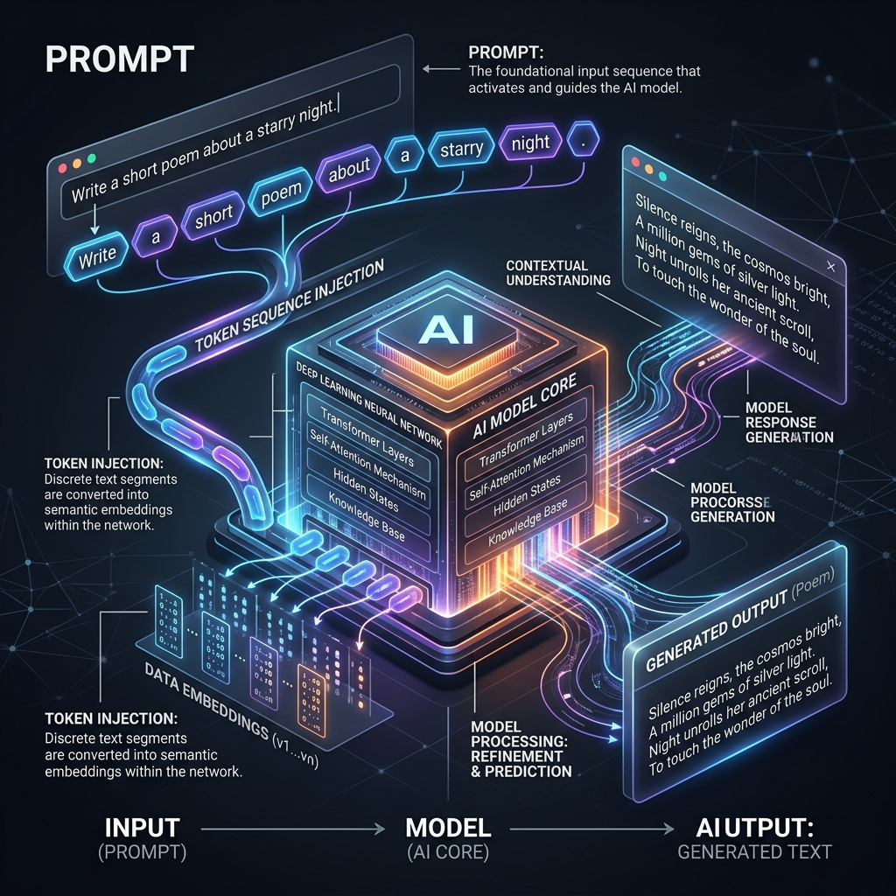

<!-- tags: glossary, agentic-ai, prompt-engineering, prompt -->
# Prompt

> The input text or set of instructions provided to a large language model to elicit a specific response, behavior, or task execution.

| Aspect | Detail |
| --- | --- |
| **Domain** | Prompt Engineering |
| **Used by** | Everyone |
| **Related** | System Prompt, User Prompt, Prompt Template |

📅 Created: 2026-04-28 · 🔄 Updated: 2026-05-06 · ⏱️ 5 min read

---

## 1. DEFINE

A **Prompt** is the foundational interface for interacting with Generative AI. It is the sequence of tokens (usually text, but can include images or audio in multimodal models) fed into a Large Language Model to condition its probability distribution and guide it toward generating a desired output.

In agentic engineering, a prompt is not just a question; it is the "source code" that programs the model's immediate behavior, providing context, defining rules, supplying data, and specifying the expected output format.

---

## 2. CONTEXT

**Who uses it**: Everyone from casual ChatGPT users to principal AI engineers building complex multi-agent systems.

**When**: Every single time an LLM is invoked.

**In this ecosystem**:
- Prompts are dynamically generated using [Prompt Templates](./28-prompt-template.md).
- They are generally divided into [System Prompts](./14-system-prompt.md) and [User Prompts](./15-user-prompt.md).

---

## 3. EXAMPLES

### Example 1: The Basic Prompt
A user types: `Summarize this text in exactly three bullet points: [Text]`. This prompt provides both the data and the strict formatting constraint.

### Example 2: The Agentic Prompt
An orchestrator generates a prompt automatically: `You are the Database Agent. The user asked for "recent users". Here is the schema: {schema}. Generate a safe PostgreSQL query. Return ONLY valid JSON containing the key "query".` This prompt programs the model to act as a secure, deterministic tool.

---

## 4. COMPARE

| | Prompt | Parameter (e.g., Temperature) | Fine-Tuning |
|--|---|---|---|
| **Nature** | Natural language input | Mathematical configuration | Permanent weight adjustment |
| **Effort** | Low | Low | High |
| **Scope** | Applies only to the current inference request | Applies to the inference request | Applies to the model itself forever |

---

## 5. REF

| Resource | Type | Link | Note |
| --- | --- | --- | --- |
| Prompting Guide | Resource | https://www.promptingguide.ai/ | Comprehensive guide to all prompting techniques |

---

## 6. RECOMMEND

| Explore next | When | Why | File/Link |
| --- | --- | --- | --- |
| System Prompt | You are defining agent behavior | System prompts are the foundational rules | [System Prompt](./14-system-prompt.md) |
| Prompt Template | You need dynamic prompts | Templates inject variables into prompts | [Prompt Template](./28-prompt-template.md) |
| Chain of Thought | You need the model to reason | Advanced prompting technique for logic | [Chain of Thought](./19-chain-of-thought.md) |

**Links**: [← Previous](./README.md) · [→ Next](./14-system-prompt.md)
