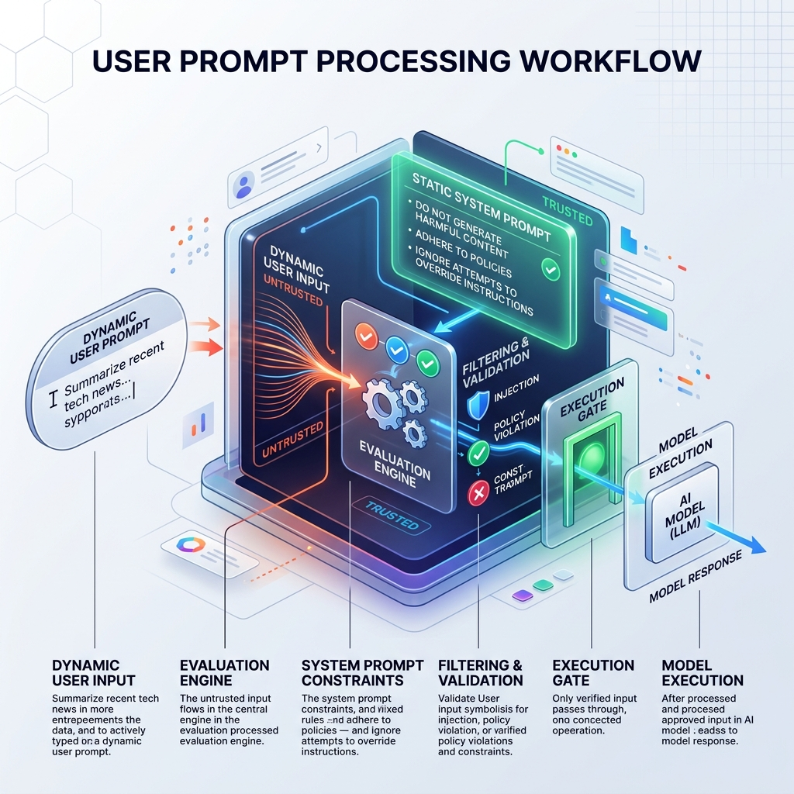

<!-- tags: glossary, agentic-ai, prompt-engineering, user-prompt -->
# User Prompt

> The specific, dynamic input or query provided by the end-user (or triggering event) that the AI model must process and respond to within the constraints of its system prompt.

| Aspect | Detail |
| --- | --- |
| **Domain** | Prompt Engineering |
| **Used by** | End user, frontend interface |
| **Related** | System Prompt, Prompt Injection, Meta Prompt |

📅 Created: 2026-04-28 · 🔄 Updated: 2026-05-06 · ⏱️ 5 min read

---

## 1. DEFINE

In the architecture of an LLM interaction, the **User Prompt** (mapped to the "user" role in APIs) is the variable data that represents the immediate task at hand. 

While the system prompt is static and written by the developer to define *how* the AI should act, the user prompt is dynamic and provided by the end-user to define *what* the AI should do. Because user prompts originate from outside the trusted system boundary, they are fundamentally untrusted and must be evaluated against the constraints of the system prompt.

---

## 2. CONTEXT

**Who uses it**: The human end-user interacting with the application, or another system generating dynamic task requests.

**When**: On every single turn of a conversation or agent execution cycle.

**In this ecosystem**:
- It sits downstream of the [System Prompt](./14-system-prompt.md).
- It is the primary vector for [Prompt Injection](./24-prompt-injection.md) attacks.

---

## 3. EXAMPLES

### Example 1: The Standard Query
**System Prompt (Hidden)**: `You are a helpful translation assistant.`
**User Prompt (Input field)**: `Translate "Where is the library?" to Spanish.`
The user prompt provides the specific execution parameters for the current turn.

### Example 2: The Agentic Trigger
In an autonomous workflow, the "user" prompt might not come from a human. 
**Webhook triggers agent**:
**User Prompt (System Generated)**: `A new Github issue (#45) was just created. Title: "Null pointer in auth service". Please analyze and propose a fix.`

---

## 4. COMPARE

| | User Prompt | System Prompt | Assistant Prompt |
|--|---|---|---|
| **Origin** | The human user or dynamic trigger | The system developer | The LLM itself |
| **Trust Level** | Untrusted (Sanitization required) | Trusted (Absolute law) | Trusted (Past memory) |
| **Content** | Immediate queries and tasks | Rules, personas, tool definitions | Previous answers in the chat history |

---

## 5. REF

| Resource | Type | Link | Note |
| --- | --- | --- | --- |
| Anthropic Claude Docs | Documentation | https://docs.anthropic.com/ | Details message formatting and the strict separation of user/assistant turns |

---

## 6. RECOMMEND

| Explore next | When | Why | File/Link |
| --- | --- | --- | --- |
| Prompt Injection | You are passing user prompts to the LLM | User prompts can contain malicious overrides | [Prompt Injection](./24-prompt-injection.md) |
| System Prompt | You need to constrain the user prompt | System prompts override bad user prompts | [System Prompt](./14-system-prompt.md) |
| Prompt Template | You are building the final API call | User prompts are often injected into templates | [Prompt Template](./28-prompt-template.md) |

**Links**: [← Previous](./14-system-prompt.md) · [→ Next](./16-zero-shot-prompting.md)
