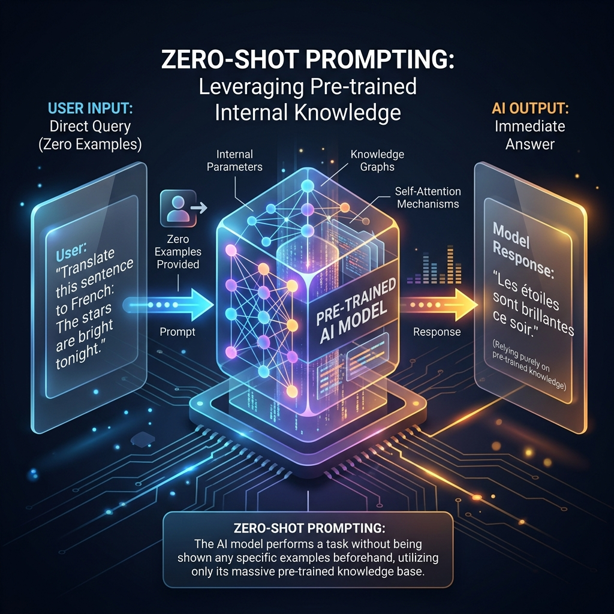

<!-- tags: glossary, agentic-ai, prompt-engineering, zero-shot-prompting -->
# Zero-Shot Prompting

> A prompting technique where the model is asked to perform a task without being provided any prior examples or demonstrations of the desired output.

| Aspect | Detail |
| --- | --- |
| **Domain** | Prompt Engineering |
| **Used by** | AI engineer, casual user |
| **Related** | Few-Shot Prompting, One-Shot Prompting, Instruction Tuning |

📅 Created: 2026-04-28 · 🔄 Updated: 2026-05-06 · ⏱️ 5 min read

---

## 1. DEFINE

**Zero-Shot Prompting** relies entirely on the LLM's pre-existing, internal knowledge base. You present the instruction and the input data, and expect the model to immediately understand the intent and format the output correctly without any "shots" (examples) to guide it.

Because modern Foundation Models undergo heavy [Instruction Tuning](./27-instruction-tuning.md) (like RLHF), they are exceptionally good at zero-shot tasks. However, zero-shot prompting is brittle when dealing with highly specific formatting requirements (like custom JSON schemas) or niche domain logic.

---

## 2. CONTEXT

**Who uses it**: Everyone. It is the default mode of interaction with chatbots like ChatGPT or Claude.

**When**: Used for general knowledge retrieval, summarization, translation, and simple reasoning tasks where strict formatting isn't mission-critical.

**In this ecosystem**:
- It contrasts directly with [Few-Shot Prompting](./17-few-shot-prompting.md).
- Combined with [Chain of Thought](./19-chain-of-thought.md), it creates [Zero-Shot CoT](./20-zero-shot-cot.md) ("Let's think step by step").

---

## 3. EXAMPLES

### Example 1: Sentiment Analysis
**Prompt**: 
`Classify the sentiment of this text as Positive, Negative, or Neutral.`
`Text: "I absolutely loved the customer service, they were so fast!"`
`Sentiment:`

The model outputs `Positive` immediately. No examples of what positive or negative look like were provided.

### Example 2: The Formatting Failure
**Prompt**:
`Extract the names from this text: "John went to the store with Mary." Return them as a comma-separated list without spaces.`
**Output**: 
`John, Mary` (Model failed the "without spaces" instruction because it wasn't shown an example).

---

## 4. COMPARE

| | Zero-Shot Prompting | Few-Shot Prompting | Fine-Tuning |
|--|---|---|---|
| **Examples Provided** | 0 | 2 to 10+ | 1,000+ |
| **Context Window Usage**| Minimal | Moderate | None (baked into weights) |
| **Best For** | General tasks, summarizing | Strict formatting, specialized logic | Fundamental behavior changes |

---

## 5. REF

| Resource | Type | Link | Note |
| --- | --- | --- | --- |
| Kojima et al. (2022) | Research | https://arxiv.org/abs/2205.11916 | "Large Language Models are Zero-Shot Reasoners" |

---

## 6. RECOMMEND

| Explore next | When | Why | File/Link |
| --- | --- | --- | --- |
| Few-Shot Prompting | Zero-shot is failing formatting | Adding examples instantly fixes most errors | [Few-Shot Prompting](./17-few-shot-prompting.md) |
| Zero-Shot CoT | Zero-shot is failing logic | Forcing reasoning helps zero-shot succeed | [Zero-Shot CoT](./20-zero-shot-cot.md) |
| Instruction Tuning | You want to understand why it works | Models are trained specifically to obey zero-shot commands | [Instruction Tuning](./27-instruction-tuning.md) |

**Links**: [← Previous](./15-user-prompt.md) · [→ Next](./17-few-shot-prompting.md)
