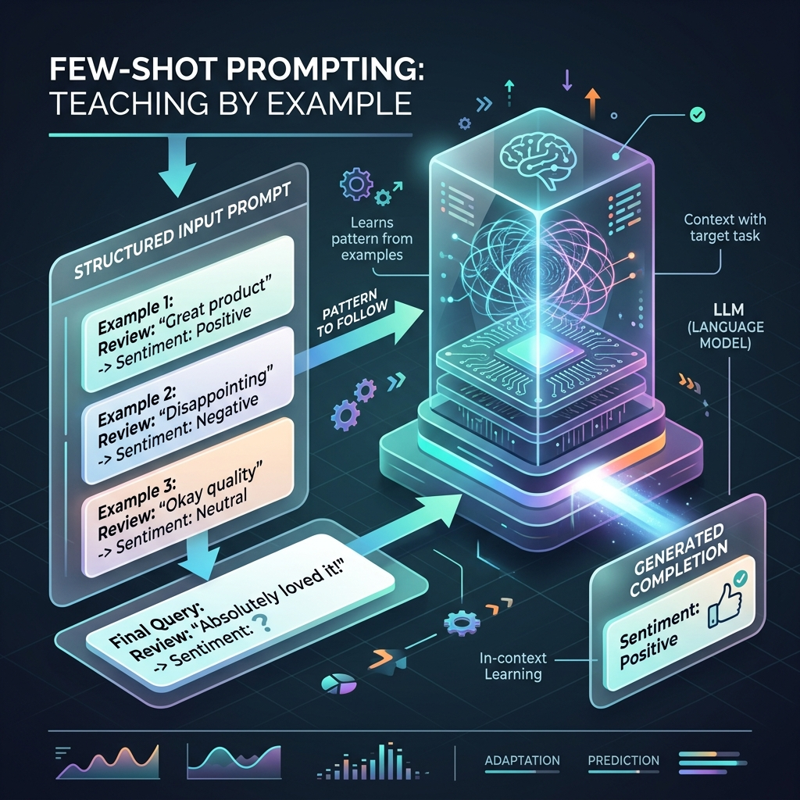

<!-- tags: glossary, agentic-ai, prompt-engineering, few-shot-prompting -->
# Few-Shot Prompting

> A prompting technique that provides the model with a small number of high-quality examples (input-output pairs) to demonstrate the desired format, tone, or logic before asking it to perform the actual task.

| Aspect | Detail |
| --- | --- |
| **Domain** | Prompt Engineering |
| **Used by** | AI engineer |
| **Related** | Zero-Shot Prompting, One-Shot Prompting, Prompt Template |

📅 Created: 2026-04-28 · 🔄 Updated: 2026-05-06 · ⏱️ 5 min read

---

## 1. DEFINE

**Few-Shot Prompting** leverages a capability known as *in-context learning*. Rather than permanently retraining the model (fine-tuning), the developer places examples directly inside the context window. The LLM uses its attention mechanism to recognize the pattern in the examples and applies that exact pattern to the final, unanswered query.

Few-shot is the silver bullet for formatting issues. If an agent consistently fails to return valid JSON, or uses the wrong tone, providing 3 to 5 examples of the exact desired output usually forces the model into compliance with near 100% reliability.

---

## 2. CONTEXT

**Who uses it**: AI engineers building deterministic pipelines where output structure matters immensely.

**When**: Anytime [Zero-Shot Prompting](./16-zero-shot-prompting.md) yields inconsistent formatting or fails to grasp specific domain logic.

**In this ecosystem**:
- It bridges the gap between [Zero-Shot Prompting](./16-zero-shot-prompting.md) and full [Fine-Tuning](../core-llm-concepts/11-fine-tuning.md).
- It consumes more of the [Context Window](../core-llm-concepts/05-context-window.md).

---

## 3. EXAMPLES



### Example 1: Enforcing Strict Formatting
**Prompt**:
```text
Convert the user request into our custom query language.

Request: Show me active users.
Query: GET_USERS status='active'

Request: Find deleted accounts from yesterday.
Query: GET_ACCOUNTS status='deleted' date='yesterday'

Request: List pending invoices.
Query:
```
The model will output `GET_INVOICES status='pending'`, perfectly mimicking the custom syntax it learned entirely from the context window.

### Example 2: Dynamic Few-Shot (RAG)
In advanced agentic systems, few-shot examples aren't hardcoded. When a user asks a coding question, the system searches a vector database for the 3 most similar past questions and their correct answers, injects them into the prompt as few-shot examples, and *then* asks the model to answer the new question.

---

## 4. COMPARE

| | Few-Shot Prompting | Zero-Shot Prompting | Fine-Tuning |
|--|---|---|---|
| **Mechanism** | In-Context Learning (Prompt) | Pre-trained knowledge | Weight updates (Training) |
| **Examples Needed**| 2 to ~20 | 0 | 1,000 to 10,000+ |
| **Cost** | Higher token cost per API call | Lowest token cost | Massive upfront compute cost |

---

## 5. REF

| Resource | Type | Link | Note |
| --- | --- | --- | --- |
| Brown et al. (2020) | Research | https://arxiv.org/abs/2005.14165 | "Language Models are Few-Shot Learners" (The GPT-3 paper) |

---

## 6. RECOMMEND

| Explore next | When | Why | File/Link |
| --- | --- | --- | --- |
| Prompt Template | You want to inject examples dynamically | Templates manage the placement of few-shot data | [Prompt Template](./28-prompt-template.md) |
| One-Shot Prompting | Context window is tight | Using exactly one example to save tokens | [One-Shot Prompting](./18-one-shot-prompting.md) |
| Fine-Tuning | Few-shot is too expensive | If you pass 50 examples every call, fine-tuning is cheaper | [Fine-Tuning](../core-llm-concepts/11-fine-tuning.md) |

**Links**: [← Previous](./16-zero-shot-prompting.md) · [→ Next](./18-one-shot-prompting.md)
