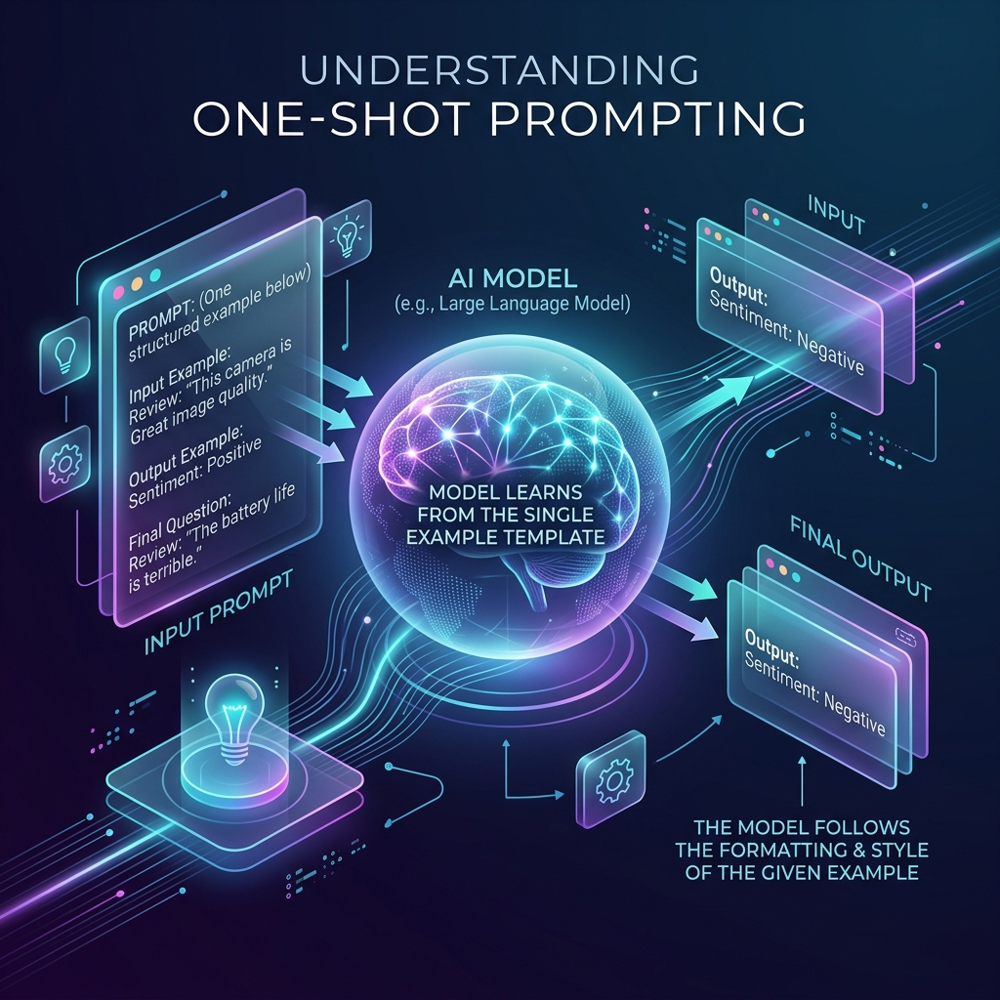

<!-- tags: glossary, agentic-ai, prompt-engineering, one-shot-prompting -->
# One-Shot Prompting

> A specific subset of few-shot prompting where exactly one example is provided to demonstrate the required pattern before executing the task.

| Aspect | Detail |
| --- | --- |
| **Domain** | Prompt Engineering |
| **Used by** | AI engineer |
| **Related** | Few-Shot Prompting, Zero-Shot Prompting |

📅 Created: 2026-04-28 · 🔄 Updated: 2026-05-06 · ⏱️ 5 min read

---

## 1. DEFINE

**One-Shot Prompting** is the strict application of in-context learning using precisely one demonstration. It is a middle ground between the token-efficiency of [Zero-Shot Prompting](./16-zero-shot-prompting.md) and the robust reliability of [Few-Shot Prompting](./17-few-shot-prompting.md).

Developers use one-shot prompting when the model understands the semantic task perfectly well but simply needs a single visual template to ensure the formatting (like specific JSON keys or markdown structures) aligns with the application's parsing logic.

---

## 2. CONTEXT

**Who uses it**: Engineers optimizing prompt length to reduce latency and token costs.

**When**: When a model is highly capable (e.g., GPT-4o) and only needs a gentle "nudge" regarding output shape, not a full lesson on the domain logic.

**In this ecosystem**:
- It is simply [Few-Shot Prompting](./17-few-shot-prompting.md) where `n=1`.

---

## 3. EXAMPLES



### Example 1: Formatting a Response
**Prompt**:
```text
Convert the date to YYYY-MM-DD.
Input: Jan 5th, 2020
Output: 2020-01-05

Input: March 12, 1994
Output:
```
The model understands dates perfectly, but the one example guarantees it won't output `1994/03/12` or `1994-3-12`.

---

## 4. COMPARE

| | One-Shot | Zero-Shot | Few-Shot |
|--|---|---|---|
| **Examples** | Exactly 1 | 0 | 2+ |
| **Token Cost** | Low | Lowest | Moderate to High |
| **Use Case** | Nudging formatting | General knowledge | Teaching complex patterns |

---

## 5. REF

| Resource | Type | Link | Note |
| --- | --- | --- | --- |
| OpenAI Cookbook | Guide | https://cookbook.openai.com/ | Contains various examples of balancing zero, one, and few-shot techniques |

---

## 6. RECOMMEND

| Explore next | When | Why | File/Link |
| --- | --- | --- | --- |
| Few-Shot Prompting | One example isn't enough | Add more examples to increase reliability | [Few-Shot Prompting](./17-few-shot-prompting.md) |
| Prompt Template | You are injecting the example | Templates hold the one-shot data | [Prompt Template](./28-prompt-template.md) |

**Links**: [← Previous](./17-few-shot-prompting.md) · [→ Next](./19-chain-of-thought.md)
