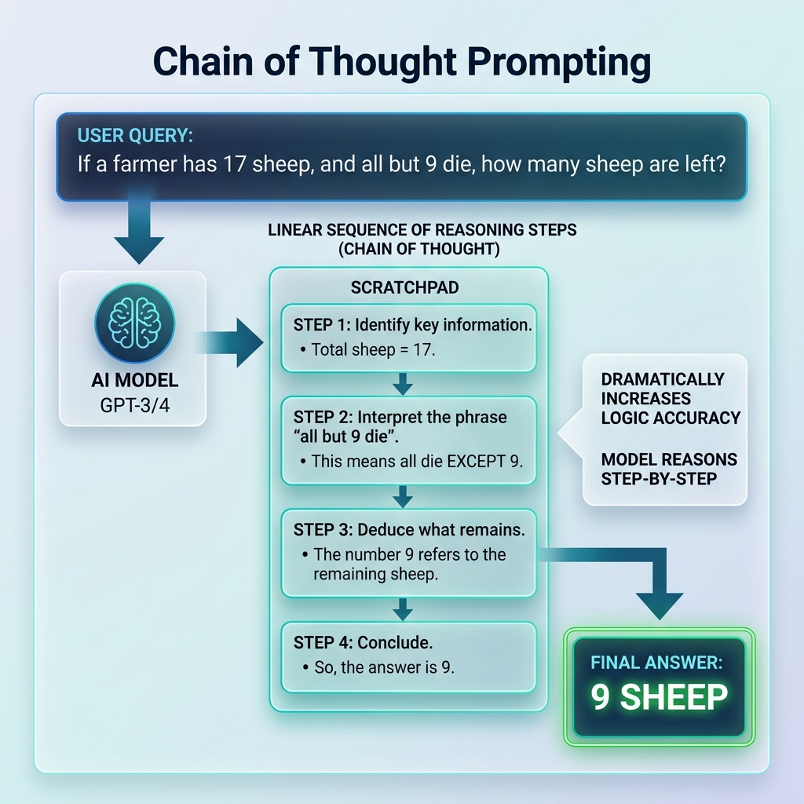

<!-- tags: glossary, agentic-ai, prompt-engineering, chain-of-thought -->
# Chain of Thought (CoT)

> A prompting technique that forces an LLM to generate a step-by-step intermediate reasoning process before outputting the final answer.

| Aspect | Detail |
| --- | --- |
| **Domain** | Prompt Engineering |
| **Used by** | AI engineer, prompt engineer |
| **Related** | Zero-Shot CoT, Tree of Thought, Agentic Loop |

📅 Created: 2026-04-28 · 🔄 Updated: 2026-05-06 · ⏱️ 5 min read

---

## 1. DEFINE

**Chain of Thought (CoT)** is arguably the most important breakthrough in prompt engineering. LLMs do not "think" in the background; they generate text one token at a time based on the tokens that came before. If you ask a complex math question and demand an immediate answer, the model must guess the final number in a single token prediction. It usually fails.

CoT forces the model to "think out loud" by writing out intermediate steps. Because the model gets to read its own generated steps, it effectively creates a "scratchpad" of logic. By the time it needs to generate the final answer, the correct logical path is already in its context window, drastically increasing accuracy.

---

## 2. CONTEXT

**Who uses it**: Anyone trying to get an LLM to perform math, logic, coding, or complex reasoning.

**When**: Mandatory for any task requiring multi-step logic.

**In this ecosystem**:
- It is the foundational mechanic that makes the [ReAct Loop](../agentic-core/36-react-loop.md) possible.
- It can be triggered manually via examples (Few-Shot CoT) or via a magic phrase ([Zero-Shot CoT](./20-zero-shot-cot.md)).

---

## 3. EXAMPLES

### Example 1: The Difference CoT Makes
**Standard Prompt**: "Roger has 5 tennis balls. He buys 2 more cans of tennis balls. Each can has 3 balls. How many does he have?"
*Model output (guess)*: 11. (Often fails on more complex variants).

**CoT Prompt**: "Roger has 5 tennis balls... Let's break this down."
*Model output*: "Roger starts with 5 balls. He buys 2 cans. Each can has 3 balls. So he buys 2 * 3 = 6 balls. 5 + 6 = 11. The answer is 11." (Highly reliable).

---

## 4. COMPARE

| | Chain of Thought | Standard Prompting | Tree of Thought |
|--|---|---|---|
| **Process** | Linear, step-by-step reasoning | Immediate final answer | Branching, multi-path reasoning |
| **Output Length**| Long (verbose) | Short | Very Long |
| **Accuracy on Logic**| Very High | Low | Extremely High |

---

## 5. REF

| Resource | Type | Link | Note |
| --- | --- | --- | --- |
| Wei et al. (2022) | Research | https://arxiv.org/abs/2201.11903 | "Chain-of-Thought Prompting Elicits Reasoning in Large Language Models" |

---

## 6. RECOMMEND

| Explore next | When | Why | File/Link |
| --- | --- | --- | --- |
| Zero-Shot CoT | You don't have examples to provide | "Let's think step by step" triggers CoT automatically | [Zero-Shot CoT](./20-zero-shot-cot.md) |
| ReAct Loop | You want the agent to use tools | ReAct is essentially Chain of Thought + Tool execution | [ReAct Loop](../agentic-core/36-react-loop.md) |
| Tree of Thought | A single linear chain isn't enough | ToT allows exploring multiple chains simultaneously | [Tree of Thought](./21-tree-of-thought.md) |

**Links**: [← Previous](./18-one-shot-prompting.md) · [→ Next](./20-zero-shot-cot.md)
